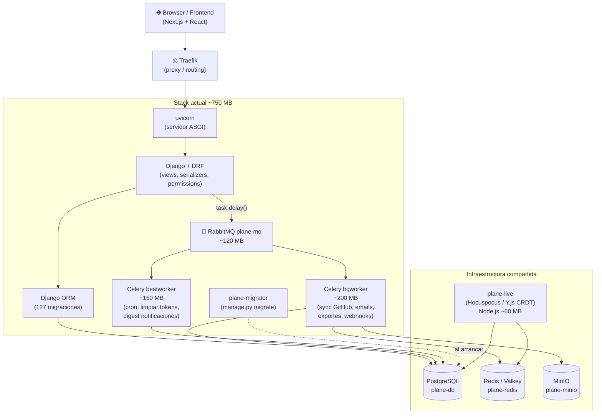
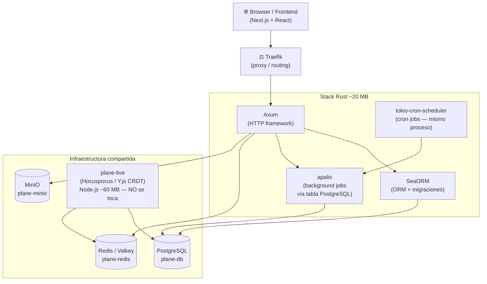
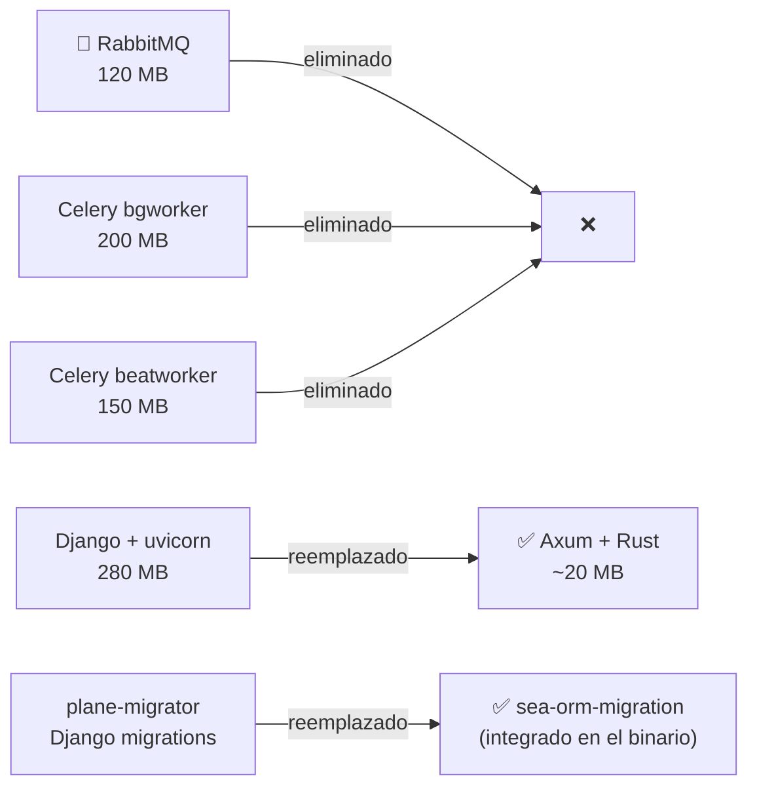

## Arquitectura actual vs futura — diagrama de flujo

### Stack actual (Django + Celery + RabbitMQ)

### Stack futuro (Rust — ~20 MB total)

### Lo que desaparece

### Impacto en frontend

> La migración a Rust **no reduce tiempos de carga percibidos** en el browser.
> El cuello de botella es el bundle JS de Next.js y la hydration de React — no la API.
> La ganancia es en el **servidor**: -730 MB RAM, mejor throughput bajo carga concurrente,
> y eliminación de 4 contenedores de infraestructura.

---

### Lo que desaparece

| Contenedor               | RAM         | Resultado     |
| ------------------------ | ----------- | ------------- |
| api (Django + uvicorn)   | ~280 MB     | → Rust ~20 MB |
| bgworker (Celery)        | ~200 MB     | → eliminado   |
| beatworker (Celery beat) | ~150 MB     | → eliminado   |
| plane-mq (RabbitMQ)      | ~120 MB     | → eliminado   |
| plane-migrator (Django)  | —           | → eliminado   |
| **Total**                | **~750 MB** | **~20 MB**    |

### Lo que se mantiene

| Servicio                        | Por qué                                        |
| ------------------------------- | ---------------------------------------------- |
| plane-live (Hocuspocus/Node.js) | protocolo Y.js CRDT — no reemplazable          |
| plane-db (PostgreSQL)           | misma DB, Rust toma ownership del schema       |
| plane-redis (Valkey)            | sigue necesario para plane-live y caché        |
| plane-minio (MinIO)             | sin cambio                                     |
| proxy (Traefik)                 | el mismo, se agrega routing al contenedor Rust |

---

