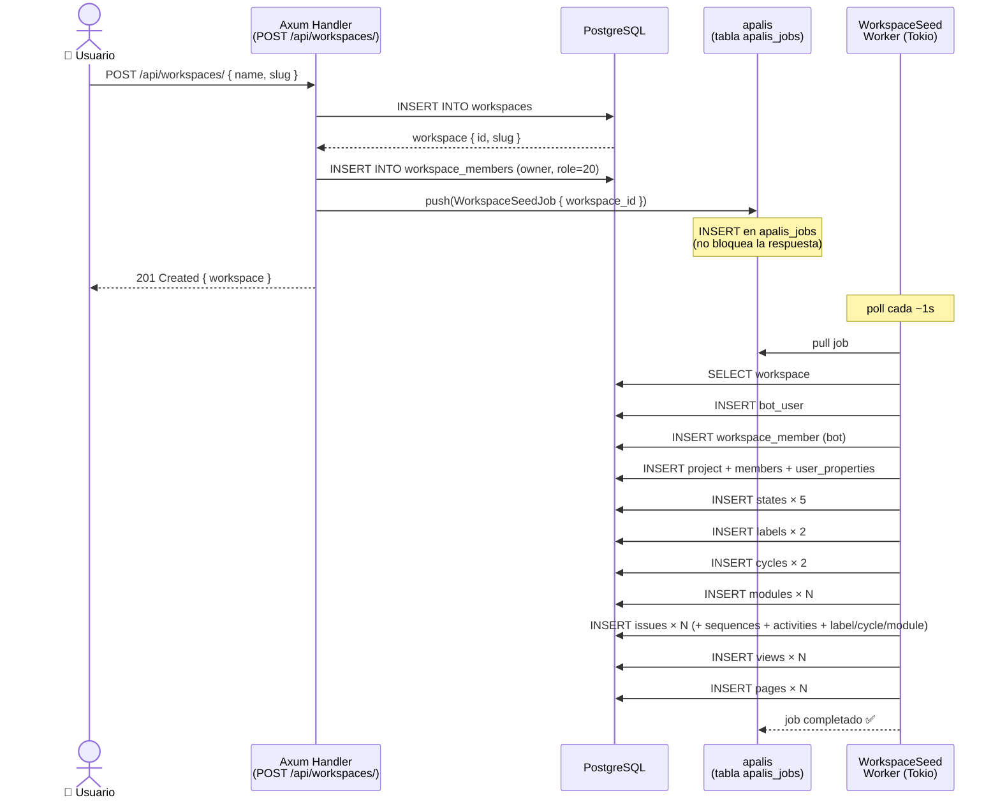
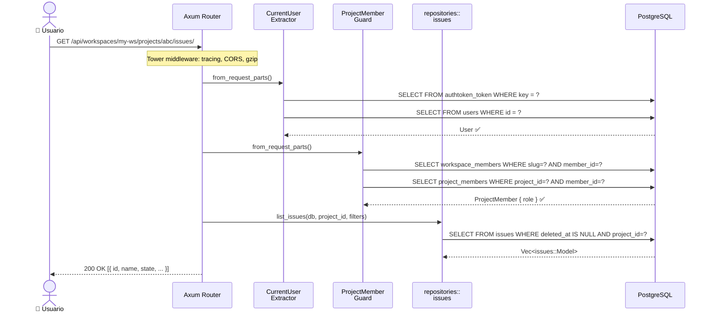

## Integración en el flujo — diagramas de secuencia

### Creación de workspace + seed asíncrono

```mermaid
sequenceDiagram
    actor User as 🧑 Usuario
    participant Axum as Axum Handler<br/>(POST /api/workspaces/)
    participant DB as PostgreSQL
    participant Apalis as apalis<br/>(tabla apalis_jobs)
    participant Worker as WorkspaceSeed<br/>Worker (Tokio)

    User->>Axum: POST /api/workspaces/ { name, slug }
    Axum->>DB: INSERT INTO workspaces
    DB-->>Axum: workspace { id, slug }
    Axum->>DB: INSERT INTO workspace_members (owner, role=20)
    Axum->>Apalis: push(WorkspaceSeedJob { workspace_id })
    Note over Apalis: INSERT en apalis_jobs<br/>(no bloquea la respuesta)
    Axum-->>User: 201 Created { workspace }

    Note over Worker: poll cada ~1s
    Worker->>Apalis: pull job
    Worker->>DB: SELECT workspace
    Worker->>DB: INSERT bot_user
    Worker->>DB: INSERT workspace_member (bot)
    Worker->>DB: INSERT project + members + user_properties
    Worker->>DB: INSERT states × 5
    Worker->>DB: INSERT labels × 2
    Worker->>DB: INSERT cycles × 2
    Worker->>DB: INSERT modules × N
    Worker->>DB: INSERT issues × N (+ sequences + activities + label/cycle/module)
    Worker->>DB: INSERT views × N
    Worker->>DB: INSERT pages × N
    Worker-->>Apalis: job completado ✅
```

### Flujo de request autenticado (issues)

```mermaid
sequenceDiagram
    actor User as 🧑 Usuario
    participant Axum as Axum Router
    participant Auth as CurrentUser<br/>Extractor
    participant Guard as ProjectMember<br/>Guard
    participant Repo as repositories::<br/>issues
    participant DB as PostgreSQL

    User->>Axum: GET /api/workspaces/my-ws/projects/abc/issues/
    Note over Axum: Tower middleware: tracing, CORS, gzip
    Axum->>Auth: from_request_parts()
    Auth->>DB: SELECT FROM authtoken_token WHERE key = ?
    Auth->>DB: SELECT FROM users WHERE id = ?
    DB-->>Auth: User ✅
    Axum->>Guard: from_request_parts()
    Guard->>DB: SELECT workspace_members WHERE slug=? AND member_id=?
    Guard->>DB: SELECT project_members WHERE project_id=? AND member_id=?
    DB-->>Guard: ProjectMember { role } ✅
    Axum->>Repo: list_issues(db, project_id, filters)
    Repo->>DB: SELECT FROM issues WHERE deleted_at IS NULL AND project_id=?
    DB-->>Repo: Vec<issues::Model>
    Axum-->>User: 200 OK [{ id, name, state, ... }]
```

---

