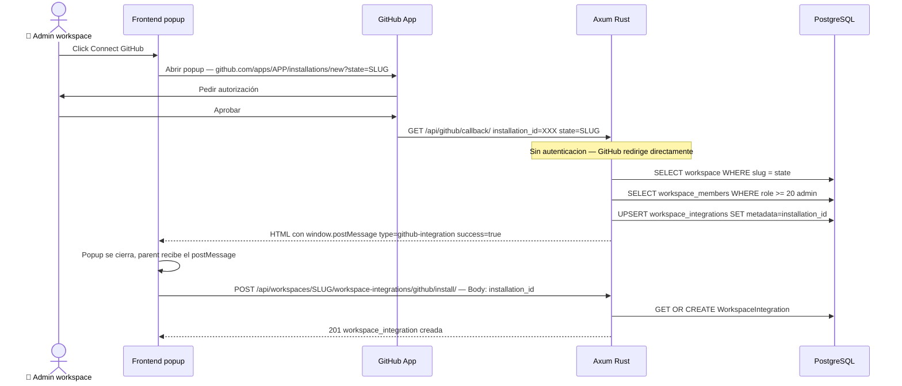

> [!NOTE] Entidades ya generadas
> Todas las entidades SeaORM de integraciones están en `src/entities/`.
> Ver tabla al final de esta nota.

## Integraciones — GitHub, GitLab, Slack

### Visión general

Plane soporta 3 integraciones externas. Sus filas maestras viven en la tabla
`integrations` (3 filas estáticas, insertadas por `m007_seed_data`). La
instalación por workspace se registra en `workspace_integrations`.

| Integración | Provider key | Autenticación          | Función principal                         |
| ----------- | ------------ | ---------------------- | ----------------------------------------- |
| **GitHub**  | `github`     | GitHub App (JWT+token) | Sync bidireccional issues/PRs, webhooks   |
| **GitLab**  | `gitlab`     | OAuth 2.0 code flow    | Sync bidireccional issues/comentarios     |
| **Slack**   | `slack`      | OAuth 2.0 code flow    | Notificaciones de actividad en canales    |

---

### Modelo de datos — relaciones clave

```
integrations (3 filas estáticas)
    └─ workspace_integrations           (1 por workspace por proveedor)
            ├─ metadata: { installation_id }   (GitHub)
            ├─ config:   { installation_id }   (GitHub)
            ├─ actor_id → users.id             (admin que instaló)
            └─ api_token_id → api_tokens.id

github_repositories       (1 por repo conectado a un proyecto)
    └─ github_repository_syncs          (1 por proyecto+repo)
            ├─ credentials: { sync_direction, issue_open_state, issue_closed_state }
            ├─ workspace_integration_id
            ├─ actor_id
            └─ label_id (opcional)

github_issue_syncs         (1 por issue importado de GitHub)
    ├─ issue_id → issues.id
    └─ repository_sync_id

github_comment_syncs       (1 por comment importado)
    ├─ comment_id → issue_comments.id
    └─ issue_sync_id

db_githubprstatemapping    (mapeo PR state → Plane state)
    ├─ workspace_integration_id
    ├─ project_id
    ├─ state_id → states.id
    └─ github_pr_state: draft_open|open|review_requested|ready_for_merge|merged|closed

slack_project_syncs        (1 por proyecto con Slack conectado)
    ├─ access_token, bot_user_id, webhook_url
    ├─ team_id, team_name
    └─ workspace_integration_id

gitlab_repositories / gitlab_repository_syncs / gitlab_issue_syncs / gitlab_comment_syncs
    (mismo patrón que GitHub)

user_github_connections    (conexión OAuth personal por usuario)
    ├─ github_user_id, github_username, github_avatar_url
    └─ access_token (token OAuth personal del usuario)
```

---

### Endpoints a implementar en Rust

#### Globales (sin workspace)

```
GET  /api/github/callback/
     ← GithubAppCallbackEndpoint (sin auth — GitHub App Setup URL)
     ← Parámetros: installation_id, setup_action, state={workspace_slug}
     ← Devuelve HTML con postMessage al opener + cierra popup

POST /api/auth/github/user-callback/
     ← UserGithubConnectionView (auth requerida)
     ← Body: code
     ← Intercambia code por access_token OAuth personal del usuario
```

#### Por workspace (requieren WorkspaceAdmin)

```
GET    /api/integrations/
       ← Lista las 3 integraciones globales (github, gitlab, slack)

GET    /api/workspaces/{slug}/workspace-integrations/
POST   /api/workspaces/{slug}/workspace-integrations/
GET    /api/workspaces/{slug}/workspace-integrations/{pk}/
PATCH  /api/workspaces/{slug}/workspace-integrations/{pk}/
DELETE /api/workspaces/{slug}/workspace-integrations/{pk}/
DELETE /api/workspaces/{slug}/workspace-integrations/{provider}/provider/

POST   /api/workspaces/{slug}/workspace-integrations/{provider}/install/
       ← OAuth callback: body varía por proveedor:
           github: { installation_id }
           gitlab: { code }
           slack:  { code }  ← intercambia code por token Slack

GET    /api/workspaces/{slug}/workspace-integrations/{wi_id}/github-repositories/
       ← Lista repos accesibles por la GitHub App installation
       ← Paginado: ?page=1 (30 repos por página)

GET    /api/workspaces/{slug}/workspace-integrations/github/repo-syncs/
POST   /api/workspaces/{slug}/workspace-integrations/github/repo-syncs/
DELETE /api/workspaces/{slug}/workspace-integrations/github/repo-syncs/{pk}/

GET    /api/workspaces/{slug}/workspace-integrations/{wi_id}/pr-state-mappings/
POST   /api/workspaces/{slug}/workspace-integrations/{wi_id}/pr-state-mappings/
DELETE /api/workspaces/{slug}/workspace-integrations/{wi_id}/pr-state-mappings/{pk}/
```

---

### Flujo OAuth — GitHub App (el más complejo)



#### Generación del JWT para GitHub App

```rust
// src/utils/github_app.rs

use jsonwebtoken::{encode, Algorithm, EncodingKey, Header};
use base64::{engine::general_purpose, Engine as _};
use reqwest::Client;
use serde_json::Value;

#[derive(serde::Serialize)]
struct AppClaims {
    iat: i64,
    exp: i64,
    iss: String,
}

/// Genera un installation access token usando la GitHub App private key.
/// Configuración leída desde instance_configurations:
///   - GITHUB_APP_ID        (numérico)
///   - GITHUB_APP_PRIVATE_KEY (PEM base64-encoded)
pub async fn get_installation_access_token(
    db: &DatabaseConnection,
    installation_id: &str,
) -> anyhow::Result<Option<String>> {
    let app_id = get_instance_config(db, "GITHUB_APP_ID").await?;
    let private_key_b64 = get_instance_config(db, "GITHUB_APP_PRIVATE_KEY").await?;

    let (Some(app_id), Some(key_b64)) = (app_id, private_key_b64) else {
        return Ok(None); // GitHub App no configurado
    };

    // Decodificar PEM desde base64
    let pem = general_purpose::STANDARD.decode(&key_b64)?;
    let encoding_key = EncodingKey::from_rsa_pem(&pem)?;

    // JWT firmado con RS256 — válido 10 minutos
    let now = chrono::Utc::now().timestamp();
    let claims = AppClaims { iat: now - 60, exp: now + 600, iss: app_id };
    let app_jwt = encode(&Header::new(Algorithm::RS256), &claims, &encoding_key)?;

    // Intercambiar JWT por installation access token
    let resp = Client::new()
        .post(format!(
            "https://api.github.com/app/installations/{installation_id}/access_tokens"
        ))
        .header("Authorization", format!("Bearer {app_jwt}"))
        .header("Accept", "application/vnd.github+json")
        .header("X-GitHub-Api-Version", "2022-11-28")
        .send().await?;

    if resp.status().is_success() {
        let body: Value = resp.json().await?;
        Ok(body["token"].as_str().map(String::from))
    } else {
        Ok(None)
    }
}
```

**Dependencias Cargo.toml necesarias:**

```toml
jsonwebtoken = { version = "9", features = [] }
base64 = "0.22"
```

---

### Flujo OAuth — Slack

```mermaid
sequenceDiagram
    actor User as 🧑 Admin workspace
    participant Frontend
    participant Slack as Slack OAuth
    participant Rust as Axum

    User->>Frontend: Click Connect Slack
    Frontend->>Slack: Abrir popup → slack.com/oauth/v2/authorize?client_id=...
    Slack->>User: Autorizar
    Slack-->>Frontend: Redirect con ?code=XXX
    Frontend->>Rust: POST /api/workspaces/SLUG/workspace-integrations/slack/install/ — Body: code
    Rust->>Slack: POST https://slack.com/api/oauth.v2.access
                  client_id + client_secret + code
    Slack-->>Rust: access_token + team id + team name
    Rust->>DB: UPSERT workspace_integrations
               metadata = slack_response
               config: access_token + team_id + team_name
    Rust-->>Frontend: 201 workspace_integration creada
```

**Variables de instancia requeridas (instance_configurations):**
- `SLACK_CLIENT_ID`
- `SLACK_CLIENT_SECRET`

---

### Job apalis — GithubInitialIssueSyncJob

Al crear un `GithubRepositorySync`, se dispara un job apalis para
importar en bulk los issues existentes del repo en GitHub:

```rust
// src/jobs/github_sync.rs

#[derive(Debug, Clone, Serialize, Deserialize)]
pub struct GithubInitialIssueSyncJob {
    pub repo_sync_id: Uuid,
}

pub async fn handle_github_initial_sync(
    job: GithubInitialIssueSyncJob,
    ctx: Data<DatabaseConnection>,
) -> Result<(), apalis::prelude::Error> {
    let db = ctx.as_ref();

    let sync = github_repository_syncs::Entity::find_by_id(job.repo_sync_id)
        .find_also_related(github_repositories::Entity)
        .one(db).await
        .map_err(|e| apalis::prelude::Error::Failed(e.to_string().into()))?;

    let Some((sync, Some(repo))) = sync else {
        tracing::warn!("GithubInitialIssueSyncJob: sync {} not found", job.repo_sync_id);
        return Ok(());
    };

    // Obtener installation_id desde workspace_integration
    let wi = workspace_integrations::Entity::find_by_id(sync.workspace_integration_id)
        .one(db).await?
        .ok_or_else(|| apalis::prelude::Error::Failed("workspace_integration not found".into()))?;

    let installation_id = wi.metadata["installation_id"]
        .as_str()
        .ok_or_else(|| apalis::prelude::Error::Failed("no installation_id".into()))?;

    let token = get_installation_access_token(db, installation_id).await
        .map_err(|e| apalis::prelude::Error::Failed(e.to_string().into()))?
        .ok_or_else(|| apalis::prelude::Error::Failed("could not obtain GitHub token".into()))?;

    // Paginar GET /repos/{owner}/{repo}/issues?state=all&per_page=100
    import_github_issues(db, &sync, &repo, &token).await
        .map_err(|e| apalis::prelude::Error::Failed(e.to_string().into()))
}

async fn import_github_issues(
    db: &DatabaseConnection,
    sync: &github_repository_syncs::Model,
    repo: &github_repositories::Model,
    token: &str,
) -> anyhow::Result<()> {
    let client = reqwest::Client::new();
    let credentials = sync.credentials.as_object().cloned().unwrap_or_default();
    let open_state_id = credentials.get("issue_open_state")
        .and_then(|v| v.as_str())
        .and_then(|s| Uuid::parse_str(s).ok());
    let closed_state_id = credentials.get("issue_closed_state")
        .and_then(|v| v.as_str())
        .and_then(|s| Uuid::parse_str(s).ok());

    let mut page = 1u32;
    loop {
        let resp: Vec<serde_json::Value> = client
            .get(format!(
                "https://api.github.com/repos/{}/{}/issues",
                repo.owner, repo.name
            ))
            .header("Authorization", format!("Bearer {token}"))
            .header("Accept", "application/vnd.github+json")
            .header("X-GitHub-Api-Version", "2022-11-28")
            .query(&[("state", "all"), ("per_page", "100"), ("page", &page.to_string())])
            .send().await?
            .json().await?;

        if resp.is_empty() { break; }

        for gh_issue in &resp {
            // Skip PRs (GitHub API devuelve PRs en /issues si tienen pull_request key)
            if gh_issue.get("pull_request").is_some() { continue; }

            let gh_issue_id = gh_issue["id"].as_i64().unwrap_or(0);
            let gh_issue_number = gh_issue["number"].as_i64().unwrap_or(0);

            // Verificar idempotencia: no reimportar si ya existe GithubIssueSync
            let exists = github_issue_syncs::Entity::find()
                .filter(github_issue_syncs::Column::GithubIssueId.eq(gh_issue_id))
                .filter(github_issue_syncs::Column::RepositorySyncId.eq(sync.id))
                .count(db).await? > 0;
            if exists { continue; }

            // Determinar state de Plane según estado del issue en GitHub
            let gh_state = gh_issue["state"].as_str().unwrap_or("open");
            let plane_state_id = if gh_state == "closed" {
                closed_state_id
            } else {
                open_state_id
            };

            // Crear Issue en Plane
            let issue = issues::ActiveModel {
                id: Set(Uuid::new_v4()),
                name: Set(gh_issue["title"].as_str().unwrap_or("").to_string()),
                description_html: Set(Some(format!(
                    "<p>{}</p>",
                    gh_issue["body"].as_str().unwrap_or("")
                ))),
                state_id: Set(plane_state_id),
                project_id: Set(sync.project_id),
                workspace_id: Set(sync.workspace_id),
                // …otros campos
                ..Default::default()
            }.insert(db).await?;

            // Crear GithubIssueSync
            github_issue_syncs::ActiveModel {
                id: Set(Uuid::new_v4()),
                repo_issue_id: Set(gh_issue_number),
                github_issue_id: Set(gh_issue_id),
                issue_url: Set(gh_issue["html_url"].as_str().unwrap_or("").to_string()),
                issue_id: Set(issue.id),
                repository_sync_id: Set(sync.id),
                project_id: Set(sync.project_id),
                workspace_id: Set(sync.workspace_id),
                ..Default::default()
            }.insert(db).await?;
        }

        page += 1;
    }
    Ok(())
}
```

**Disparar el job desde el handler de creación de repo sync:**

```rust
// En routes/integrations.rs — POST github/repo-syncs/
state.job_storage
    .push(GithubInitialIssueSyncJob { repo_sync_id: new_sync.id })
    .await
    .ok(); // best-effort, no bloquear la respuesta
```

---

### Helper — HTML postMessage para callbacks OAuth

Reutilizable para GitHub, GitLab, Slack — devuelve una página HTML
mínima que cierra el popup y notifica al parent:

```rust
// src/utils/oauth_popup.rs

use axum::response::Html;

pub fn postmessage_html(success: bool, message_type: &str, error: Option<&str>) -> Html<String> {
    let error_json = error
        .map(|e| format!(r#", "error": "{}""#, e.replace('"', "\\\"")))
        .unwrap_or_default();
    let success_str = if success { "true" } else { "false" };

    Html(format!(r#"<!DOCTYPE html>
<html>
<head><meta charset="utf-8"><title>Connecting…</title></head>
<body>
<script>
(function(){{
  try{{
    window.opener && window.opener.postMessage(
      {{"type":"{message_type}","success":{success_str}{error_json}}},
      window.location.origin
    );
  }}catch(e){{}}
  window.close();
}})();
</script>
<p style="font-family:sans-serif;text-align:center;margin-top:4rem;">
  {}
</p>
</body>
</html>"#,
        if success {
            "Integration connected. You may close this window."
        } else {
            "An error occurred. You may close this window."
        }
    ))
}
```

---

### Registro del webhook en GitHub

Al crear un `GithubRepositorySync`, Rust debe registrar el webhook
en GitHub para recibir eventos en tiempo real:

```rust
// src/utils/github_webhooks.rs

pub async fn register_github_webhook(
    db: &DatabaseConnection,
    workspace_integration: &workspace_integrations::Model,
    owner: &str,
    repo_name: &str,
    web_url: &str,
    webhook_secret: &str,
) -> anyhow::Result<()> {
    let installation_id = workspace_integration.metadata["installation_id"]
        .as_str()
        .ok_or_else(|| anyhow::anyhow!("no installation_id"))?;

    let token = get_installation_access_token(db, installation_id).await?
        .ok_or_else(|| anyhow::anyhow!("could not obtain token"))?;

    let client = reqwest::Client::new();
    client
        .post(format!("https://api.github.com/repos/{owner}/{repo_name}/hooks"))
        .header("Authorization", format!("Bearer {token}"))
        .header("Accept", "application/vnd.github+json")
        .header("X-GitHub-Api-Version", "2022-11-28")
        .json(&serde_json::json!({
            "name": "web",
            "config": {
                "url": format!("{web_url}/api/github-webhook/"),
                "content_type": "json",
                "secret": webhook_secret,
            },
            "events": ["issues", "pull_request", "issue_comment"],
            "active": true,
        }))
        .send().await?;
    // Fallo silencioso — no bloquear creación del sync
    Ok(())
}
```

---

### Variables de entorno por integración

Leídas desde `instance_configurations` (vía helper `get_instance_config`)
con fallback a variables de entorno. Se configuran en "God Mode" (admin panel).

| Variable                  | Integración | Uso                                        |
| ------------------------- | ----------- | ------------------------------------------ |
| `GITHUB_APP_ID`           | GitHub      | ID de la GitHub App para firmar JWT        |
| `GITHUB_APP_PRIVATE_KEY`  | GitHub      | PEM base64 para firmar JWT RS256           |
| `GITHUB_CLIENT_ID`        | GitHub      | OAuth personal connection (user-callback)  |
| `GITHUB_CLIENT_SECRET`    | GitHub      | OAuth personal connection (user-callback)  |
| `GITHUB_WEBHOOK_SECRET`   | GitHub      | Verificar firma HMAC de webhooks entrantes |
| `SLACK_CLIENT_ID`         | Slack       | OAuth app install flow                     |
| `SLACK_CLIENT_SECRET`     | Slack       | Intercambiar code por access_token         |

```rust
// src/utils/instance_config.rs

pub async fn get_instance_config(
    db: &DatabaseConnection,
    key: &str,
) -> anyhow::Result<Option<String>> {
    // 1. Buscar en instance_configurations (prioridad DB sobre env)
    if let Some(row) = instance_configurations::Entity::find()
        .filter(instance_configurations::Column::Key.eq(key))
        .one(db).await?
    {
        if !row.value.is_empty() {
            return Ok(Some(row.value));
        }
    }
    // 2. Fallback a variable de entorno
    Ok(std::env::var(key).ok())
}
```

---

### Cosas críticas — Integraciones

#### 1. `GET /api/github/callback/` es **sin autenticación**

GitHub App redirige el popup directamente a esta URL. El handler no puede
usar `CurrentUser` extractor. Debe tener `authentication_classes = []`.
En Rust: no agregar `CurrentUser` a la firma del handler, usar un
`Router` separado sin middleware de auth para esta ruta.

#### 2. GithubAppCallbackEndpoint busca el primer admin del workspace

El callback es unauthenticated pero `workspace_integrations.actor_id` es
NOT NULL. Se busca el primer `WorkspaceMember` con `role >= 20`. Si no
existe → error. **No usar el usuario actual** (no hay uno).

#### 3. Soft-delete en `GithubRepository` y `GithubRepositorySync`

Al crear un repo sync, primero buscar con `all_objects` (incluyendo
`deleted_at IS NOT NULL`) para no violar el constraint unique de Postgres.
Si existe uno soft-deleted → resucitar con `deleted_at = NULL`.
En Rust: **no usar `.active()`** en estas queries de creación — usar
filtro explícito sin `.active()` para incluir soft-deleted.

#### 4. GitHub devuelve PRs en el endpoint de issues

`GET /repos/{owner}/{repo}/issues` incluye Pull Requests. Filtrar
los que tengan `"pull_request"` key en el JSON antes de crear Issues en Plane.

#### 5. PR State Mapping — enum Postgres

`github_pr_state` es un enum con valores exactos:
`draft_open`, `open`, `review_requested`, `ready_for_merge`, `merged`, `closed`.
En SeaORM se puede modelar como `String` o como enum Rust derivado.
**Constraint unique:** `(workspace_integration_id, project_id, github_pr_state)`.

#### 6. Instalación Slack — intercambio de code en el backend

A diferencia de GitHub (que llama al callback del servidor directamente),
Slack envía el `code` al **frontend** que lo reenvía al backend via
`POST /install/`. El backend hace el intercambio con `slack.com/api/oauth.v2.access`.
Esto significa que `SLACK_CLIENT_ID` y `SLACK_CLIENT_SECRET` son requeridos
en el backend Rust, no en el frontend.

#### 7. Paginación de repos GitHub — dos endpoints distintos

- **GitHub App token** → `GET /installation/repositories` (devuelve `{ total_count, repositories: [...] }`)
- **Personal OAuth token** → `GET /user/repos` (devuelve array plano)

La lógica de selección de endpoint es: si `workspace_integration.metadata.installation_id`
existe → usar endpoint de installation. Rust debe manejar ambos casos en el mismo handler.

#### 8. Webhook registration — best-effort, never block

El registro del webhook en GitHub al crear un repo sync puede fallar
(credenciales no configuradas, GitHub caído). **Nunca** hacer que esto
falle la creación del sync. Usar `let _ = register_github_webhook(...).await;`
o `if let Err(e) = ... { tracing::warn!(...) }`.

#### 9. `user_github_connections` — token personal del usuario, no del workspace

Es una conexión individual (tabla `user_github_connections`) distinta al
`workspace_integrations`. Se crea/actualiza via `POST /auth/github/user-callback/`
con el OAuth personal del usuario (no la GitHub App). Requiere
`GITHUB_CLIENT_ID` y `GITHUB_CLIENT_SECRET` (OAuth App, no GitHub App).

---

### Entidades Rust ya generadas ✅

Todas las entidades de integraciones están generadas en `src/entities/`:

| Entidad Rust                           | Tabla DB                        |
| -------------------------------------- | ------------------------------- |
| `integrations.rs`                      | `integrations`                  |
| `workspace_integrations.rs`            | `workspace_integrations`        |
| `github_repositories.rs`              | `github_repositories`           |
| `github_repository_syncs.rs`          | `github_repository_syncs`       |
| `github_issue_syncs.rs`               | `github_issue_syncs`            |
| `github_comment_syncs.rs`             | `github_comment_syncs`          |
| `db_githubprstatemapping.rs`          | `db_githubprstatemapping`       |
| `user_github_connections.rs`          | `user_github_connections`       |
| `gitlab_repositories.rs`             | `gitlab_repositories`           |
| `gitlab_repository_syncs.rs`         | `gitlab_repository_syncs`       |
| `gitlab_issue_syncs.rs`              | `gitlab_issue_syncs`            |
| `gitlab_comment_syncs.rs`            | `gitlab_comment_syncs`          |
| `slack_project_syncs.rs`             | `slack_project_syncs`           |

---

### Plan de implementación — integraciones en Rust (Fase 2 extendida)

```
[ ] src/utils/github_app.rs         — get_installation_access_token (JWT RS256)
[ ] src/utils/instance_config.rs    — get_instance_config (DB + env fallback)
[ ] src/utils/oauth_popup.rs        — postmessage_html helper
[ ] src/utils/github_webhooks.rs    — register_github_webhook
[ ] src/routes/integrations.rs      — todos los endpoints listados arriba
[ ] src/jobs/github_sync.rs         — GithubInitialIssueSyncJob (apalis)
[ ] Cargo.toml: agregar jsonwebtoken = "9", base64 = "0.22"
[ ] Router: ruta /api/github/callback/ sin middleware de auth
```

Prioridad de implementación:

1. `GET /api/integrations/` — sin lógica compleja, desbloquea el panel de integraciones en el frontend
2. `GET/POST/DELETE /api/workspaces/{slug}/workspace-integrations/` — CRUD básico
3. `GET /api/github/callback/` + `POST /install/` — flujo de instalación completo
4. `GET /github-repositories/` — lista de repos (requiere GitHub App JWT)
5. `POST/DELETE github/repo-syncs/` — crear sync + disparar job de importación
6. `GET/POST/DELETE pr-state-mappings/` — CRUD de mappings PR state
7. `POST /auth/github/user-callback/` — conexión personal GitHub

---

