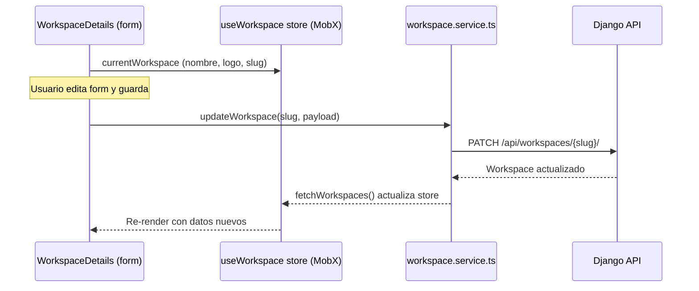
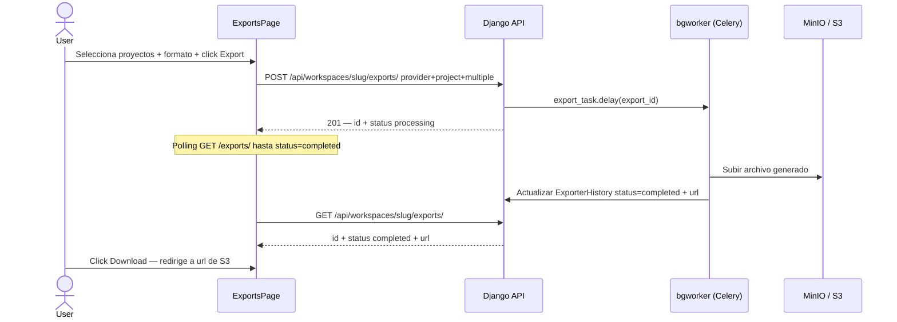
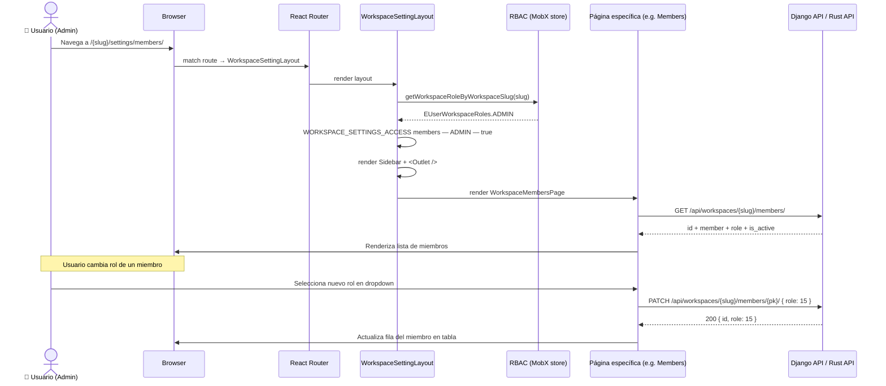

> [!NOTE] Panel de configuración del workspace
> Accesible desde `/{workspaceSlug}/settings/`.
> Control de acceso basado en `WORKSPACE_SETTINGS_ACCESS` y rol MobX del usuario.

## Flujo de Workspace Settings

### Visión general

El panel de Workspace Settings es la interfaz de administración del workspace.
Se accede desde `/{workspaceSlug}/settings/` y expone 6 secciones agrupadas en
3 categorías. El acceso está controlado por el rol del usuario en el workspace.

---

### Índice de secciones de Workspace Settings

| # | Sección | Ruta frontend | Endpoint Django principal | Roles con acceso |
|---|---------|--------------|--------------------------|-----------------|
| WS-1 | [General](#ws-1--general) | `/{slug}/settings/` | `GET/PATCH /api/workspaces/{slug}/` | Admin, Member |
| WS-2 | [Members](#ws-2--members) | `/{slug}/settings/members/` | `GET /api/workspaces/{slug}/members/` | Admin, Member |
| WS-3 | [Billing & Plans](#ws-3--billing--plans) | `/{slug}/settings/billing/` | (cloud only — CE vacío) | Admin |
| WS-4 | [Exports](#ws-4--exports) | `/{slug}/settings/exports/` | `GET/POST /api/workspaces/{slug}/exports/` | Admin, Member |
| WS-5 | [Integrations](#ws-5--integrations) | `/{slug}/settings/integrations/` | `GET /api/integrations/` | Admin |
| WS-6 | [Webhooks](#ws-6--webhooks) | `/{slug}/settings/webhooks/` | `GET/POST /api/workspaces/{slug}/webhooks/` | Admin |

---

### Arquitectura de capas

```
Browser
  └─ React Router → /{workspaceSlug}/settings/*
       └─ Layout: WorkspaceSettingLayout
            ├─ RBAC check: WORKSPACE_SETTINGS_ACCESS[accessKey].includes(userRole)
            │    ↓ si false → <NotAuthorizedView section="settings" />
            ├─ Sidebar: WorkspaceSettingsSidebarRoot
            │    └─ WorkspaceSettingsSidebarItemCategories
            │         └─ GROUPED_WORKSPACE_SETTINGS[category]
            │              └─ filtrado por allowPermissions(item.access, WORKSPACE, slug)
            └─ <Outlet /> → página específica de la sección
```

**Constantes clave** (`packages/constants/src/settings/workspace.ts`):

```typescript
WORKSPACE_SETTINGS_CATEGORIES = ["administration", "features", "developer"]

GROUPED_WORKSPACE_SETTINGS = {
  administration: [general, members, billing-and-plans, export],
  features:       [integrations],
  developer:      [webhooks],
}

WORKSPACE_SETTINGS_ACCESS = {
  "/settings":              [Admin, Member],
  "/settings/members":      [Admin, Member],
  "/settings/billing":      [Admin],
  "/settings/exports":      [Admin, Member],
  "/settings/integrations": [Admin],
  "/settings/webhooks":     [Admin],
}
```

---

### WS-1 — General

**Propósito:** Editar nombre, logo, descripción y slug del workspace. También permite
eliminar el workspace (solo admin).

**Ruta frontend:** `/{workspaceSlug}/settings/`
**Componente raíz:** `apps/web/app/(all)/[workspaceSlug]/(settings)/settings/(workspace)/page.tsx`
**Componente principal:** `apps/web/core/components/workspace/settings/workspace-details.tsx`

**Flujo de datos:**



**Endpoints Django:**

| Método | URL | Acción | Permiso |
|--------|-----|--------|---------|
| `GET` | `/api/workspaces/{slug}/` | Obtener datos del workspace | WorkSpaceBasePermission |
| `PATCH` | `/api/workspaces/{slug}/` | Actualizar nombre, logo, etc. | WorkSpaceAdminPermission |
| `DELETE` | `/api/workspaces/{slug}/` | Eliminar workspace | WorkSpaceAdminPermission |

**Implementación Rust (Fase 2):**

```rust
// src/routes/workspaces.rs
Router::new()
    .route("/api/workspaces/:slug", get(get_workspace).patch(update_workspace).delete(delete_workspace))
// get_workspace: CurrentUser extractor + filter by slug + workspace_member check
// update_workspace: WorkspaceMemberGuard { role >= Admin (20) }
// delete_workspace: WorkspaceMemberGuard { role == Owner (20) }
```

---

### WS-2 — Members

**Propósito:** Ver, invitar, cambiar rol y expulsar miembros del workspace.

**Ruta frontend:** `/{workspaceSlug}/settings/members/`
**Componente raíz:** `apps/web/app/(all)/[workspaceSlug]/(settings)/settings/(workspace)/members/page.tsx`

**Sub-flujos:**

```
WorkspaceMembersPage
  ├─ WorkspaceMembersList       ← tabla de miembros activos
  │    └─ WorkspaceMembersListItem (rol dropdown, botón expulsar)
  ├─ SendWorkspaceInvitationModal ← formulario de invitación por email
  └─ MemberListFiltersDropdown  ← filtro por rol
```

**Endpoints Django:**

| Método | URL | Acción | Permiso |
|--------|-----|--------|---------|
| `GET` | `/api/workspaces/{slug}/members/` | Listar miembros activos | WorkSpaceBasePermission |
| `GET` | `/api/workspaces/{slug}/members/{pk}/` | Detalle de un miembro | WorkSpaceBasePermission |
| `PATCH` | `/api/workspaces/{slug}/members/{pk}/` | Cambiar rol | WorkSpaceAdminPermission |
| `DELETE` | `/api/workspaces/{slug}/members/{pk}/` | Expulsar miembro | WorkSpaceAdminPermission |
| `POST` | `/api/workspaces/{slug}/members/leave/` | El propio usuario abandona | WorkSpaceBasePermission |
| `GET` | `/api/workspaces/{slug}/invitations/` | Listar invitaciones pendientes | WorkSpaceAdminPermission |
| `POST` | `/api/workspaces/{slug}/invitations/` | Invitar por email | WorkSpaceAdminPermission |
| `DELETE` | `/api/workspaces/{slug}/invitations/{pk}/` | Cancelar invitación | WorkSpaceAdminPermission |
| `GET` | `/api/workspaces/{slug}/project-members/` | Miembros con proyectos | WorkSpaceBasePermission |

**Roles (EUserWorkspaceRoles):**

| Valor numérico | Nombre | Puede invitar | Puede cambiar roles | Puede expulsar |
|---------------|--------|:---:|:---:|:---:|
| 20 | Admin / Owner | ✅ | ✅ | ✅ |
| 15 | Member | ❌ | ❌ | ❌ |
| 10 | Viewer | ❌ | ❌ | ❌ |
| 5 | Guest | ❌ | ❌ | ❌ |

**Implementación Rust (Fase 2):**

```rust
// src/routes/workspaces.rs — miembros
Router::new()
    .route("/api/workspaces/:slug/members",          get(list_members))
    .route("/api/workspaces/:slug/members/:pk",      get(get_member).patch(update_member_role).delete(remove_member))
    .route("/api/workspaces/:slug/members/leave",    post(leave_workspace))
    .route("/api/workspaces/:slug/invitations",      get(list_invitations).post(create_invitation))
    .route("/api/workspaces/:slug/invitations/:pk",  delete(cancel_invitation))
```

---

### WS-3 — Billing & Plans

**Propósito:** Gestión de plan de suscripción.

**Estado en CE (self-hosted):** La página existe en el frontend pero el contenido
es un componente de `plane-web` que renderiza vacío o un banner de "upgrade" en
la edición Community. No hay endpoint de billing en la API de CE.

**Implementación Rust:** No requiere endpoints nuevos para CE. Si se implementa
la versión cloud, los endpoints de billing van en un router separado con
middleware de license check.

---

### WS-4 — Exports

**Propósito:** Exportar datos del workspace (issues, cycles, modules) a CSV/JSON.

**Ruta frontend:** `/{workspaceSlug}/settings/exports/`
**Componente raíz:** `apps/web/app/(all)/[workspaceSlug]/(settings)/settings/(workspace)/exports/page.tsx`

**Flujo:**



**Endpoints Django:**

| Método | URL | Acción |
|--------|-----|--------|
| `GET` | `/api/workspaces/{slug}/exports/` | Listar exports históricos |
| `POST` | `/api/workspaces/{slug}/exports/` | Iniciar nuevo export |
| `DELETE` | `/api/workspaces/{slug}/exports/{pk}/` | Eliminar registro |

**Implementación Rust (Fase 3 — requiere apalis):**

El export es asíncrono. En Rust se reemplaza el Celery task por un `apalis` worker:

```rust
#[derive(Debug, Clone, Serialize, Deserialize)]
pub struct ExportJob {
    pub export_id: Uuid,
    pub workspace_id: Uuid,
    pub project_ids: Vec<Uuid>,
    pub provider: String,   // "csv" | "json"
    pub multiple: bool,
}

pub async fn handle_export(job: ExportJob, ctx: Data<DatabaseConnection>) -> Result<(), apalis::prelude::Error> {
    // 1. Generar CSV/JSON en memoria
    // 2. Subir a S3/MinIO con aws-sdk-s3
    // 3. Actualizar exporter_histories.status = "completed" + url
}
```

---

### WS-5 — Integrations

**Propósito:** Conectar el workspace con GitHub App, GitLab y Slack.

**Ruta frontend:** `/{workspaceSlug}/settings/integrations/`
**Sub-ruta de detalle:** `/{workspaceSlug}/settings/integrations/{provider}/`

**Documentación completa:** ver sección [Integraciones — GitHub, GitLab, Slack](#integraciones--github-gitlab-slack) de este documento.

**Resumen de endpoints:**

| Método | URL | Acción |
|--------|-----|--------|
| `GET` | `/api/integrations/` | Listar las 3 integraciones disponibles (filas estáticas) |
| `GET` | `/api/workspaces/{slug}/workspace-integrations/` | Listar integraciones instaladas en el workspace |
| `POST` | `/api/workspaces/{slug}/workspace-integrations/{provider}/install/` | Instalar una integración (OAuth callback) |
| `DELETE` | `/api/workspaces/{slug}/workspace-integrations/{provider}/provider/` | Desinstalar integración |

**Flujo de la página de lista (`/settings/integrations/`):**

```
WorkspaceIntegrationsPage (useSWR)
  ├─ GET /api/integrations/            → lista de providers disponibles (3 filas)
  ├─ GET /api/workspaces/{slug}/workspace-integrations/ → integraciones instaladas
  └─ <SingleIntegrationCard /> × 3
       ├─ isEnabled: instancia config (IS_GITHUB_INTEGRATION_ENABLED etc.)
       ├─ isInstalled: workspace_integrations filtrado por provider
       ├─ Botón "Connect" → useIntegrationPopup → popup OAuth
       └─ Botón "Configure →" → navega a /settings/integrations/{provider}/
```

---

### WS-6 — Webhooks

**Propósito:** Registrar URLs externas que reciben notificaciones de eventos del workspace.

**Ruta frontend:** `/{workspaceSlug}/settings/webhooks/`
**Componente raíz:** `apps/web/app/(all)/[workspaceSlug]/(settings)/settings/(workspace)/webhooks/page.tsx`

**Flujo:**

```
WebhooksPage
  ├─ WebhooksList                  ← tabla de webhooks registrados
  │    └─ WebhookListItem          ← nombre, url, estado activo/inactivo
  └─ CreateWebhookModal            ← formulario: url + eventos a suscribir

WebhookDetailPage (/{webhookId}/)
  ├─ WebhookForm                   ← editar url, eventos, activo/inactivo
  └─ WebhookSecretSection          ← mostrar/regenerar secret
```

**Eventos disponibles (checkbox list en el form):**

| Evento | Descripción |
|--------|-------------|
| `issue` | Creación, actualización, eliminación de issues |
| `cycle` | Eventos de ciclos |
| `module` | Eventos de módulos |
| `issue_comment` | Comentarios en issues |
| `project` | Creación/actualización de proyectos |

**Endpoints Django:**

| Método | URL | Acción | Permiso |
|--------|-----|--------|---------|
| `GET` | `/api/workspaces/{slug}/webhooks/` | Listar webhooks | WorkSpaceAdminPermission |
| `POST` | `/api/workspaces/{slug}/webhooks/` | Crear webhook | WorkSpaceAdminPermission |
| `GET` | `/api/workspaces/{slug}/webhooks/{pk}/` | Detalle | WorkSpaceAdminPermission |
| `PATCH` | `/api/workspaces/{slug}/webhooks/{pk}/` | Editar | WorkSpaceAdminPermission |
| `DELETE` | `/api/workspaces/{slug}/webhooks/{pk}/` | Eliminar | WorkSpaceAdminPermission |
| `POST` | `/api/workspaces/{slug}/webhooks/{pk}/regenerate/` | Regenerar secret | WorkSpaceAdminPermission |

**Modelo Django (`Webhook`):**

```python
class Webhook(BaseModel):
    workspace   = ForeignKey(Workspace)
    url         = URLField()
    is_active   = BooleanField(default=True)
    secret_key  = CharField()   # HMAC secret para verificar payloads
    # eventos suscritos (BooleanField × evento)
    issue       = BooleanField(default=True)
    cycle       = BooleanField(default=False)
    module      = BooleanField(default=False)
    issue_comment = BooleanField(default=False)
    project     = BooleanField(default=False)
```

**Implementación Rust (Fase 2):**

```rust
// src/routes/workspaces.rs — webhooks
Router::new()
    .route("/api/workspaces/:slug/webhooks",
           get(list_webhooks).post(create_webhook))
    .route("/api/workspaces/:slug/webhooks/:pk",
           get(get_webhook).patch(update_webhook).delete(delete_webhook))
    .route("/api/workspaces/:slug/webhooks/:pk/regenerate",
           post(regenerate_webhook_secret))
// Todos requieren WorkspaceMemberGuard { role >= Admin (20) }
```

**Despacho de eventos webhook (Fase 3 — apalis):**

En Django, cada mutación (crear issue, etc.) dispara un signal que encola un
Celery task que hace el HTTP POST al URL del webhook. En Rust:

```rust
// src/jobs/webhooks.rs
#[derive(Debug, Clone, Serialize, Deserialize)]
pub struct WebhookDeliveryJob {
    pub webhook_id: Uuid,
    pub event_type: String,
    pub payload: serde_json::Value,
}

pub async fn handle_webhook_delivery(
    job: WebhookDeliveryJob,
    ctx: Data<DatabaseConnection>,
) -> Result<(), apalis::prelude::Error> {
    let db = ctx.as_ref();
    let webhook = webhooks::Entity::find_by_id(job.webhook_id)
        .one(db).await?
        .ok_or_else(|| apalis::prelude::Error::Failed("webhook not found".into()))?;

    if !webhook.is_active { return Ok(()); }

    // Firmar el payload con HMAC-SHA256
    let signature = compute_hmac_signature(&webhook.secret_key, &job.payload);

    let client = reqwest::Client::new();
    let _ = client.post(&webhook.url)
        .header("X-Plane-Delivery", Uuid::new_v4().to_string())
        .header("X-Plane-Event", &job.event_type)
        .header("X-Plane-Signature", signature)
        .json(&job.payload)
        .timeout(std::time::Duration::from_secs(30))
        .send().await;
    // Fallo silencioso — registrar en webhook_logs, no relanzar

    Ok(())
}
```

---

### Flujo completo de request en Workspace Settings



---

### Tabla de entidades SeaORM relevantes para Workspace Settings

| Sección | Entidad Rust | Tabla DB | Notas |
|---------|-------------|----------|-------|
| General | `workspaces.rs` | `workspaces` | PATCH + soft delete |
| Members | `workspace_members.rs` | `workspace_members` | Filtrar `is_active=true` |
| Members | `workspace_member_invites.rs` | `workspace_member_invites` | Estado: pending/accepted |
| Exports | `exporter_histories.rs` | `exporter_histories` | status: processing/completed/failed |
| Integrations | `workspace_integrations.rs` | `workspace_integrations` | Ver sección Integraciones |
| Integrations | `integrations.rs` | `integrations` | 3 filas estáticas (seed) |
| Webhooks | `webhooks.rs` | `webhooks` | secret_key para HMAC |
| Webhooks | `webhook_logs.rs` | `webhook_logs` | Historial de entregas |

---

### Prioridad de implementación en Rust

```
Fase 2 (endpoints de alta frecuencia):
  ✅ WS-1 General     → GET/PATCH /workspaces/{slug}/
  ✅ WS-2 Members     → CRUD completo de miembros e invitaciones
  [ ] WS-6 Webhooks   → CRUD + regenerate secret

Fase 3 (background jobs):
  [ ] WS-4 Exports    → ExportJob en apalis
  [ ] WS-6 Webhooks   → WebhookDeliveryJob en apalis (disparado desde mutations)

Fase 2 extendida (integraciones):
  [ ] WS-5 Integrations → ver sección Integraciones de este documento
```

