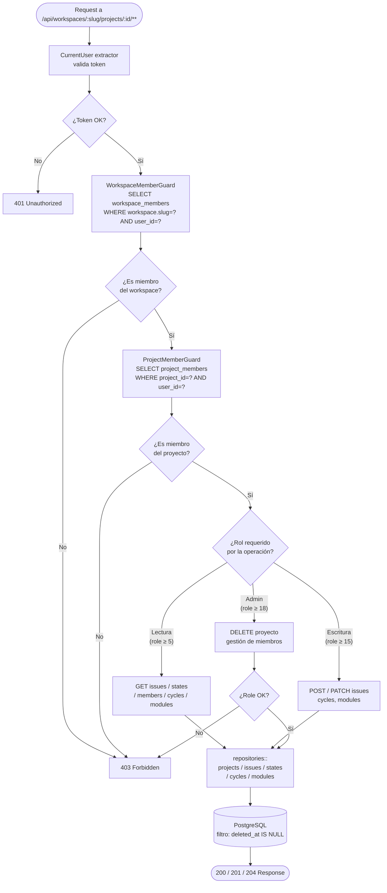
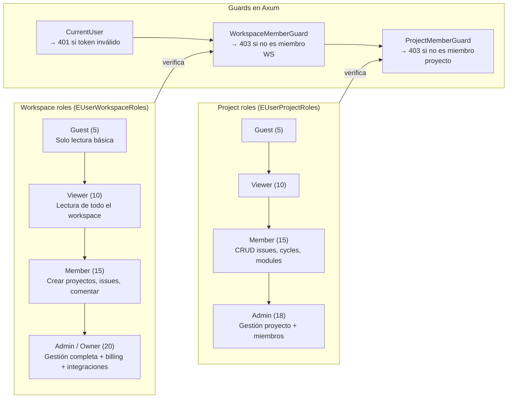
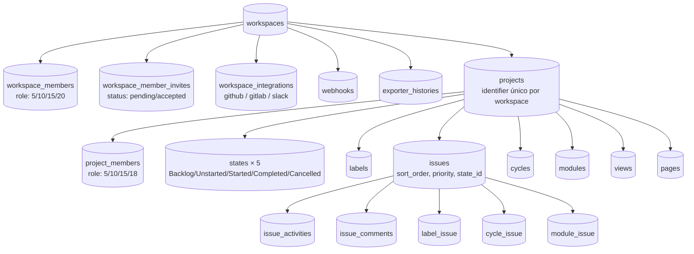

## Diagramas de flujo — Workspace y Projects

> Este documento complementa `[[11-diagramas-secuencia]]` con **diagramas de flujo** (flowcharts)
> que muestran la lógica de decisión y las rutas de acceso a las entidades principales.
> Los diagramas de secuencia muestran el *orden temporal*; estos muestran el *árbol de decisiones*.

---

## Workspace

### Flujo de creación y acceso al workspace

```mermaid
flowchart TD
    A([🧑 Request llega al router Axum]) --> B{¿Token Bearer\npresente?}

    B -- No --> ERR401[401 Unauthorized\nAppError::Unauthorized]
    B -- Sí --> C[CurrentUser extractor\nSELECT authtoken_token\n+ SELECT users]

    C --> D{¿Token válido\ny usuario activo?}
    D -- No --> ERR401
    D -- Sí --> E{¿Tipo de operación?}

    E -- Crear workspace --> CREATE[POST /api/workspaces/]
    E -- Operar en workspace --> F[WorkspaceMemberGuard\nSELECT workspace_members\nWHERE slug=? AND user_id=?]

    CREATE --> G[repositories::workspaces\n::create_workspace]
    G --> H[(INSERT workspaces)]
    H --> I[(INSERT workspace_members\nrole = Owner / 20)]
    I --> J[apalis: push\nWorkspaceSeedJob]
    J --> K([201 Created\n{ workspace }])

    F --> L{¿Es miembro?}
    L -- No --> ERR403[403 Forbidden\nAppError::Forbidden]
    L -- Sí --> M{¿Rol requerido?}

    M -- "Solo lectura\n(role ≥ 5)" --> READ_WS[GET /api/workspaces/:slug/]
    M -- "Admin\n(role ≥ 20)" --> ADMIN_WS[PATCH / DELETE\n/api/workspaces/:slug/]

    READ_WS --> N[repositories::workspaces\n::get_workspace_by_slug]
    ADMIN_WS --> O{¿DELETE?}

    O -- Sí --> P{¿Es Owner?}
    P -- No --> ERR403
    P -- Sí --> Q[soft_delete workspace\nUPDATE deleted_at = NOW]
    O -- No --> R[UPDATE workspaces\n{ name, logo, slug }]

    N --> RESP200([200 OK\n{ workspace }])
    R --> RESP200
    Q --> RESP204([204 No Content])
```

---

### Flujo del WorkspaceSeed Worker (apalis)

```mermaid
flowchart TD
    START([apalis poll → WorkspaceSeedJob\n{ workspace_id }]) --> WS[SELECT workspace]
    WS --> BOT[INSERT users\nbot_user_for_workspace]
    BOT --> WM[INSERT workspace_members\nbot como Member / 15]
    WM --> PROJ[INSERT projects\n'Default Project']
    PROJ --> PM[INSERT project_members\nowner + bot]
    PM --> UP[INSERT user_properties\n× miembros]
    UP --> ST[INSERT states × 5\nBacklog / Unstarted / Started / Completed / Cancelled]
    ST --> LB[INSERT labels × 2\nBug / Feature]
    LB --> CY[INSERT cycles × 2\nSprint 1 / Sprint 2]
    CY --> MOD[INSERT modules × N]
    MOD --> IS[INSERT issues × N\n+ sequences\n+ activities\n+ label_issue / cycle_issue / module_issue]
    IS --> VW[INSERT views × N]
    VW --> PG[INSERT pages × N]
    PG --> DONE([✅ job completado\napalis marca status = Success])
```

---

### Flujo de miembros e invitaciones

```mermaid
flowchart TD
    A([Admin navega a /settings/members/]) --> B[GET /api/workspaces/:slug/members/]
    B --> C[WorkspaceMemberGuard\nrole ≥ Member / 15]
    C --> D[repositories::workspace_members\n::list_members — filtra deleted_at IS NULL]
    D --> E([200 OK — lista de miembros])

    A2([Admin invita]) --> F[POST /api/workspaces/:slug/invitations/\n{ email, role }]
    F --> G[WorkspaceMemberGuard\nrole ≥ Admin / 20]
    G --> H{¿Email ya es miembro?}
    H -- Sí --> ERR409[409 Conflict]
    H -- No --> I[INSERT workspace_member_invites\nstatus = pending]
    I --> J[apalis: push EmailJob\ninvitación por correo]
    J --> K([201 Created { invite }])

    A3([Invitado acepta]) --> L[POST /api/auth/workspace-invitations/accept/\n{ token }]
    L --> M{¿Token válido\ny no expirado?}
    M -- No --> ERR410[410 Gone / 400]
    M -- Sí --> N[INSERT workspace_members\nrole = invite.role]
    N --> O[UPDATE workspace_member_invites\nstatus = accepted]
    O --> P([200 OK — acceso al workspace])

    A4([Admin expulsa miembro]) --> Q[DELETE /api/workspaces/:slug/members/:pk/]
    Q --> R[WorkspaceMemberGuard role ≥ Admin]
    R --> S{¿Intentando expulsar\nal único Owner?}
    S -- Sí --> ERR400[400 Bad Request]
    S -- No --> T[soft_delete workspace_member\n+ soft_delete project_members]
    T --> U([204 No Content])
```

---

## Projects

### Flujo de acceso a un proyecto (guard chain)



---

### Flujo CRUD de un proyecto

```mermaid
flowchart TD
    subgraph LIST["Listar proyectos"]
        L1[GET /api/workspaces/:slug/projects/] --> L2[WorkspaceMemberGuard]
        L2 --> L3[repositories::projects\n::list_projects_for_member]
        L3 --> L4[(SELECT projects JOIN project_members\nWHERE member_id=? AND deleted_at IS NULL)]
        L4 --> L5([200 OK — lista])
    end

    subgraph CREATE["Crear proyecto"]
        C1[POST /api/workspaces/:slug/projects/\n{ name, identifier, network }] --> C2[WorkspaceMemberGuard\nrole ≥ Member / 15]
        C2 --> C3[Validar identifier único\nen el workspace]
        C3 --> F1{¿Único?}
        F1 -- No --> E409[409 Conflict\nidentifier duplicado]
        F1 -- Sí --> C4[INSERT projects]
        C4 --> C5[INSERT project_members\ncreador como Admin / 18]
        C5 --> C6[INSERT states × 5\npor defecto]
        C6 --> C7([201 Created { project }])
    end

    subgraph UPDATE["Actualizar proyecto"]
        U1[PATCH /api/workspaces/:slug/projects/:id/\n{ name, description, network }] --> U2[ProjectMemberGuard\nrole ≥ Admin / 18]
        U2 --> U3[repositories::projects\n::update_project]
        U3 --> U4[(UPDATE projects SET ...)]
        U4 --> U5([200 OK { project }])
    end

    subgraph DELETE_P["Eliminar proyecto"]
        D1[DELETE /api/workspaces/:slug/projects/:id/] --> D2[ProjectMemberGuard\nrole ≥ Admin / 18]
        D2 --> D3[soft_delete\nUPDATE deleted_at = NOW]
        D3 --> D4([204 No Content])
    end
```

---

### Flujo de issues dentro de un proyecto

```mermaid
flowchart TD
    REQ([Request a /projects/:id/issues/**]) --> GRD[ProjectMemberGuard\ncadena completa CurrentUser → WS → Project]
    GRD --> OP{¿Operación?}

    OP -- "GET /issues/" --> LIST[repositories::issues\n::list_issues con IssueFilters\nstate_id, assignee_id, priority, label]
    OP -- "POST /issues/" --> CREATE[repositories::issues\n::create_issue]
    OP -- "GET /issues/:id/" --> DETAIL[repositories::issues\n::get_issue_by_id]
    OP -- "PATCH /issues/:id/" --> UPDATE[repositories::issues\n::update_issue]
    OP -- "DELETE /issues/:id/" --> DELETE[ProjectMemberGuard\nrole ≥ Member / 15\nsoft_delete issue]

    LIST --> FILT{¿Filtros aplicados?}
    FILT -- Sí --> Q1[(SELECT issues WHERE project_id=?\nAND deleted_at IS NULL\nAND filtros dinámicos)]
    FILT -- No --> Q2[(SELECT issues WHERE project_id=?\nAND deleted_at IS NULL\nORDER BY sort_order ASC)]

    CREATE --> VAL{¿Estado válido\ndentro del proyecto?}
    VAL -- No --> E422[422 Unprocessable Entity]
    VAL -- Sí --> INS[(INSERT issues\n+ INSERT issue_sequences\n+ INSERT issue_activities)]

    Q1 --> RESP200([200 OK — Vec issues])
    Q2 --> RESP200
    INS --> RESP201([201 Created { issue }])
    DETAIL --> Q3[(SELECT issue WHERE id=? AND deleted_at IS NULL)]
    Q3 --> RESP200
    UPDATE --> UPD[(UPDATE issues SET ...\n+ INSERT issue_activity)]
    UPD --> RESP200
    DELETE --> SD[(UPDATE issues SET deleted_at = NOW)]
    SD --> RESP204([204 No Content])
```

---

### Diagrama de roles por entidad



---

### Relación entidades Workspace ↔ Projects



---

## Resumen de rutas Rust por entidad

| Entidad | Método | Ruta | Guard mínimo | Fase |
|---------|--------|------|-------------|------|
| Workspaces | GET | `/api/workspaces/` | `CurrentUser` | 2 |
| Workspace | POST | `/api/workspaces/` | `CurrentUser` | 2 |
| Workspace | GET/PATCH/DELETE | `/api/workspaces/:slug/` | `WorkspaceMemberGuard` | 2 |
| WS Members | GET | `/api/workspaces/:slug/members/` | `WorkspaceMemberGuard (≥15)` | 2 |
| WS Members | PATCH/DELETE | `/api/workspaces/:slug/members/:pk/` | `WorkspaceMemberGuard (≥20)` | 2 |
| WS Invitations | GET/POST | `/api/workspaces/:slug/invitations/` | `WorkspaceMemberGuard (≥20)` | 2 |
| WS Webhooks | GET/POST | `/api/workspaces/:slug/webhooks/` | `WorkspaceMemberGuard (≥20)` | 2 |
| Projects | GET | `/api/workspaces/:slug/projects/` | `WorkspaceMemberGuard (≥5)` | 2 |
| Project | POST | `/api/workspaces/:slug/projects/` | `WorkspaceMemberGuard (≥15)` | 2 |
| Project | GET/PATCH/DELETE | `/api/workspaces/:slug/projects/:id/` | `ProjectMemberGuard (≥18 para PATCH/DELETE)` | 2 |
| Issues | GET/POST | `/api/workspaces/:slug/projects/:id/issues/` | `ProjectMemberGuard (≥5 GET, ≥15 POST)` | 2 |
| Issue | GET/PATCH/DELETE | `/api/workspaces/:slug/projects/:id/issues/:iid/` | `ProjectMemberGuard (≥15 PATCH/DELETE)` | 2 |
| States | GET | `/api/workspaces/:slug/projects/:id/states/` | `ProjectMemberGuard (≥5)` | 2 |
| Members | GET | `/api/workspaces/:slug/projects/:id/members/` | `ProjectMemberGuard (≥5)` | 2 |
| Cycles | GET/POST | `/api/workspaces/:slug/projects/:id/cycles/` | `ProjectMemberGuard (≥5 GET, ≥15 POST)` | 2 |
| Modules | GET/POST | `/api/workspaces/:slug/projects/:id/modules/` | `ProjectMemberGuard (≥5 GET, ≥15 POST)` | 2 |
| Exports | GET/POST | `/api/workspaces/:slug/exports/` | `WorkspaceMemberGuard (≥5)` | 3 |
