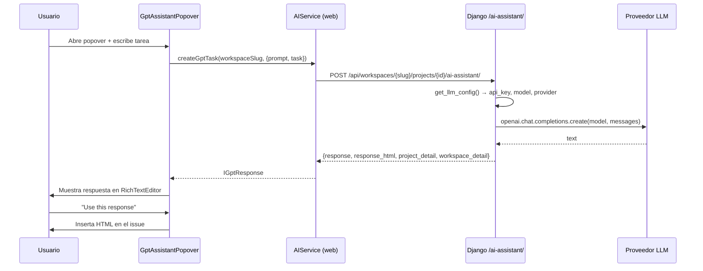
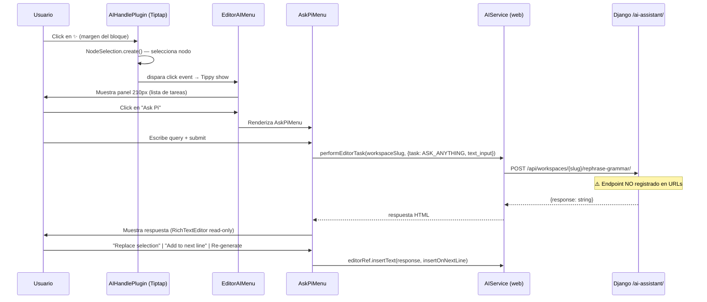

# 🤖 Dominio IA — Asistente Pi y Procesamiento de Texto

> [!SUMMARY] Objetivo
> Plane expone dos capacidades de IA a usuarios autenticados:
>
> 1. **Asistente libre (Pi)** — responde cualquier prompt en el contexto de un workspace o proyecto.
> 2. **Reformulación de texto (rephrase-grammar)** — mejora selecciones del editor con control de tono.
>
> Ambas capacidades son **multi-proveedor**: OpenAI, Anthropic y Gemini configurables desde el panel de administración.

---

## 🏗️ Arquitectura general

```
┌──────────────────────────────────────────────────────────────────┐
│                         Frontend (Next.js)                        │
│                                                                    │
│  ┌───────────────────┐        ┌──────────────────────────────┐   │
│  │  GptAssistantPop  │        │      EditorAIMenu            │   │
│  │  over.tsx         │        │  (pages editor — Pi menu)    │   │
│  │  (issue detail)   │        │                              │   │
│  └────────┬──────────┘        └──────────────┬───────────────┘   │
│           │ createGptTask()                   │ performEditorTask()│
│           │                                   │ (ASK_ANYTHING     │
│           │                                   │  → AskPiMenu)     │
│           ▼                                   ▼                   │
│        AIService (apps/web/core/services/ai.service.ts)          │
│        AIService (packages/services/src/ai/ai.service.ts)        │
└───────────────────────────────┬──────────────────────────────────┘
                                │ HTTP POST
                ┌───────────────▼──────────────────┐
                │          Django API               │
                │  plane/app/views/external/base.py │
                │                                   │
                │  POST /api/workspaces/{slug}/      │
                │       projects/{id}/ai-assistant/  │
                │    → GPTIntegrationEndpoint        │
                │                                   │
                │  POST /api/workspaces/{slug}/      │
                │       ai-assistant/                │
                │    → WorkspaceGPTIntegrationEndpoint│
                │                                   │
                │  POST /api/workspaces/{slug}/      │
                │       rephrase-grammar/            │
                │    → ⚠️ NO REGISTRADO (ver errores)│
                └───────────────┬──────────────────┘
                                │
                ┌───────────────▼──────────────────┐
                │       get_llm_response()          │
                │   (via openai SDK universal)      │
                │                                   │
                │  ┌──────────┐ ┌─────────────────┐│
                │  │  OpenAI  │ │   Anthropic      ││
                │  │ gpt-4o   │ │ claude-3-sonnet  ││
                │  │ gpt-4o-mi│ │ claude-3-haiku   ││
                │  │ o1-mini  │ │ claude-3-opus    ││
                │  └──────────┘ └─────────────────┘│
                │  ┌──────────┐                     │
                │  │  Gemini  │ (prefijo gemini/)   │
                │  │ gemini-pr│                     │
                │  │ 1.5-pro  │                     │
                │  └──────────┘                     │
                └───────────────────────────────────┘
```

---

## 📁 Mapa de archivos

| Capa                   | Archivo                                                          | Rol                                                  |
| ---------------------- | ---------------------------------------------------------------- | ---------------------------------------------------- |
| **Tipos**              | `packages/types/src/ai.ts`                                       | `IGptResponse` — respuesta del asistente de proyecto |
| **Tipos instancia**    | `packages/types/src/instance/ai.ts`                              | Keys de configuración: `LLM_API_KEY`, `LLM_MODEL`    |
| **Constantes**         | `packages/constants/src/ai.ts`                                   | Enum `AI_EDITOR_TASKS`                               |
| **Constantes web**     | `apps/web/core/constants/ai.ts`                                  | Enum + `LOADING_TEXTS` por tarea                     |
| **Servicio (paquete)** | `packages/services/src/ai/ai.service.ts`                         | `prompt()`, `rephraseGrammar()`                      |
| **Servicio (web)**     | `apps/web/core/services/ai.service.ts`                           | `createGptTask()`, `performEditorTask()`             |
| **Plugin editor**      | `packages/editor/src/core/plugins/ai-handle.ts`                  | Botón ✨ en el margen del editor (Tiptap)            |
| **Menú editor**        | `packages/editor/src/core/components/menus/ai-menu.tsx`          | `AIFeaturesMenu` — popover Tippy                     |
| **Tipos editor**       | `packages/editor/src/core/types/ai.ts`                           | `TAIHandler`, `TAIMenuProps`                         |
| **Menú Pi**            | `apps/web/ce/components/pages/editor/ai/menu.tsx`                | `EditorAIMenu` — panel lateral 700px                 |
| **Submenú Ask Pi**     | `apps/web/ce/components/pages/editor/ai/ask-pi-menu.tsx`         | Input libre + acciones de respuesta                  |
| **Popover issue**      | `apps/web/core/components/core/modals/gpt-assistant-popover.tsx` | `GptAssistantPopover` — desde detail de issue        |
| **Backend**            | `apps/api/plane/app/views/external/base.py`                      | Endpoints + proveedores LLM                          |
| **URLs**               | `apps/api/plane/app/urls/external.py`                            | Registro de rutas                                    |
| **Config instancia**   | `apps/api/plane/utils/instance_config_variables/core.py`         | Variables `LLM_*` en BD cifrada                      |
| **Admin UI**           | `apps/admin/app/(all)/(dashboard)/ai/`                           | Panel de configuración del operador                  |

---

## 🔄 Flujo de proceso — Asistente en issue detail



---

## 🔄 Flujo de proceso — Asistente Pi en editor de páginas



---

## ⚙️ Configuración de proveedores LLM

### Variables de instancia

| Variable       | Default           | Cifrada | Descripción                                |
| -------------- | ----------------- | ------- | ------------------------------------------ |
| `LLM_API_KEY`  | `None`            | ✅ Sí   | API key del proveedor activo               |
| `LLM_PROVIDER` | `"openai"`        | No      | Proveedor: `openai`, `anthropic`, `gemini` |
| `LLM_MODEL`    | `"gpt-4o-mini"`   | No      | Modelo específico a usar                   |
| `GPT_ENGINE`   | `"gpt-3.5-turbo"` | No      | **Deprecado** — usar `LLM_MODEL`           |

### Modelos soportados por proveedor

| Proveedor     | Modelos disponibles                                                                                                                                                               | Default                    |
| ------------- | --------------------------------------------------------------------------------------------------------------------------------------------------------------------------------- | -------------------------- |
| **OpenAI**    | `gpt-3.5-turbo`, `gpt-4o-mini`, `gpt-4o`, `o1-mini`, `o1-preview`                                                                                                                 | `gpt-4o-mini`              |
| **Anthropic** | `claude-3-5-sonnet-20240620`, `claude-3-haiku-20240307`, `claude-3-opus-20240229`, `claude-3-sonnet-20240229`, `claude-2.1`, `claude-2`, `claude-instant-1.2`, `claude-instant-1` | `claude-3-sonnet-20240229` |
| **Gemini**    | `gemini-pro`, `gemini-1.5-pro-latest`, `gemini-pro-vision`                                                                                                                        | `gemini-pro`               |

> **Nota técnica:** Gemini se invoca a través del SDK de OpenAI con el prefijo `gemini/` en el nombre del modelo (compatible vía LiteLLM o proxy). Todos los proveedores usan el mismo cliente `OpenAI(api_key=...)`.

### Lógica de selección

```python
# get_llm_config() — apps/api/plane/app/views/external/base.py
api_key, provider_key, model = get_configuration_value([LLM_API_KEY, LLM_PROVIDER, LLM_MODEL])
provider = SUPPORTED_PROVIDERS.get(provider_key.lower())  # openai | anthropic | gemini
if not model: model = provider.default_model
if model not in provider.models: → error
```

---

## 🎨 Componentes UI

### `GptAssistantPopover` — Issue detail

- Entrada libre de tarea/prompt
- Muestra contexto del issue como `RichTextEditor` read-only
- Acciones: Generate → Use this response
- Rate limit: 50 requests/mes/usuario (error HTTP 429)

### `EditorAIMenu` — Editor de páginas (210px → 700px)

- Panel colapsable de tareas de IA
- Tono ajustable: `Default (5/5)`, `💼 Professional (0/10)`, `😃 Casual (10/0)`
- El panel se expande a 700px al activar una tarea
- Advertencia de compartir datos con terceros

### `AskPiMenu` — Subpanel Ask Pi

- Input libre "Tell AI what to do..."
- Respuesta en RichTextEditor read-only
- Acciones: `Replace selection`, `Add to next line` (CornerDownRight), `Re-generate` (RefreshCcw)

### `AIHandlePlugin` — Tiptap plugin

- Botón ✨ sparkles en el margen lateral del editor
- Calcula `NodeSelection` para el nodo apuntado por cursor
- Maneja casos especiales: `blockquote`, listas anidadas

---

## 🔌 Endpoints Django

### `POST /api/workspaces/{slug}/projects/{project_id}/ai-assistant/`

**Vista:** `GPTIntegrationEndpoint`
**Roles:** `ADMIN`, `MEMBER`

```json
// Request
{ "task": "Resumir este issue en 3 puntos", "prompt": "<texto del issue>" }

// Response
{
  "response": "1. Punto uno\n2. ...",
  "response_html": "1. Punto uno<br/>2. ...",
  "project_detail": { ...ProjectLite },
  "workspace_detail": { ...WorkspaceLite }
}
```

### `POST /api/workspaces/{slug}/ai-assistant/`

**Vista:** `WorkspaceGPTIntegrationEndpoint`
**Roles:** `ADMIN`, `MEMBER` (nivel workspace)

```json
// Request
{ "task": "Pregunta libre", "prompt": "" }

// Response
{ "response": "...", "response_html": "..." }
```

### `POST /api/workspaces/{slug}/rephrase-grammar/`

**Estado:** ⚠️ **NO IMPLEMENTADO en Django**
Llamado por `AIService.performEditorTask()` / `rephraseGrammar()` desde el frontend.
La ruta **no está registrada** en `apps/api/plane/app/urls/external.py`.

---

## ⚠️ Errores encontrados

### Error 1 — Endpoint `/rephrase-grammar/` ausente en Django

**Severidad:** 🔴 Crítico — funcionalidad rota en producción

El frontend llama:

```
POST /api/workspaces/{slug}/rephrase-grammar/
Body: { task, text_input, casual_score?, formal_score? }
```

Pero `apps/api/plane/app/urls/external.py` **no registra esta ruta**. Cualquier usuario que intente usar "Ask Pi" o la reformulación de texto en el editor de páginas recibirá un `404`.

**Fix requerido en Rust:** Implementar el endpoint con la lógica equivalente al asistente de workspace, aceptando el payload de editor (`TTaskPayload`).

### Error 2 — Modelos de Anthropic desactualizados

**Severidad:** 🟡 Medio

Los modelos listados en `AnthropicProvider` son de la familia Claude 3 (2024). A la fecha no incluyen `claude-3-5-haiku`, `claude-3-7-sonnet` ni modelos de la familia Claude 4. Si un operador configura un modelo más reciente vía env var, la validación del backend lo rechazará.

### Error 3 — Gemini vía OpenAI SDK sin proxy

**Severidad:** 🟡 Medio

`get_llm_response()` usa `OpenAI(api_key=...)` para todos los proveedores, incluyendo Gemini. Gemini no es compatible directamente con el SDK de OpenAI sin un proxy LiteLLM intermedio. La integración Gemini es funcional **solo si** existe un proxy configurado externamente — no está documentado ni validado en el código.

### Error 4 — `ASK_ANYTHING` no envía prompt al backend

**Severidad:** 🟡 Medio

En `EditorAIMenu`, al activar `ASK_ANYTHING` el flujo retorna temprano (`if (key === AI_EDITOR_TASKS.ASK_ANYTHING) return;`) sin llamar al backend. El input del `AskPiMenu` captura texto pero el botón de submit no tiene `onClick` conectado — el campo `query` se actualiza en estado local pero nunca se envía. La funcionalidad está **incompleta**.

---

## 🦀 Plan de implementación Rust

### Endpoints a exponer

```
POST /api/workspaces/:slug/projects/:project_id/ai-assistant/
POST /api/workspaces/:slug/ai-assistant/
POST /api/workspaces/:slug/rephrase-grammar/   ← NUEVO (fix error #1)
```

### Estructura sugerida

```
src/
  domains/
    ai/
      mod.rs
      router.rs          ← axum Router con las 3 rutas
      handlers.rs        ← handlers HTTP
      service.rs         ← llm_call() multi-proveedor
      providers/
        mod.rs
        openai.rs
        anthropic.rs     ← cliente nativo reqwest (no SDK OpenAI)
        gemini.rs
      types.rs           ← structs Request/Response
```

### Dependencias Rust requeridas

```toml
[dependencies]
reqwest = { version = "0.12", features = ["json", "rustls-tls"] }
serde = { version = "1", features = ["derive"] }
serde_json = "1"
```

> No se requiere SDK de OpenAI para Rust — usar `reqwest` directo a la API REST de cada proveedor es más liviano y explícito.

### Lógica `llm_call()` Rust

```rust
pub async fn llm_call(
    api_key: &str,
    model: &str,
    provider: LlmProvider,
    messages: Vec<Message>,
) -> Result<String, AppError> {
    match provider {
        LlmProvider::OpenAI => openai::complete(api_key, model, messages).await,
        LlmProvider::Anthropic => anthropic::complete(api_key, model, messages).await,
        LlmProvider::Gemini => gemini::complete(api_key, model, messages).await,
    }
}
```

### Payload para `/rephrase-grammar/` (fix error #1)

```rust
#[derive(Deserialize)]
pub struct RephrasePayload {
    pub task: AiEditorTask,
    pub text_input: String,
    pub casual_score: Option<u8>,   // 0–10
    pub formal_score: Option<u8>,   // 0–10
}

#[derive(Serialize)]
pub struct RephraseResponse {
    pub response: String,
}
```

---

## 📊 Estado de implementación

| Componente                              | Estado               | Notas                            |
| --------------------------------------- | -------------------- | -------------------------------- |
| Endpoint `/projects/{id}/ai-assistant/` | 📝 Planificado       | Migrar de Django                 |
| Endpoint `/ai-assistant/` (workspace)   | 📝 Planificado       | Migrar de Django                 |
| Endpoint `/rephrase-grammar/`           | 🔴 Pendiente urgente | No existe en Django — nuevo      |
| Multi-proveedor OpenAI                  | 📝 Planificado       | Via reqwest                      |
| Multi-proveedor Anthropic               | 📝 Planificado       | Via reqwest nativo               |
| Multi-proveedor Gemini                  | 📝 Planificado       | Via reqwest nativo               |
| Config desde instancia BD               | 📝 Planificado       | Reutilizar capa config existente |

---

## 🔗 Notas relacionadas

- [[impl-bootstrap]] — cómo se registran routers en `main.rs`
- [[impl-appstate-repository]] — acceso a config de instancia desde handlers
- [[dominio-integraciones]] — otros servicios externos (GitHub, GitLab, Slack)
- [[dominio-paginas]] — editor de páginas donde vive el menú Pi

---

_Dominio documentado desde rama `feature/integrations-panel-fix-17593507967815292912`_
