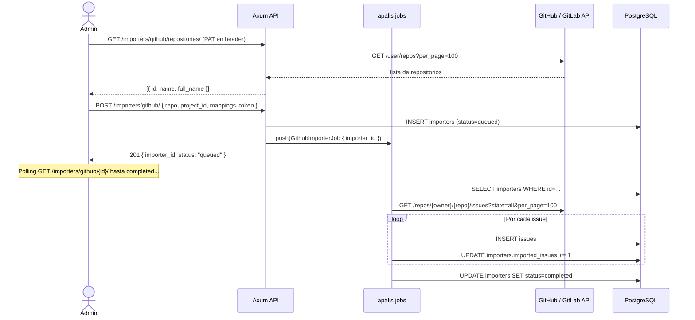

# Dominio — Importadores (GitHub / GitLab)

> [!NOTE] Diferencia clave con Integraciones
> **Integraciones** = sync bidireccional continuo (issues nuevos fluyen en ambas direcciones).
> **Importadores** = migración one-shot de issues existentes desde GitHub/GitLab hacia Plane.

---

## Modelo de datos

```
workspaces
    └─ importers                  (registro de cada operación de importación)
            ├─ token: encrypted   (PAT de GitHub/GitLab del usuario)
            ├─ metadata: JSON     (repo, mapeo de labels, mapeo de estados)
            └─ status             (queued, processing, completed, failed)
```

La tabla `importers` almacena todo el estado de la importación. Los issues importados se crean directamente en `issues`.

---

## Endpoints a implementar

### GitHub Importer

| Método | URL | Guard | Fase |
|--------|-----|-------|------|
| `GET` | `/api/workspaces/{slug}/importers/github/repositories/` | `WorkspaceMemberGuard (≥15)` | 4 |
| `GET` | `/api/workspaces/{slug}/importers/github/` | `WorkspaceMemberGuard (≥15)` | 4 |
| `POST` | `/api/workspaces/{slug}/importers/github/` | `WorkspaceMemberGuard (≥15)` | 4 |
| `GET/DELETE` | `/api/workspaces/{slug}/importers/github/{importer_id}/` | `WorkspaceMemberGuard (≥15)` | 4 |

### GitLab Importer

| Método | URL | Guard | Fase |
|--------|-----|-------|------|
| `GET` | `/api/workspaces/{slug}/importers/gitlab/repositories/` | `WorkspaceMemberGuard (≥15)` | 4 |
| `GET` | `/api/workspaces/{slug}/importers/gitlab/` | `WorkspaceMemberGuard (≥15)` | 4 |
| `POST` | `/api/workspaces/{slug}/importers/gitlab/` | `WorkspaceMemberGuard (≥15)` | 4 |
| `GET/DELETE` | `/api/workspaces/{slug}/importers/gitlab/{importer_id}/` | `WorkspaceMemberGuard (≥15)` | 4 |

---

## Flujo completo de importación



---

## `GET /importers/github/repositories/`

Devuelve los repositorios a los que tiene acceso el PAT del usuario. El token se pasa como header `X-Github-Token`:

```rust
pub async fn list_github_repositories(
    State(state): State<AppState>,
    WorkspaceMemberGuard { .. }: WorkspaceMemberGuard,
    axum::extract::TypedHeader(token): TypedHeader<XGithubToken>,
) -> Result<Json<Vec<GitHubRepo>>, AppError> {
    let mut repos = vec![];
    let mut page = 1u32;

    loop {
        let resp = reqwest::Client::new()
            .get("https://api.github.com/user/repos")
            .query(&[("per_page", "100"), ("page", &page.to_string())])
            .header("Authorization", format!("token {}", token.0))
            .header("User-Agent", "plane-importer/1.0")
            .send().await
            .map_err(|e| AppError::Internal(e.to_string()))?;

        if !resp.status().is_success() {
            return Err(AppError::BadRequest("invalid GitHub token or rate limit".into()));
        }

        let page_repos: Vec<GitHubRepo> = resp.json().await
            .map_err(|e| AppError::Internal(e.to_string()))?;

        let done = page_repos.len() < 100;
        repos.extend(page_repos);
        if done { break; }
        page += 1;
    }

    Ok(Json(repos))
}

#[derive(Serialize, Deserialize, ToSchema)]
pub struct GitHubRepo {
    pub id:        u64,
    pub name:      String,
    pub full_name: String,
    pub private:   bool,
    pub html_url:  String,
}
```

---

## `POST /importers/github/` — iniciar importación

```rust
#[derive(Deserialize, ToSchema)]
pub struct CreateGithubImporterRequest {
    pub repo_url:    String,         // "https://github.com/owner/repo"
    pub github_token: String,        // PAT — se cifra antes de guardar
    pub project_id:  Uuid,
    pub metadata:    ImporterMetadata,
}

#[derive(Deserialize, Serialize, ToSchema)]
pub struct ImporterMetadata {
    pub repo:           String,      // "owner/repo"
    pub owner:          String,
    pub label_map:      Vec<LabelMapping>,    // label GitHub → label Plane
    pub state_map:      Vec<StateMapping>,    // state GitHub → state Plane
    pub priority_map:   Vec<PriorityMapping>, // label GitHub → prioridad Plane
}

pub async fn create_github_importer(
    State(state): State<AppState>,
    WorkspaceMemberGuard { user, workspace, .. }: WorkspaceMemberGuard,
    Json(payload): Json<CreateGithubImporterRequest>,
) -> Result<(StatusCode, Json<ImporterResponse>), AppError> {
    let db = &state.db;

    // Cifrar el token antes de guardar (no almacenar plaintext)
    let encrypted_token = encrypt_token(&payload.github_token, &state.config.secret_key)
        .map_err(|e| AppError::Internal(e.to_string()))?;

    let importer = importers::ActiveModel {
        id:             Set(Uuid::new_v4()),
        workspace_id:   Set(workspace.id),
        project_id:     Set(Some(payload.project_id)),
        service:        Set("github".into()),
        status:         Set("queued".into()),
        token:          Set(Some(encrypted_token)),
        metadata:       Set(Some(serde_json::to_value(&payload.metadata).unwrap())),
        initiated_by_id: Set(Some(user.id)),
        total_issues:   Set(0),
        imported_issues: Set(0),
        ..Default::default()
    }.insert(db).await.map_err(AppError::Database)?;

    // Encolar el job de importación
    state.job_storage
        .push(GithubImporterJob { importer_id: importer.id })
        .await
        .map_err(|e| AppError::Internal(format!("queue error: {e}")))?;

    Ok((StatusCode::CREATED, Json(ImporterResponse::from(importer))))
}
```

---

## `GithubImporterJob` — apalis (Fase 3)

```rust
// src/jobs/importer.rs
#[derive(Debug, Clone, Serialize, Deserialize)]
pub struct GithubImporterJob {
    pub importer_id: Uuid,
}

pub async fn handle_github_importer(
    job: GithubImporterJob,
    ctx: Data<sea_orm::DatabaseConnection>,
) -> Result<(), apalis::prelude::Error> {
    let db = ctx.as_ref();

    let importer = importers::Entity::find_by_id(job.importer_id)
        .one(db).await.map_err(|e| apalis::prelude::Error::Failed(e.to_string().into()))?
        .ok_or_else(|| apalis::prelude::Error::Failed("importer not found".into()))?;

    // Marcar como processing
    update_importer_status(db, importer.id, "processing", None).await.ok();

    let metadata: ImporterMetadata = serde_json::from_value(
        importer.metadata.clone().unwrap_or_default()
    ).map_err(|e| apalis::prelude::Error::Failed(e.to_string().into()))?;

    // Descifrar token
    let token = decrypt_token(
        importer.token.as_deref().unwrap_or(""),
        // config vendrá desde Data<Arc<Config>> en producción
        &std::env::var("SECRET_KEY").unwrap_or_default(),
    ).unwrap_or_default();

    // Paginar todos los issues del repo (incluye PRs — filtrar)
    let mut page = 1u32;
    let mut total = 0u64;

    loop {
        let url = format!(
            "https://api.github.com/repos/{}/issues",
            metadata.repo
        );
        let resp: Vec<serde_json::Value> = reqwest::Client::new()
            .get(&url)
            .query(&[
                ("state", "all"),
                ("per_page", "100"),
                ("page", &page.to_string()),
            ])
            .header("Authorization", format!("token {token}"))
            .header("User-Agent", "plane-importer/1.0")
            .send().await
            .map_err(|e| apalis::prelude::Error::Failed(e.to_string().into()))?
            .json().await
            .map_err(|e| apalis::prelude::Error::Failed(e.to_string().into()))?;

        let done = resp.len() < 100;

        for gh_issue in &resp {
            // Ignorar PRs (tienen "pull_request" key)
            if gh_issue.get("pull_request").is_some() { continue; }

            import_single_issue(db, &metadata, gh_issue, &importer).await
                .unwrap_or_else(|e| tracing::warn!("Failed to import issue: {e}"));

            total += 1;

            // Actualizar contador cada 10 issues
            if total % 10 == 0 {
                update_importer_progress(db, importer.id, total).await.ok();
            }
        }

        if done { break; }
        page += 1;

        // Rate limit: 5000 req/hora para GitHub API con PAT
        tokio::time::sleep(std::time::Duration::from_millis(100)).await;
    }

    update_importer_status(db, importer.id, "completed", Some(total)).await.ok();
    tracing::info!("GitHub importer {} completed: {} issues", job.importer_id, total);
    Ok(())
}
```

---

## Mapeo de issues GitHub → Plane

```rust
async fn import_single_issue(
    db: &DatabaseConnection,
    metadata: &ImporterMetadata,
    gh_issue: &serde_json::Value,
    importer: &importers::Model,
) -> anyhow::Result<()> {
    let gh_state = gh_issue["state"].as_str().unwrap_or("open");
    let gh_labels: Vec<String> = gh_issue["labels"]
        .as_array().unwrap_or(&vec![])
        .iter()
        .filter_map(|l| l["name"].as_str().map(String::from))
        .collect();

    // Resolver estado Plane desde mapeo
    let state_id = metadata.state_map.iter()
        .find(|m| m.github_state == gh_state)
        .map(|m| m.plane_state_id);

    // Resolver prioridad desde labels de GitHub
    let priority = metadata.priority_map.iter()
        .find(|m| gh_labels.contains(&m.github_label))
        .map(|m| m.plane_priority.clone())
        .unwrap_or("none".into());

    // Crear el issue en Plane
    let issue_id = Uuid::new_v4();
    issues::ActiveModel {
        id:               Set(issue_id),
        name:             Set(gh_issue["title"].as_str().unwrap_or("").to_string()),
        description_html: Set(gh_issue["body"].as_str().map(|b| markdown_to_html(b))),
        state_id:         Set(state_id),
        priority:         Set(priority),
        project_id:       Set(importer.project_id.unwrap()),
        workspace_id:     Set(importer.workspace_id),
        external_id:      Set(Some(gh_issue["number"].to_string())),
        external_source:  Set(Some("github".into())),
        ..Default::default()
    }.insert(db).await?;

    // Crear IssueSequence
    issue_sequences::ActiveModel {
        id: Set(Uuid::new_v4()),
        issue_id: Set(issue_id),
        project_id: Set(importer.project_id.unwrap()),
        workspace_id: Set(importer.workspace_id),
        sequence_id: Set(0),
        ..Default::default()
    }.insert(db).await?;

    // Importar labels mapeadas
    for gh_label in &gh_labels {
        if let Some(mapping) = metadata.label_map.iter().find(|m| &m.github_label == gh_label) {
            issue_labels::ActiveModel {
                id: Set(Uuid::new_v4()),
                issue_id: Set(issue_id),
                label_id: Set(mapping.plane_label_id),
                project_id: Set(importer.project_id.unwrap()),
                workspace_id: Set(importer.workspace_id),
                ..Default::default()
            }.insert(db).await.ok();
        }
    }

    Ok(())
}
```

---

## GitLab Importer — diferencias con GitHub

```rust
#[derive(Debug, Clone, Serialize, Deserialize)]
pub struct GitLabImporterJob {
    pub importer_id: Uuid,
}

// GitLab usa project ID numérico, no "owner/repo"
// API: GET /api/v4/projects/{id}/issues?state=opened&per_page=100
// Auth: Header "PRIVATE-TOKEN: {token}"
// Issues endpoint NO incluye MRs (Merge Requests) — endpoint separado

pub async fn handle_gitlab_importer(
    job: GitLabImporterJob,
    ctx: Data<sea_orm::DatabaseConnection>,
) -> Result<(), apalis::prelude::Error> {
    // Mismo flujo que GitHub con diferencias:
    // 1. URL base: state.config.gitlab_url o "https://gitlab.com"
    // 2. Header auth: "PRIVATE-TOKEN" en lugar de "Authorization: token"
    // 3. Campo title en lugar de name (mismo key en JSON de GitLab)
    // 4. Campo description en lugar de body
    // 5. GitLab no incluye PRs en /issues — no necesita filtrar
    // 6. Paginación: header "X-Next-Page" en lugar de detectar < 100
    Ok(())
}
```

---

## DTOs

```rust
#[derive(Serialize, ToSchema)]
pub struct ImporterResponse {
    pub id:              Uuid,
    pub service:         String,      // "github" | "gitlab"
    pub status:          String,      // "queued" | "processing" | "completed" | "failed"
    pub total_issues:    i64,
    pub imported_issues: i64,
    pub project_id:      Option<Uuid>,
    pub created_at:      DateTime<Utc>,
    pub updated_at:      DateTime<Utc>,
}

#[derive(Deserialize, Serialize, ToSchema)]
pub struct LabelMapping {
    pub github_label:   String,
    pub plane_label_id: Uuid,
}

#[derive(Deserialize, Serialize, ToSchema)]
pub struct StateMapping {
    pub github_state:   String,  // "open" | "closed"
    pub plane_state_id: Uuid,
}

#[derive(Deserialize, Serialize, ToSchema)]
pub struct PriorityMapping {
    pub github_label:    String,
    pub plane_priority:  String,  // "urgent"|"high"|"medium"|"low"|"none"
}
```

---

## Puntos críticos

> [!WARNING] 6 puntos críticos

1. **Token cifrado** — NUNCA almacenar PATs en plaintext. Usar `AES-256-GCM` con `SECRET_KEY` como clave. Descifrar solo dentro del job.
2. **GitHub incluye PRs en `/issues`** — filtrar los que tengan la key `"pull_request"` en el JSON. GitLab tiene endpoint separado para MRs.
3. **Rate limiting** — GitHub: 5000 req/hora con PAT. GitLab: 2000 req/hora. Agregar `sleep(100ms)` entre páginas. Si llega 429 → reintentar con backoff exponencial.
4. **`external_id` + `external_source`** — guardar el `number` de GitHub (o `iid` de GitLab) para evitar duplicados si el import se reintenta.
5. **Progreso incremental** — actualizar `imported_issues` cada N issues para que el usuario vea progreso en tiempo real via polling.
6. **Fallo parcial** — si un issue individual falla, loguear y continuar. No cancelar toda la importación por un issue problemático.

---

## Entidades SeaORM involucradas ✅

| Entidad | Tabla |
|---------|-------|
| `importers.rs` | `importers` |
| `issues.rs` | `issues` (inserción masiva) |
| `issue_sequences.rs` | `issue_sequences` |
| `issue_labels.rs` | `issue_labels` |

---

## Cargo.toml — dependencias adicionales

```toml
aes-gcm = "0.10"   # cifrado de tokens
hex     = "0.4"    # encode/decode del token cifrado
```

---

## 🔗 Navegar

← [[dominio-analytics]] | [[MOC]] | → [[dominio-busqueda]]

**Relacionado:** Integraciones: [[dominio-integraciones]] | Issues: [[dominio-issues]] | Jobs: [[impl-error-jobs-cron]]
