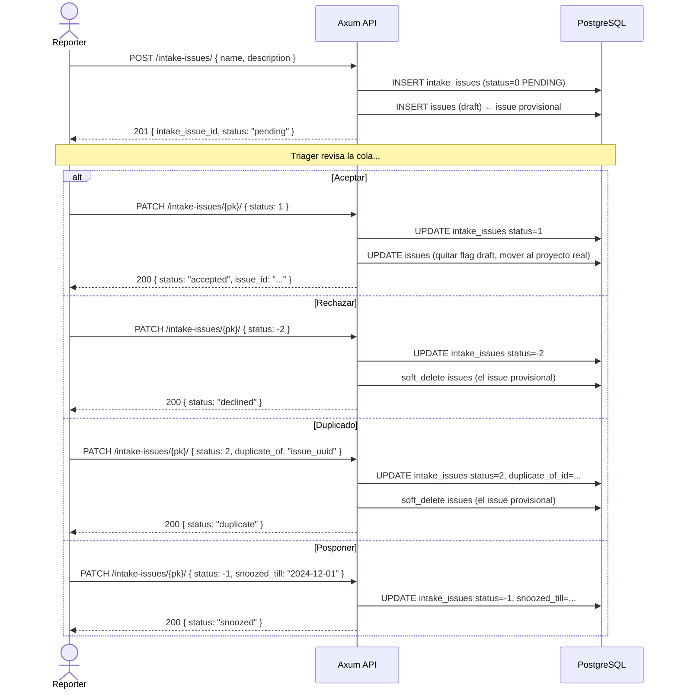

# Dominio — Intake (Triage de issues entrantes)

> [!NOTE] Puerta de entrada para issues externos
> El módulo Intake permite que usuarios externos (o miembros con menos permisos) envíen issues que deben pasar por un proceso de revisión/aprobación antes de convertirse en issues reales del proyecto.
> Reemplaza al módulo "Inbox" (deprecado desde Django migration 0085).

---

## Modelo de datos

```tree
projects
    └─ intakes              (configuración del intake del proyecto, generalmente 1 por proyecto)
            └─ intake_issues (issues pendientes de revisión)
                    ├─ issue_id → issues    (issue real una vez aprobado)
                    └─ duplicate_of → issues (si se marca como duplicado)
```

**Estados de un `intake_issue`:**

| `status` (int) | Nombre      | Descripción                            |
| -------------- | ----------- | -------------------------------------- |
| `-2`           | `DECLINED`  | Rechazado — no se convierte en issue   |
| `-1`           | `SNOOZED`   | Pospuesto hasta `snoozed_till`         |
| `0`            | `PENDING`   | Pendiente de revisión (estado inicial) |
| `1`            | `ACCEPTED`  | Aceptado — issue real creado           |
| `2`            | `DUPLICATE` | Marcado como duplicado de otro issue   |

---

## Endpoints a implementar

### Gestión de intakes (configuración del módulo)

| Método             | URL                                              | Guard                      | Fase |
| ------------------ | ------------------------------------------------ | -------------------------- | ---- |
| `GET/POST`         | `/workspaces/{slug}/projects/{id}/intakes/`      | `ProjectMemberGuard (≥15)` | 4    |
| `GET/PATCH/DELETE` | `/workspaces/{slug}/projects/{id}/intakes/{pk}/` | `ProjectMemberGuard (≥15)` | 4    |

### Issues en el intake

| Método             | URL                                                    | Guard                        | Fase |
| ------------------ | ------------------------------------------------------ | ---------------------------- | ---- |
| `GET/POST`         | `/workspaces/{slug}/projects/{id}/intake-issues/`      | `ProjectMemberGuard (≥5)`    | 4    |
| `GET/PATCH/DELETE` | `/workspaces/{slug}/projects/{id}/intake-issues/{pk}/` | `ProjectMemberGuard (≥5/15)` | 4    |

### Versiones de descripción de intake-issues

| Método | URL                                                                                            | Guard                     | Fase |
| ------ | ---------------------------------------------------------------------------------------------- | ------------------------- | ---- |
| `GET`  | `/workspaces/{slug}/projects/{id}/intake-work-items/{work_item_id}/description-versions/`      | `ProjectMemberGuard (≥5)` | 4    |
| `GET`  | `/workspaces/{slug}/projects/{id}/intake-work-items/{work_item_id}/description-versions/{pk}/` | `ProjectMemberGuard (≥5)` | 4    |

### Compatibilidad (endpoints Inbox deprecados — mantener por retrocompat)

| Método             | URL                                                   | Guard                     | Fase |
| ------------------ | ----------------------------------------------------- | ------------------------- | ---- |
| `GET/POST`         | `/workspaces/{slug}/projects/{id}/inboxes/`           | `ProjectMemberGuard (≥5)` | 4    |
| `GET/PATCH/DELETE` | `/workspaces/{slug}/projects/{id}/inboxes/{pk}/`      | `ProjectMemberGuard (≥5)` | 4    |
| `GET/POST`         | `/workspaces/{slug}/projects/{id}/inbox-issues/`      | `ProjectMemberGuard (≥5)` | 4    |
| `GET/PATCH/DELETE` | `/workspaces/{slug}/projects/{id}/inbox-issues/{pk}/` | `ProjectMemberGuard (≥5)` | 4    |

---

## Flujo de triage



---

## Handler — `POST /intake-issues/`

```rust
pub async fn create_intake_issue(
    State(state): State<AppState>,
    ProjectMemberGuard { user, workspace, project, .. }: ProjectMemberGuard,
    Path((_slug, project_id)): Path<(String, Uuid)>,
    Json(payload): Json<CreateIntakeIssueRequest>,
) -> Result<(StatusCode, Json<IntakeIssueResponse>), AppError> {
    let db = &state.db;

    // 1. Obtener el intake del proyecto (debe existir uno)
    let intake = intakes::Entity::find()
        .filter(intakes::Column::ProjectId.eq(project_id))
        .filter(intakes::Column::DeletedAt.is_null())
        .one(db).await.map_err(AppError::Database)?
        .ok_or(AppError::NotFound("intake not configured for this project".into()))?;

    // 2. Crear issue provisional (campo is_draft=true o sin estado real)
    let issue_id = Uuid::new_v4();
    let issue = issues::ActiveModel {
        id:               Set(issue_id),
        name:             Set(payload.name.clone()),
        description_html: Set(payload.description_html.clone()),
        project_id:       Set(project_id),
        workspace_id:     Set(workspace.id),
        state_id:         Set(None), // sin estado hasta ser aceptado
        priority:         Set(payload.priority.clone().unwrap_or("none".into())),
        created_by_id:    Set(Some(user.id)),
        ..Default::default()
    }.insert(db).await.map_err(AppError::Database)?;

    // 3. Crear intake_issue vinculado
    let intake_issue = intake_issues::ActiveModel {
        id:               Set(Uuid::new_v4()),
        intake_id:        Set(intake.id),
        issue_id:         Set(issue_id),
        status:           Set(0), // PENDING
        project_id:       Set(project_id),
        workspace_id:     Set(workspace.id),
        source:           Set(payload.source.unwrap_or("IN_APP".into())),
        created_by_id:    Set(Some(user.id)),
        ..Default::default()
    }.insert(db).await.map_err(AppError::Database)?;

    Ok((StatusCode::CREATED, Json(IntakeIssueResponse::from(intake_issue, issue))))
}
```

---

## Handler — `PATCH /intake-issues/{pk}/` (cambio de status)

```rust
pub async fn update_intake_issue(
    State(state): State<AppState>,
    ProjectMemberGuard { user, .. }: ProjectMemberGuard,
    Path((_slug, project_id, pk)): Path<(String, Uuid, Uuid)>,
    Json(payload): Json<UpdateIntakeIssueRequest>,
) -> Result<Json<IntakeIssueResponse>, AppError> {
    let db = &state.db;

    let intake_issue = intake_issues::Entity::find_by_id(pk)
        .filter(intake_issues::Column::DeletedAt.is_null())
        .one(db).await.map_err(AppError::Database)?
        .ok_or(AppError::NotFound("intake issue".into()))?;

    let mut active: intake_issues::ActiveModel = intake_issue.clone().into();

    if let Some(new_status) = payload.status {
        active.status = Set(new_status);

        match new_status {
            1 => {
                // ACCEPTED: promover el issue provisional al proyecto real
                // Asignar estado por defecto del proyecto, mover a la cola
                promote_intake_issue_to_real(db, &intake_issue, project_id).await
                    .map_err(|e| AppError::Internal(e.to_string()))?;
            }
            -2 | 2 => {
                // DECLINED / DUPLICATE: soft-delete del issue provisional
                soft_delete_provisional_issue(db, intake_issue.issue_id).await
                    .map_err(|e| AppError::Internal(e.to_string()))?;

                if new_status == 2 {
                    active.duplicate_of_id = Set(payload.duplicate_of);
                }
            }
            -1 => {
                // SNOOZED: setear snoozed_till
                active.snoozed_till = Set(payload.snoozed_till);
            }
            _ => {}
        }
    }

    let updated = active.update(db).await.map_err(AppError::Database)?;
    // Re-cargar issue actualizado para la respuesta
    let issue = issues::Entity::find_by_id(updated.issue_id)
        .one(db).await.map_err(AppError::Database)?
        .ok_or(AppError::NotFound("issue".into()))?;

    Ok(Json(IntakeIssueResponse::from(updated, issue)))
}
```

---

## Source values — origen del intake issue

| `source`   | Descripción                               |
| ---------- | ----------------------------------------- |
| `"IN_APP"` | Creado desde la UI de Plane               |
| `"API"`    | Creado vía API externa                    |
| `"EMAIL"`  | Enviado por email (futuro)                |
| `"FORM"`   | Enviado desde formulario público (futuro) |

---

## DTOs

```rust
#[derive(Deserialize, ToSchema)]
pub struct CreateIntakeIssueRequest {
    pub name:             String,
    pub description_html: Option<String>,
    pub priority:         Option<String>,
    pub source:           Option<String>,  // default "IN_APP"
    pub assignee_ids:     Option<Vec<Uuid>>,
}

#[derive(Deserialize, ToSchema)]
pub struct UpdateIntakeIssueRequest {
    pub status:       Option<i16>,          // -2, -1, 0, 1, 2
    pub snoozed_till: Option<DateTime<Utc>>, // solo si status = -1
    pub duplicate_of: Option<Uuid>,          // solo si status = 2
    // También permite PATCH de campos del issue subyacente:
    pub name:         Option<String>,
    pub priority:     Option<String>,
    pub description_html: Option<String>,
}

#[derive(Serialize, ToSchema)]
pub struct IntakeIssueResponse {
    pub id:           Uuid,
    pub intake_id:    Uuid,
    pub issue:        IssueResponse,         // issue completo embebido
    pub status:       i16,
    pub status_name:  String,                // "pending", "accepted", etc.
    pub snoozed_till: Option<DateTime<Utc>>,
    pub duplicate_of: Option<Uuid>,
    pub source:       String,
    pub created_at:   DateTime<Utc>,
    pub updated_at:   DateTime<Utc>,
}
```

---

## Puntos críticos

> [!WARNING] 6 puntos críticos

1. **Intake debe existir** — antes de crear un `intake_issue`, verificar que el proyecto tiene un `intake` configurado. Si no → 400 "intake not configured".
2. **Issue provisional** — al crear `intake_issue`, el `issues` row se crea en un estado "sin validar" (sin `state_id`). Al aceptar, asignar el estado por defecto del proyecto.
3. **Soft-delete al rechazar/duplicar** — el issue provisional se elimina con soft-delete al cambiar status a -2 o 2. El `intake_issue` NO se borra.
4. **`snoozed_till` sin status** — el cron job debe re-evaluar intake_issues con `status=-1 AND snoozed_till < NOW()` y devolverlos a `status=0`.
5. **Retrocompat Inbox** — los endpoints `/inboxes/` e `/inbox-issues/` son alias de `/intakes/` e `/intake-issues/`. Implementar como re-exports o redirects internos.
6. **Description versions** — el endpoint `/intake-work-items/{id}/description-versions/` reutiliza la misma lógica de `page_versions` pero para issues de intake.

---

## Cron — desnoozear automáticamente (Fase 3)

```rust
// src/jobs/scheduled.rs
let job = Job::new_async("0 */30 * * * *", |_, _| Box::pin(async {
    // Cada 30 minutos: devolver a PENDING los snoozed vencidos
    // UPDATE intake_issues SET status=0
    // WHERE status=-1 AND snoozed_till < NOW() AND deleted_at IS NULL
    tracing::info!("Re-activating snoozed intake issues");
}))
.map_err(|e| anyhow::anyhow!("Invalid cron expression for intake unsnooze job: {e}"))?; // silence-patterns-ok

scheduler.add(job).await
    .map_err(|e| anyhow::anyhow!("Failed to register intake unsnooze job: {e}"))?; // silence-patterns-ok
```

---

## Entidades SeaORM involucradas ✅

| Entidad                   | Tabla                  |
| ------------------------- | ---------------------- |
| `intakes.rs`              | `intakes`              |
| `intake_issues.rs`        | `intake_issues`        |
| `description_versions.rs` | `description_versions` |

---

## Plan de implementación

```
Fase 3:
  [ ] src/routes/intake.rs         — CRUD de intake forms + IntakeIssueEndpoint
  [ ] src/jobs/scheduled.rs        — cron de desnoozear issues (IntakeSnoozeCronJob)
```

## 🔗 Navegar

← [[dominio-notificaciones]] | [[MOC]] | → [[dominio-analytics]]

**Relacionado:** Issues: [[dominio-issues]] | Proyectos: [[dominio-proyectos]] | Jobs: [[impl-error-jobs-cron]]
