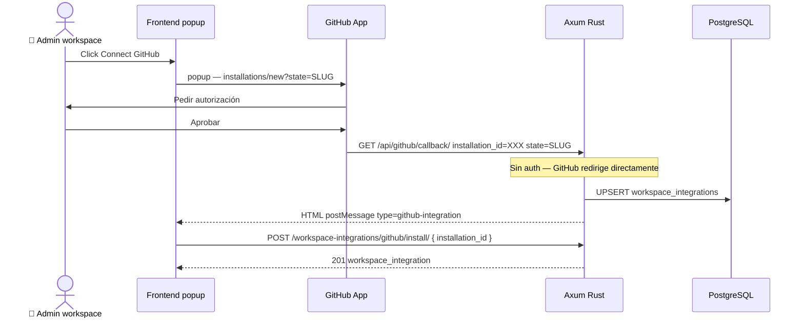

# Integraciones — GitHub, GitLab, Slack

> [!NOTE] Entidades ya generadas
> Todas las entidades SeaORM de integraciones están en `src/entities/`. Ver tabla al final de esta nota.

---

## Visión general

Plane soporta 3 integraciones externas. Sus filas maestras viven en la tabla `integrations` (3 filas estáticas, insertadas por migración `m007_seed_data`).

| Integración | Provider key | Autenticación | Función principal |
|-------------|--------------|--------------|-------------------|
| **GitHub** | `github` | GitHub App (JWT + token) | Sync bidireccional issues/PRs, webhooks |
| **GitLab** | `gitlab` | OAuth 2.0 code flow | Sync bidireccional issues/comentarios |
| **Slack** | `slack` | OAuth 2.0 code flow | Notificaciones de actividad en canales |

---

## Modelo de datos — relaciones clave

```
integrations (3 filas estáticas)
    └─ workspace_integrations           (1 por workspace por proveedor)
            ├─ metadata: { installation_id }   (GitHub)
            ├─ config:   { installation_id }   (GitHub)
            └─ actor_id → users.id

github_repositories       (1 por repo conectado a un proyecto)
    └─ github_repository_syncs
            └─ credentials: { sync_direction, issue_open_state, issue_closed_state }

github_issue_syncs         (1 por issue importado de GitHub)
github_comment_syncs       (1 por comment importado)
db_githubprstatemapping    (mapeo PR state → Plane state)
slack_project_syncs        (1 por proyecto con Slack conectado)
user_github_connections    (conexión OAuth personal por usuario)
```

---

## Endpoints a implementar

### Globales

```
GET  /api/github/callback/
     ← Sin auth — GitHub App Setup URL
     ← Parámetros: installation_id, setup_action, state={workspace_slug}
     ← Devuelve HTML con postMessage al opener

POST /api/auth/github/user-callback/
     ← Auth requerida
     ← Body: code — intercambia por access_token OAuth personal
```

### Por workspace (requieren WorkspaceAdmin)

```
GET    /api/integrations/
GET    /api/workspaces/{slug}/workspace-integrations/
POST   /api/workspaces/{slug}/workspace-integrations/
GET    /api/workspaces/{slug}/workspace-integrations/{pk}/
PATCH  /api/workspaces/{slug}/workspace-integrations/{pk}/
DELETE /api/workspaces/{slug}/workspace-integrations/{pk}/
DELETE /api/workspaces/{slug}/workspace-integrations/{provider}/provider/

POST   /api/workspaces/{slug}/workspace-integrations/{provider}/install/
       ← github: { installation_id }
       ← gitlab: { code }
       ← slack:  { code }

GET    /api/workspaces/{slug}/workspace-integrations/{wi_id}/github-repositories/
GET/POST/DELETE /api/workspaces/{slug}/workspace-integrations/github/repo-syncs/
GET/POST/DELETE /api/workspaces/{slug}/workspace-integrations/{wi_id}/pr-state-mappings/
```

---

## Flujo OAuth — GitHub App



### Generación del JWT para GitHub App

```rust
// src/utils/github_app.rs
use jsonwebtoken::{encode, Algorithm, EncodingKey, Header};
use base64::{engine::general_purpose, Engine as _};

pub async fn get_installation_access_token(
    db: &DatabaseConnection,
    installation_id: &str,
) -> anyhow::Result<Option<String>> {
    let app_id    = get_instance_config(db, "GITHUB_APP_ID").await?;
    let key_b64   = get_instance_config(db, "GITHUB_APP_PRIVATE_KEY").await?;

    let (Some(app_id), Some(key_b64)) = (app_id, key_b64) else {
        return Ok(None); // GitHub App no configurado
    };

    let pem = general_purpose::STANDARD.decode(&key_b64)?;
    let encoding_key = EncodingKey::from_rsa_pem(&pem)?;

    let now = chrono::Utc::now().timestamp();
    let claims = AppClaims { iat: now - 60, exp: now + 600, iss: app_id };
    let app_jwt = encode(&Header::new(Algorithm::RS256), &claims, &encoding_key)?;

    let resp = reqwest::Client::new()
        .post(format!(
            "https://api.github.com/app/installations/{installation_id}/access_tokens"
        ))
        .header("Authorization", format!("Bearer {app_jwt}"))
        .header("Accept", "application/vnd.github+json")
        .header("X-GitHub-Api-Version", "2022-11-28")
        .send().await?;

    if resp.status().is_success() {
        let body: serde_json::Value = resp.json().await?;
        Ok(body["token"].as_str().map(String::from))
    } else {
        Ok(None)
    }
}
```

---

## Helper — postMessage HTML para callbacks OAuth

```rust
// src/utils/oauth_popup.rs
use axum::response::Html;

pub fn postmessage_html(success: bool, message_type: &str, error: Option<&str>) -> Html<String> {
    let error_json   = error
        .map(|e| format!(r#", "error": "{}""#, e.replace('"', "\\\"")))
        .unwrap_or_default();
    let success_str  = if success { "true" } else { "false" };

    Html(format!(r#"<!DOCTYPE html>
<html><head><meta charset="utf-8"></head>
<body>
<script>
(function(){{
  try{{
    window.opener && window.opener.postMessage(
      {{"type":"{message_type}","success":{success_str}{error_json}}},
      window.location.origin
    );
  }}catch(e){{}}
  window.close();
}})();
</script>
</body></html>"#))
}
```

---

## Job apalis — GithubInitialIssueSyncJob

```rust
// src/jobs/github_sync.rs
#[derive(Debug, Clone, Serialize, Deserialize)]
pub struct GithubInitialIssueSyncJob {
    pub repo_sync_id: Uuid,
}

pub async fn handle_github_initial_sync(
    job: GithubInitialIssueSyncJob,
    ctx: Data<DatabaseConnection>,
) -> Result<(), apalis::prelude::Error> {
    let db = ctx.as_ref();
    // ... obtener installation_id desde workspace_integration
    // ... paginar GET /repos/{owner}/{repo}/issues?state=all&per_page=100
    // ... filtrar PRs (tienen "pull_request" key)
    // ... crear Issue + GithubIssueSync por cada issue importado
    Ok(())
}
```

Disparar desde el handler de creación de repo sync:

```rust
state.job_storage
    .push(GithubInitialIssueSyncJob { repo_sync_id: new_sync.id })
    .await
    .ok(); // best-effort
```

---

## Helper — `get_instance_config`

```rust
// src/utils/instance_config.rs
pub async fn get_instance_config(
    db: &DatabaseConnection,
    key: &str,
) -> anyhow::Result<Option<String>> {
    // 1. Buscar en instance_configurations (prioridad DB sobre env)
    if let Some(row) = instance_configurations::Entity::find()
        .filter(instance_configurations::Column::Key.eq(key))
        .one(db).await?
    {
        if !row.value.is_empty() {
            return Ok(Some(row.value));
        }
    }
    // 2. Fallback a variable de entorno
    Ok(std::env::var(key).ok())
}
```

---

## Variables de entorno por integración

| Variable | Integración | Uso |
|----------|-------------|-----|
| `GITHUB_APP_ID` | GitHub | ID de la GitHub App |
| `GITHUB_APP_PRIVATE_KEY` | GitHub | PEM base64 para JWT RS256 |
| `GITHUB_CLIENT_ID` | GitHub | OAuth personal connection |
| `GITHUB_CLIENT_SECRET` | GitHub | OAuth personal connection |
| `GITHUB_WEBHOOK_SECRET` | GitHub | Verificar firma HMAC |
| `SLACK_CLIENT_ID` | Slack | OAuth app install flow |
| `SLACK_CLIENT_SECRET` | Slack | Intercambiar code por access_token |

---

## Puntos críticos — integraciones

> [!WARNING] 9 puntos críticos específicos de integraciones

1. **`GET /api/github/callback/` es sin autenticación** — no usar `CurrentUser` extractor
2. **GithubAppCallback busca el primer admin** — `WorkspaceMember WHERE role >= 20`
3. **Soft-delete en GithubRepository y GithubRepositorySync** — NO usar `.active()` al crear para no violar constraint unique; resucitar si existe soft-deleted
4. **GitHub devuelve PRs en el endpoint de issues** — filtrar los que tengan `"pull_request"` key
5. **PR State Mapping — enum Postgres** — valores exactos: `draft_open`, `open`, `review_requested`, `ready_for_merge`, `merged`, `closed`
6. **Instalación Slack — intercambio de code en el backend** — `SLACK_CLIENT_ID` y `SLACK_CLIENT_SECRET` son del backend, no del frontend
7. **Paginación de repos GitHub — dos endpoints distintos** — GitHub App: `/installation/repositories`; OAuth personal: `/user/repos`
8. **Webhook registration — best-effort** — `let _ = register_github_webhook(...).await;`
9. **`user_github_connections` — token personal del usuario** — tabla distinta al `workspace_integrations`

---

## Plan de implementación

```
[ ] src/utils/github_app.rs         — get_installation_access_token (JWT RS256)
[ ] src/utils/instance_config.rs    — get_instance_config (DB + env fallback)
[ ] src/utils/oauth_popup.rs        — postmessage_html helper
[ ] src/routes/integrations.rs      — todos los endpoints
[ ] src/jobs/github_sync.rs         — GithubInitialIssueSyncJob (apalis)
[ ] Cargo.toml: jsonwebtoken = "9", base64 = "0.22"
[ ] Router: /api/github/callback/ sin middleware de auth
```

**Prioridad:**
1. `GET /api/integrations/` — desbloquea el panel en el frontend
2. `GET/POST/DELETE /api/workspaces/{slug}/workspace-integrations/`
3. `GET /api/github/callback/` + `POST /install/`
4. `GET /github-repositories/`
5. `POST/DELETE github/repo-syncs/`

---

## Entidades Rust generadas ✅

| Entidad Rust | Tabla DB |
|--------------|----------|
| `integrations.rs` | `integrations` |
| `workspace_integrations.rs` | `workspace_integrations` |
| `github_repositories.rs` | `github_repositories` |
| `github_repository_syncs.rs` | `github_repository_syncs` |
| `github_issue_syncs.rs` | `github_issue_syncs` |
| `github_comment_syncs.rs` | `github_comment_syncs` |
| `db_githubprstatemapping.rs` | `db_githubprstatemapping` |
| `user_github_connections.rs` | `user_github_connections` |
| `gitlab_repositories.rs` | `gitlab_repositories` |
| `gitlab_repository_syncs.rs` | `gitlab_repository_syncs` |
| `gitlab_issue_syncs.rs` | `gitlab_issue_syncs` |
| `gitlab_comment_syncs.rs` | `gitlab_comment_syncs` |
| `slack_project_syncs.rs` | `slack_project_syncs` |

---

## 🔗 Navegar

← [[dominio-workspace-seed]] | [[MOC]] | → [[dominio-workspace-settings]]

**Relacionado:** Flujo en settings: [[dominio-workspace-settings#WS-5 — Integrations]] | Diagrama secuencia: [[ref-diagramas-secuencia#3. Flujo OAuth — GitHub App instalación workspace]] | Riesgos: [[plan-riesgos]]
