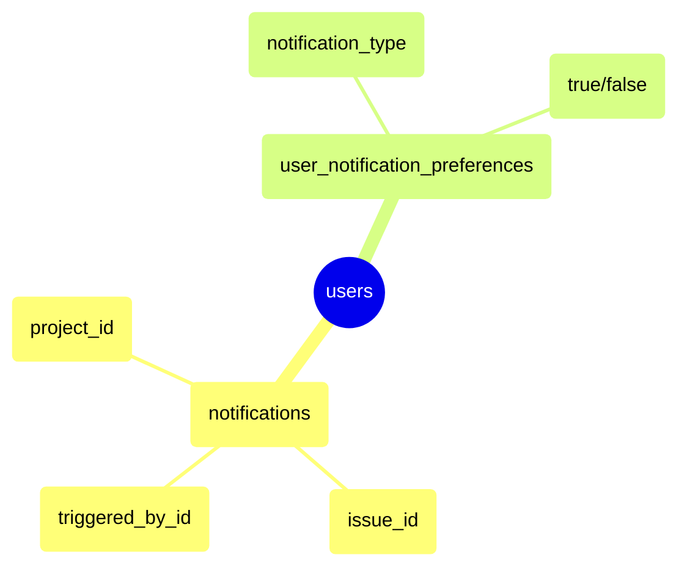
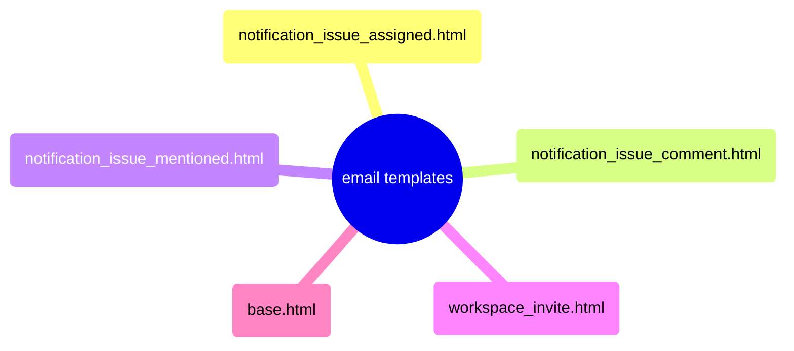

# Dominio — Notifications y Email Jobs

> [!NOTE] Dos capas de notificación
>
> 1. **In-app notifications** — almacenadas en `notifications`, accesibles vía REST.
> 2. **Email notifications** — enviadas por `EmailJob` (apalis + lettre). Disparadas por `NotificationJob`.

---

## Modelo de datos



---

## Endpoints REST — in-app notifications

| Método        | URL                                                     | Guard                       | Fase |
| ------------- | ------------------------------------------------------- | --------------------------- | ---- |
| `GET`         | `/workspaces/{slug}/users/notifications/`               | `WorkspaceMemberGuard (≥5)` | 4    |
| `GET`         | `/workspaces/{slug}/users/notifications/{pk}/`          | `WorkspaceMemberGuard (≥5)` | 4    |
| `PATCH`       | `/workspaces/{slug}/users/notifications/{pk}/`          | `WorkspaceMemberGuard (≥5)` | 4    |
| `DELETE`      | `/workspaces/{slug}/users/notifications/{pk}/`          | `WorkspaceMemberGuard (≥5)` | 4    |
| `POST/DELETE` | `/workspaces/{slug}/users/notifications/{pk}/read/`     | `WorkspaceMemberGuard (≥5)` | 4    |
| `POST/DELETE` | `/workspaces/{slug}/users/notifications/{pk}/archive/`  | `WorkspaceMemberGuard (≥5)` | 4    |
| `GET`         | `/workspaces/{slug}/users/notifications/unread/`        | `WorkspaceMemberGuard (≥5)` | 4    |
| `POST`        | `/workspaces/{slug}/users/notifications/mark-all-read/` | `WorkspaceMemberGuard (≥5)` | 4    |
| `GET/PATCH`   | `/users/me/notification-preferences/`                   | `AuthGuard`                 | 4    |

---

## Filtros del listado de notificaciones

```rust
#[derive(Deserialize, ToSchema)]
pub struct NotificationQueryParams {
    pub type_:     Option<String>,  // "assigned"|"mentioned"|"subscribed"|"created"
    pub is_read:   Option<bool>,
    pub is_archived: Option<bool>,
    pub snoozed:   Option<bool>,
    pub cursor:    Option<String>,
    pub per_page:  Option<u32>,
}
```

---

## `NotificationJob` — job apalis (Fase 3)

Disparado desde los handlers de issues/comments cuando ocurren eventos relevantes:

```rust
// src/jobs/notifications.rs
use apalis::prelude::*;
use serde::{Deserialize, Serialize};
use uuid::Uuid;

#[derive(Debug, Clone, Serialize, Deserialize)]
pub struct NotificationJob {
    pub issue_id:    Uuid,
    pub project_id:  Uuid,
    pub workspace_id: Uuid,
    pub actor_id:    Uuid,        // quién generó el evento
    pub event_type:  NotificationEvent,
    pub field:       Option<String>,  // qué campo cambió (para "updated")
    pub old_value:   Option<String>,
    pub new_value:   Option<String>,
}

#[derive(Debug, Clone, Serialize, Deserialize)]
pub enum NotificationEvent {
    IssueCreated,
    IssueUpdated,
    IssueCommentAdded,
    IssueMentioned,   // usuario mencionado en descripción o comentario
    IssueAssigned,
    IssueSubscribed,
}

pub async fn handle_notification(
    job: NotificationJob,
    ctx: Data<sea_orm::DatabaseConnection>,
) -> Result<(), apalis::prelude::Error> {
    let db = ctx.as_ref();

    // 1. Determinar lista de receptores según tipo de evento
    let recipients = get_recipients(db, &job).await
        .map_err(|e| apalis::prelude::Error::Failed(e.to_string().into()))?;

    // 2. Crear notification row para cada receptor (excepto el actor)
    for user_id in recipients {
        if user_id == job.actor_id { continue; } // no notificar al propio actor

        let should_email = check_notification_preference(db, user_id, &job.event_type).await
            .unwrap_or(true);

        // 2a. In-app notification
        notifications::ActiveModel {
            id:              Set(Uuid::new_v4()),
            workspace_id:    Set(job.workspace_id),
            project_id:      Set(job.project_id),
            issue_id:        Set(Some(job.issue_id)),
            triggered_by_id: Set(Some(job.actor_id)),
            receiver_id:     Set(user_id),
            title:           Set(build_notification_title(&job)),
            data:            Set(build_notification_data(&job)),
            entity_type:     Set("issue".into()),
            read_at:         Set(None),
            archived_at:     Set(None),
            ..Default::default()
        }.insert(db).await
            .map_err(|e| apalis::prelude::Error::Failed(e.to_string().into()))?;

        // 2b. Email (best-effort, no falla el job si el email falla)
        // [Fix #23] Error loguado explícitamente — `let _` descartaba fallos sin traza
        if should_email {
            if let Ok(user) = users::Entity::find_by_id(user_id).one(db).await {
                if let Some(u) = user {
                    if let Err(e) = send_notification_email(db, &u, &job).await {
                        tracing::warn!(
                            user_id  = %user_id,
                            issue_id = %job.issue_id,
                            error    = %e,
                            "send_notification_email failed (best-effort, continuing)"
                        );
                    }
                }
            }
        }
    }

    Ok(())
}
```

---

## Receptores por tipo de evento

```rust
async fn get_recipients(
    db: &DatabaseConnection,
    job: &NotificationJob,
) -> anyhow::Result<Vec<Uuid>> {
    let mut recipients = std::collections::HashSet::new();

    match &job.event_type {
        NotificationEvent::IssueCreated => {
            // Notificar a todos los miembros del proyecto que siguen "created"
            // (los que tienen notification_preference.issue_created = true)
        }
        NotificationEvent::IssueAssigned => {
            // Notificar al assignee nuevo
            // + a todos los subscribers del issue
        }
        NotificationEvent::IssueCommentAdded => {
            // Notificar a todos los subscribers del issue
            let subs = issue_subscribers::Entity::find()
                .filter(issue_subscribers::Column::IssueId.eq(job.issue_id))
                .all(db).await?;
            for s in subs { recipients.insert(s.subscriber_id); }
        }
        NotificationEvent::IssueMentioned => {
            // Notificar solo al usuario mencionado (ya viene en new_value como user_id)
            if let Some(ref user_str) = job.new_value {
                if let Ok(uid) = Uuid::parse_str(user_str) {
                    recipients.insert(uid);
                }
            }
        }
        _ => {}
    }

    // Siempre incluir al owner del issue si existe
    if let Some(issue) = issues::Entity::find_by_id(job.issue_id).one(db).await? {
        if let Some(owner) = issue.created_by_id {
            recipients.insert(owner);
        }
    }

    Ok(recipients.into_iter().collect())
}
```

---

## `EmailJob` — lettre (Fase 3)

```rust
// src/jobs/email.rs
use lettre::{
    message::header::ContentType,
    transport::smtp::authentication::Credentials,
    Message, SmtpTransport, Transport,
};

#[derive(Debug, Clone, Serialize, Deserialize)]
pub struct EmailJob {
    pub to:       String,
    pub subject:  String,
    pub html_body: String,
    pub text_body: String,
}

pub async fn handle_email(
    job: EmailJob,
    ctx: Data<Arc<Config>>,
) -> Result<(), apalis::prelude::Error> {
    let config = ctx.as_ref();

    let email = Message::builder()
        .from(config.email_from.parse()
            .map_err(|_| apalis::prelude::Error::Failed("invalid from".into()))?)
        .to(job.to.parse()
            .map_err(|_| apalis::prelude::Error::Failed("invalid to".into()))?)
        .subject(&job.subject)
        .header(ContentType::TEXT_HTML)
        .body(job.html_body)
        .map_err(|e| apalis::prelude::Error::Failed(e.to_string().into()))?;

    let creds = Credentials::new(
        config.email_user.clone(),
        config.email_password.clone(),
    );

    let mailer = SmtpTransport::relay(&config.smtp_host)
        .map_err(|e| apalis::prelude::Error::Failed(e.to_string().into()))?
        .credentials(creds)
        .port(config.smtp_port)
        .build();

    mailer.send(&email)
        .map_err(|e| apalis::prelude::Error::Failed(e.to_string().into()))?;

    Ok(())
}
```

### Configuración SMTP (variables de entorno)

| Variable              | Descripción                     | Django equiv          |
| --------------------- | ------------------------------- | --------------------- |
| `EMAIL_HOST`          | Servidor SMTP                   | `EMAIL_HOST`          |
| `EMAIL_PORT`          | Puerto SMTP (587 TLS / 465 SSL) | `EMAIL_PORT`          |
| `EMAIL_HOST_USER`     | Usuario SMTP                    | `EMAIL_HOST_USER`     |
| `EMAIL_HOST_PASSWORD` | Contraseña SMTP                 | `EMAIL_HOST_PASSWORD` |
| `EMAIL_FROM`          | Dirección remitente             | `DEFAULT_FROM_EMAIL`  |
| `EMAIL_USE_TLS`       | Usar STARTTLS                   | `EMAIL_USE_TLS`       |

---

## Templates de email — notificaciones

Los templates son HTML embebidos en el binario con `include_str!()`:



```rust
// src/utils/email_templates.rs
pub fn render_notification_email(job: &NotificationJob) -> (String, String) {
    let template = match job.event_type {
        NotificationEvent::IssueAssigned =>
            include_str!("../templates/email/notification_issue_assigned.html"),
        NotificationEvent::IssueCommentAdded =>
            include_str!("../templates/email/notification_issue_comment.html"),
        _ => include_str!("../templates/email/notification_issue_assigned.html"),
    };
    // Sustitución simple de variables {{issue_name}}, {{actor_name}}, etc.
    let html = template
        .replace("{{issue_id}}", &job.issue_id.to_string())
        .replace("{{event_type}}", &format!("{:?}", job.event_type));
    let text = html_to_text(&html); // fallback plain text
    (html, text)
}
```

---

## Cron — tareas de notificación periódicas

Registradas en `tokio-cron-scheduler` al arrancar (ver [[impl-error-jobs-cron]]):

| Tarea                        | Frecuencia       | Qué hace                                               |
| ---------------------------- | ---------------- | ------------------------------------------------------ |
| `clean_old_notifications`    | Diario (3:00 AM) | Borrar notificaciones > 90 días                        |
| `send_digest_emails`         | Diario (8:00 AM) | Resumen de actividad para usuarios con digest activado |
| `cleanup_read_notifications` | Semanal          | Archivar automáticamente las leídas > 30 días          |

```rust
// src/jobs/scheduled.rs (fragmento — notificaciones)
// [Fix #22] unwrap() doble reemplazado: Job::new_async puede fallar con cron inválido;
// scheduler.add() puede fallar si el scheduler ya fue cerrado.
// Ambos se propagan al caller (startup) en lugar de causar panic en runtime.
scheduler.add(
    Job::new_async("0 0 3 * * *", |_, _| Box::pin(async {
        // DELETE FROM notifications WHERE created_at < NOW() - INTERVAL '90 days'
        tracing::info!("Cleaning old notifications");
    }))
    .map_err(|e| anyhow::anyhow!("cron job creation failed: {e}"))?
)
.await
.map_err(|e| anyhow::anyhow!("cron job scheduling failed: {e}"))?;
```

---

## Preferencias de notificación por usuario

```rust
// Un usuario puede desactivar tipos específicos de notificación por workspace
// Tabla: user_notification_preferences

pub async fn check_notification_preference(
    db: &DatabaseConnection,
    user_id: Uuid,
    event_type: &NotificationEvent,
) -> anyhow::Result<bool> {
    let pref_key = match event_type {
        NotificationEvent::IssueCreated      => "issue_created",
        NotificationEvent::IssueUpdated      => "issue_updated",
        NotificationEvent::IssueCommentAdded => "issue_comment",
        NotificationEvent::IssueMentioned    => "issue_mention",
        NotificationEvent::IssueAssigned     => "issue_assigned",
        _                                    => "issue_activity",
    };

    let pref = user_notification_preferences::Entity::find()
        .filter(user_notification_preferences::Column::UserId.eq(user_id))
        .filter(user_notification_preferences::Column::Property.eq(pref_key))
        .one(db).await?;

    // Si no hay preferencia explícita → habilitado por defecto
    Ok(pref.map(|p| p.value == "true").unwrap_or(true))
}
```

---

## Enqueue desde handlers de issues

```rust
// En create_issue, update_issue, create_comment, etc.:
// Best-effort — no bloquear la respuesta HTTP si el job falla

if let Err(e) = state.job_storage.push(NotificationJob { // silence-patterns-ok: best-effort, no bloquear el handler principal
    issue_id:     issue.id,
    project_id:   project_id,
    workspace_id: workspace.id,
    actor_id:     user.id,
    event_type:   NotificationEvent::IssueCreated,
    field:        None,
    old_value:    None,
    new_value:    None,
}).await {
    tracing::warn!(issue_id = %issue.id, "Failed to enqueue NotificationJob: {e}");
}
```

---

## Puntos críticos

> [!WARNING] 5 puntos críticos

1. **No notificar al actor** — quien genera el evento nunca se notifica a sí mismo. Filtrar `user_id != actor_id` en `get_recipients`.
2. **Email best-effort** — si falla el envío de email, el job NO debe fallar. Loguear el error y continuar.
3. **`NotificationJob` vs `EmailJob` separados** — `NotificationJob` crea las filas en DB y opcionalmente encola `EmailJob`. Separar permite reintentar emails sin re-crear notificaciones in-app.
4. **Preferencias respetadas** — antes de encolar `EmailJob`, verificar `user_notification_preferences`. Si el usuario desactivó ese tipo → no encolar.
5. **Digest vs inmediato** — algunos usuarios prefieren recibir un email de resumen diario en lugar de uno por evento. `send_digest_emails` cron agrupa notificaciones del día anterior.

---

## Entidades SeaORM involucradas ✅

| Entidad                            | Tabla                           |
| ---------------------------------- | ------------------------------- |
| `notifications.rs`                 | `notifications`                 |
| `user_notification_preferences.rs` | `user_notification_preferences` |
| `email_notification_logs.rs`       | `email_notification_logs`       |

---

## Cargo.toml — dependencias adicionales

```toml
lettre = { version = "0.11", features = ["tokio1-native-tls", "builder"] }
```

---

## Plan de implementación

```
Fase 3:
  [ ] src/jobs/notifications.rs    — NotificationJob (apalis) + handler
  [ ] src/jobs/email.rs            — EmailJob (apalis) + handler lettre
  [ ] src/utils/email_templates.rs — plantillas HTML de correo (issue-activity, invitation)
  [ ] src/jobs/scheduled.rs        — cron de envío de notificaciones agrupadas
  [ ] src/routes/notifications.rs  — GET /notifications/ + read/unread + preferences
```

## 🔗 Navegar

← [[dominio-paginas]] | [[MOC]] | → [[dominio-intake]]

**Relacionado:** Jobs: [[impl-error-jobs-cron]] | Issues: [[dominio-issues]] | Riesgos: [[plan-riesgos]]
