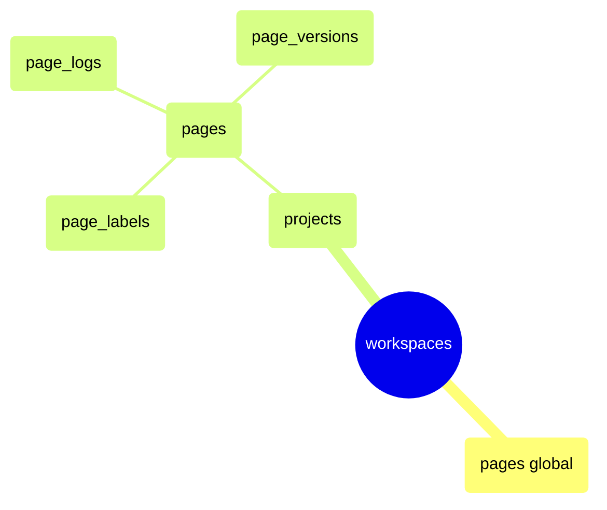

# Dominio — Pages (Documentos colaborativos)

> [!NOTE] Editor tipo Notion dentro de Plane
> Las páginas son documentos de texto enriquecido (Tiptap/ProseMirror serializado como HTML). Soportan historial de versiones, locking, archivado y acceso público/privado.

---

## Modelo de datos



> [!NOTE] Pages globales vs pages de proyecto
> Las páginas pueden ser de proyecto (`project_id` NOT NULL) o globales (`project_id` NULL, solo `workspace_id`). El frontend las diferencia por ruta.

---

## Endpoints a implementar

### CRUD de página

| Método   | URL                                                 | Guard                      | Fase |
| -------- | --------------------------------------------------- | -------------------------- | ---- |
| `GET`    | `/workspaces/{slug}/projects/{id}/pages/`           | `ProjectMemberGuard (≥5)`  | 4    |
| `POST`   | `/workspaces/{slug}/projects/{id}/pages/`           | `ProjectMemberGuard (≥15)` | 4    |
| `GET`    | `/workspaces/{slug}/projects/{id}/pages/{page_id}/` | `ProjectMemberGuard (≥5)`  | 4    |
| `PATCH`  | `/workspaces/{slug}/projects/{id}/pages/{page_id}/` | `ProjectMemberGuard (≥5)`  | 4    |
| `DELETE` | `/workspaces/{slug}/projects/{id}/pages/{page_id}/` | `ProjectMemberGuard (≥20)` | 4    |
| `GET`    | `/workspaces/{slug}/projects/{id}/pages-summary/`   | `ProjectMemberGuard (≥5)`  | 4    |

### Descripción (contenido enriquecido)

| Método      | URL                                                             | Guard                     | Fase |
| ----------- | --------------------------------------------------------------- | ------------------------- | ---- |
| `GET/PATCH` | `/workspaces/{slug}/projects/{id}/pages/{page_id}/description/` | `ProjectMemberGuard (≥5)` | 4    |

> [!WARNING] La descripción tiene endpoint propio
> El contenido HTML de la página se gestiona en un endpoint separado del metadata. Permite actualizaciones de contenido frecuentes sin tocar el resto de los campos.

### Versiones

| Método | URL                                                               | Guard                     | Fase |
| ------ | ----------------------------------------------------------------- | ------------------------- | ---- |
| `GET`  | `/workspaces/{slug}/projects/{id}/pages/{page_id}/versions/`      | `ProjectMemberGuard (≥5)` | 4    |
| `GET`  | `/workspaces/{slug}/projects/{id}/pages/{page_id}/versions/{pk}/` | `ProjectMemberGuard (≥5)` | 4    |

### Operaciones especiales

| Método        | URL                                                           | Guard                      | Fase |
| ------------- | ------------------------------------------------------------- | -------------------------- | ---- |
| `POST/DELETE` | `/workspaces/{slug}/projects/{id}/pages/{page_id}/archive/`   | `ProjectMemberGuard (≥15)` | 4    |
| `POST/DELETE` | `/workspaces/{slug}/projects/{id}/pages/{page_id}/lock/`      | `ProjectMemberGuard (≥15)` | 4    |
| `POST`        | `/workspaces/{slug}/projects/{id}/pages/{page_id}/access/`    | `ProjectMemberGuard (≥20)` | 4    |
| `POST`        | `/workspaces/{slug}/projects/{id}/pages/{page_id}/duplicate/` | `ProjectMemberGuard (≥15)` | 4    |
| `POST/DELETE` | `/workspaces/{slug}/projects/{id}/favorite-pages/{page_id}/`  | `ProjectMemberGuard (≥5)`  | 4    |

---

## Lock y Access — control de edición

```rust
// POST /pages/{id}/lock/ — bloquear página para edición exclusiva
pub async fn lock_page(
    State(state): State<AppState>,
    ProjectMemberGuard { user, .. }: ProjectMemberGuard,
    Path((_slug, project_id, page_id)): Path<(String, Uuid, Uuid)>,
) -> Result<Json<serde_json::Value>, AppError> {
    let page = pages::Entity::find_by_id(page_id)
        .filter(pages::Column::DeletedAt.is_null())
        .one(&state.db).await.map_err(AppError::Database)?
        .ok_or(AppError::NotFound("page".into()))?;

    // Solo el owner puede bloquear su página
    if page.owned_by != user.id {
        return Err(AppError::Forbidden);
    }

    if page.is_locked {
        return Err(AppError::Conflict("page is already locked".into()));
    }

    let mut active: pages::ActiveModel = page.into();
    active.is_locked = Set(true);
    active.update(&state.db).await.map_err(AppError::Database)?;

    Ok(Json(serde_json::json!({ "is_locked": true })))
}

// DELETE /pages/{id}/lock/ — desbloquear
// Solo el owner o un Admin del proyecto puede desbloquear
```

**Acceso — valores posibles de `access`:**

| Valor | Significado                                             |
| ----- | ------------------------------------------------------- |
| `0`   | `PUBLIC` — visible para todos los miembros del proyecto |
| `1`   | `SECRET` — solo visible para el owner                   |

---

## Historial de versiones — `page_versions`

Cada vez que se guarda una descripción, se crea una versión snapshot:

```rust
// src/utils/page_version.rs
pub async fn create_page_version(
    db: &DatabaseConnection,
    page_id: Uuid,
    project_id: Uuid,
    workspace_id: Uuid,
    description_html: &str,
    actor_id: Uuid,
) -> anyhow::Result<()> {
    // Solo guardar si el contenido cambió desde la última versión
    let last_version = page_versions::Entity::find()
        .filter(page_versions::Column::PageId.eq(page_id))
        .order_by_desc(page_versions::Column::CreatedAt)
        .one(db).await?;

    if let Some(v) = last_version {
        if v.description_html.as_deref() == Some(description_html) {
            return Ok(()); // Sin cambios, no crear versión
        }
    }

    page_versions::ActiveModel {
        id:               Set(Uuid::new_v4()),
        page_id:          Set(page_id),
        project_id:       Set(project_id),
        workspace_id:     Set(workspace_id),
        description_html: Set(Some(description_html.to_string())),
        owned_by_id:      Set(Some(actor_id)),
        ..Default::default()
    }.insert(db).await?;

    Ok(())
}
```

---

## Duplicate page — clonar página

```rust
pub async fn duplicate_page(
    State(state): State<AppState>,
    ProjectMemberGuard { user, workspace, project, .. }: ProjectMemberGuard,
    Path((_slug, project_id, page_id)): Path<(String, Uuid, Uuid)>,
) -> Result<(StatusCode, Json<PageResponse>), AppError> {
    let original = pages::Entity::find_by_id(page_id)
        .filter(pages::Column::DeletedAt.is_null())
        .one(&state.db).await.map_err(AppError::Database)?
        .ok_or(AppError::NotFound("page".into()))?;

    let new_page = pages::ActiveModel {
        id:               Set(Uuid::new_v4()),
        name:             Set(format!("Copy of {}", original.name)),
        description_html: Set(original.description_html.clone()),
        access:           Set(1), // SECRET por defecto al duplicar
        is_locked:        Set(false),
        archived_at:      Set(None),
        project_id:       Set(project_id),
        workspace_id:     Set(workspace.id),
        owned_by_id:      Set(Some(user.id)),
        created_by_id:    Set(Some(user.id)),
        ..Default::default()
    }.insert(&state.db).await.map_err(AppError::Database)?;

    Ok((StatusCode::CREATED, Json(PageResponse::from(new_page))))
}
```

---

## DTOs

```rust
#[derive(Deserialize, ToSchema)]
pub struct CreatePageRequest {
    pub name:             String,           // ⚠️ FIX-31: validar máx 255 chars
    pub description_html: Option<String>,   // ⚠️ FIX-31: validar máx 512 KB — cada PATCH genera snapshot en page_versions
    pub access:           Option<i16>,      // 0=public, 1=secret — validar que sea 0 o 1
    pub label_ids:        Option<Vec<Uuid>>,
}

// - Fix-31: Guards requeridos en handler de create/update --------─
// const MAX_PAGE_NAME: usize    = 255;
// const MAX_PAGE_HTML: usize    = 512 * 1024; // 512 KB
//
// if payload.name.len() > MAX_PAGE_NAME {
//     return Err(AppError::bad_request("name exceeds 255 characters"));
// }
// if let Some(ref html) = payload.description_html {
//     if html.len() > MAX_PAGE_HTML {
//         return Err(AppError::bad_request("description_html exceeds 512 KB"));
//     }
// }
//
// Riesgo sin validación:
//   • Sin límite en description_html: cada PATCH a /description/ crea un snapshot
//     en page_versions. Atacante envía 1 MB 100 veces → 100 MB en DB.
//   • Sin límite en name: queries con ORDER BY name se vuelven costosas.
// -------------------------------------

#[derive(Deserialize, ToSchema)]
pub struct UpdatePageDescriptionRequest {
    pub description_html:   String,            // ⚠️ FIX-31: validar máx 512 KB
    pub description_binary: Option<Vec<u8>>,   // para YJS collaboration (futuro) — también limitar tamaño
}

#[derive(Serialize, ToSchema)]
pub struct PageResponse {
    pub id:               Uuid,
    pub name:             String,
    pub description_html: Option<String>,
    pub access:           i16,
    pub is_locked:        bool,
    pub archived_at:      Option<DateTime<Utc>>,
    pub owned_by_id:      Option<Uuid>,
    pub project_id:       Option<Uuid>,
    pub workspace_id:     Uuid,
    pub label_ids:        Vec<Uuid>,
    pub is_favorite:      bool,
    pub created_at:       DateTime<Utc>,
    pub updated_at:       DateTime<Utc>,
}

#[derive(Serialize, ToSchema)]
pub struct PageVersionResponse {
    pub id:               Uuid,
    pub page_id:          Uuid,
    pub description_html: Option<String>,
    pub owned_by_id:      Option<Uuid>,
    pub created_at:       DateTime<Utc>,
}
```

---

## Pages-summary — listado ligero

`GET /pages-summary/` devuelve solo `id`, `name`, `updated_at` — sin `description_html`. Usado para la sidebar de navegación de páginas:

```rust
#[derive(Serialize, ToSchema)]
pub struct PageSummary {
    pub id:         Uuid,
    pub name:       String,
    pub access:     i16,
    pub is_locked:  bool,
    pub owned_by_id: Option<Uuid>,
    pub updated_at: DateTime<Utc>,
}
```

---

## Puntos críticos

> [!WARNING] 7 puntos críticos — incluye Fix-32 XSS

1. **Descripción en endpoint separado** — `PATCH /pages/{id}/description/` solo actualiza `description_html`. El `PATCH /pages/{id}/` solo actualiza metadata (name, access, labels). No mezclar.
2. **Versión en cada save** — al `PATCH /description/`, crear snapshot en `page_versions` si el contenido cambió.
3. **Lock verifica owner** — solo el `owned_by` puede bloquear. Un Admin del proyecto puede desbloquear cualquier página.
4. **Access check** — páginas con `access=1` (SECRET) solo visibles para el `owned_by`. En `GET /pages/`, filtrar si el usuario no es owner.
5. **Archivar no es soft-delete** — `archived_at` es distinto de `deleted_at`. Las páginas archivadas siguen visibles pero no en el listado principal.
6. **Duplicar** — la copia siempre queda como `SECRET` (access=1) y propiedad del usuario que duplica.
7. **⚠️ FIX-32 — Sanitizar `description_html` en ingreso** — el contenido HTML se almacena y sirve sin filtrado. Sin sanitización, un usuario puede inyectar `<script>`, event handlers u otras cargas XSS que se ejecutarán en el navegador de cualquier miembro que abra la página.
   - Usar crate `ammonia` en Rust para sanitizar en el handler de `POST /pages/` y `PATCH /description/` antes de persistir.
   - Permitlist: tags seguros de Tiptap (`p`, `h1`–`h6`, `ul`, `ol`, `li`, `strong`, `em`, `a`, `code`, `pre`, `blockquote`, `table`, `tr`, `td`, `th`).
   - Strip: cualquier tag o atributo no listado, especialmente `<script>`, `onerror`, `onclick`, `href="javascript:"`.
   - La sanitización en el backend es obligatoria incluso si el frontend (Tiptap) ya sanea — el API puede recibir requests directas sin pasar por el editor.

---

## Entidades SeaORM involucradas ✅

| Entidad            | Tabla           |
| ------------------ | --------------- |
| `pages.rs`         | `pages`         |
| `page_labels.rs`   | `page_labels`   |
| `page_logs.rs`     | `page_logs`     |
| `page_versions.rs` | `page_versions` |

---

## Plan de implementación

```
Fase 4:
  [ ] src/routes/pages.rs          — CRUD + lock/unlock + archive + duplicate + access
  [ ] src/routes/page_versions.rs  — GET versiones + GET versión específica
  [ ] src/utils/page_version.rs    — create_page_version helper (snapshot on save)
  [ ] src/routes/favorite_pages.rs — POST/DELETE /favorite-pages/{id}/
```

## 🔗 Navegar

← [[dominio-modulos]] | [[MOC]] | → [[dominio-notificaciones]]

**Relacionado:** Issues: [[dominio-issues]] | Proyectos: [[dominio-proyectos]] | Seed (pages iniciales): [[dominio-workspace-seed]]
