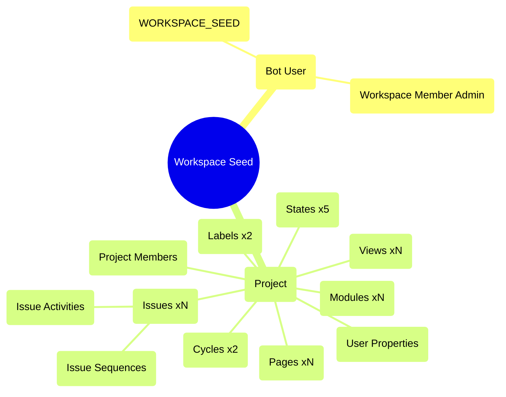

# WorkspaceSeedJob — población inicial del workspace

---

## Qué hace el seed en Django

`workspace_seed_task.py` es un **Celery task** disparado con `.delay(workspace_id)` inmediatamente después de `POST /api/workspaces/`. Crea de forma asíncrona:



---

## Archivos JSON de datos

Los datos de plantilla viven en 8 archivos JSON en `apps/api_rust/seeds/data/`:

| Archivo         | Descripción                                    |
| --------------- | ---------------------------------------------- |
| `projects.json` | 1 proyecto demo con nombre, identifier, logo   |
| `states.json`   | 5 estados con color, grupo (backlog/started/…) |
| `labels.json`   | 2 labels (admin, concepts)                     |
| `cycles.json`   | 2 ciclos con tipo CURRENT / UPCOMING           |
| `modules.json`  | N módulos con nombre y orden                   |
| `issues.json`   | N issues con description_html, priority, refs  |
| `views.json`    | N vistas con filtros                           |
| `pages.json`    | N páginas con description_html                 |

```bash
# Copiar desde el proyecto Django
mkdir -p apps/api_rust/seeds/data
cp apps/api/plane/seeds/data/*.json apps/api_rust/seeds/data/
```

Los JSON se incluyen en el binario con `include_str!()` — no necesitan rutas en runtime.

---

## Estructuras de deserialización

```rust
// src/jobs/workspace_seed/seed_data.rs
use serde::Deserialize;

#[derive(Debug, Deserialize)]
pub struct ProjectSeed {
    pub id:          i32,
    pub name:        String,
    pub identifier:  String,
    pub description: Option<String>,
    pub network:     i16,
    pub logo_props:  serde_json::Value,
}

#[derive(Debug, Deserialize)]
pub struct StateSeed {
    pub id:         i32,
    pub name:       String,
    pub color:      String,
    pub sequence:   f64,
    pub group:      String,
    pub default:    bool,
    pub project_id: i32,
}

#[derive(Debug, Deserialize)]
pub struct CycleSeed {
    pub id:         i32,
    pub name:       String,
    pub project_id: i32,
    #[serde(rename = "type")]
    pub cycle_type: String, // "CURRENT" | "UPCOMING"
}

#[derive(Debug, Deserialize)]
pub struct IssueSeed {
    pub id:                  i32,
    pub name:                String,
    pub sequence_id:         i32,
    pub description_html:    Option<String>,
    pub sort_order:          f64,
    pub state_id:            i32,
    pub labels:              Vec<i32>,
    pub priority:            String,
    pub project_id:          i32,
    pub cycle_id:            Option<i32>,
    pub module_ids:          Option<Vec<i32>>,
}
```

---

## El job apalis

```rust
// src/jobs/workspace_seed/mod.rs
use apalis::prelude::*;
use serde::{Deserialize, Serialize};
use uuid::Uuid;
use std::collections::HashMap;

#[derive(Debug, Clone, Serialize, Deserialize)]
pub struct WorkspaceSeedJob {
    pub workspace_id: Uuid,
}

pub async fn handle_workspace_seed(
    job: WorkspaceSeedJob,
    ctx: Data<sea_orm::DatabaseConnection>,
) -> Result<(), apalis::prelude::Error> {
    let db = ctx.as_ref();
    seed_workspace(db, job.workspace_id).await
        .map_err(|e| apalis::prelude::Error::Failed(e.to_string().into()))
}

async fn seed_workspace(
    db: &sea_orm::DatabaseConnection,
    workspace_id: Uuid,
) -> anyhow::Result<()> {
    // 1. Idempotencia — no re-sembrar si ya existe un proyecto.
    //
    // [Fix #15a] Race condition: la comprobación DEBE ocurrir dentro de la
    // transacción con un advisory lock de Postgres para evitar que dos
    // instancias del worker ejecuten el seed simultáneamente para el mismo
    // workspace (apalis puede reencolar un job si el worker muere antes del ACK).
    //
    // pg_try_advisory_xact_lock(key) — el lock se libera automáticamente
    // al hacer commit/rollback, no se necesita unlock manual.
    let txn = db.begin().await?;

    // Lock exclusivo por workspace — bloquea otros workers que intenten sembrar el mismo workspace.
    // Usar los bytes del UUID como la clave i64 del advisory lock.
    // Los primeros 8 bytes de un UUID v4 siempre existen — slice nunca falla.
    // SAFETY: workspace_id.as_bytes() devuelve exactamente 16 bytes; [..8] es siempre válido.
    let lock_key = i64::from_le_bytes(
        workspace_id.as_bytes()[..8].try_into()
            .expect("UUID bytes slice [..8] always yields exactly 8 bytes") // silence-patterns-ok: invariante estático garantizado por el tipo UUID
    );
    let locked: bool = txn.query_one(
        sea_orm::Statement::from_sql_and_values(
            sea_orm::DatabaseBackend::Postgres,
            "SELECT pg_try_advisory_xact_lock($1)",
            [lock_key.into()],
        )
    ).await?.try_get_by_index(0)?;

    if !locked {
        tracing::warn!(workspace_id = %workspace_id, "Seed already in progress (advisory lock held), skipping");
        txn.rollback().await?;
        return Ok(());
    }

    // Con el lock adquirido, verificar idempotencia dentro de la misma transacción.
    let existing = projects::Entity::find()
        .filter(projects::Column::WorkspaceId.eq(workspace_id))
        .count(&txn).await?;
    if existing > 0 {
        tracing::info!(workspace_id = %workspace_id, "Workspace already seeded, skipping");
        txn.rollback().await?;
        return Ok(());
    }

    // 2. Cargar seeds desde JSON embebido en el binario
    // include_str! se resuelve en tiempo de compilación — no hay I/O en runtime.
    let projects_tpl: Vec<ProjectSeed> = serde_json::from_str(
        include_str!("../../seeds/data/projects.json"))?;
    let states_tpl: Vec<StateSeed> = serde_json::from_str(
        include_str!("../../seeds/data/states.json"))?;
    let labels_tpl: Vec<LabelSeed> = serde_json::from_str(
        include_str!("../../seeds/data/labels.json"))?;
    let cycles_tpl: Vec<CycleSeed> = serde_json::from_str(
        include_str!("../../seeds/data/cycles.json"))?;
    let issues_tpl: Vec<IssueSeed> = serde_json::from_str(
        include_str!("../../seeds/data/issues.json"))?;
    // ...modules, views, pages igual

    // [Fix #15b] Todos los INSERTs dentro de la misma transacción — si algo
    // falla a mitad (ej. FK violation en issues), el rollback deja el workspace
    // limpio y apalis puede reintentar el job sin datos huérfanos.

    // 3. Bot user
    let bot_id = create_bot_user(&txn, workspace_id).await?;
    add_bot_to_workspace(&txn, workspace_id, bot_id).await?;

    // 4. Workspace members actuales
    let members = workspace_members::Entity::find()
        .filter(workspace_members::Column::WorkspaceId.eq(workspace_id))
        .all(&txn).await?;

    // 5. Proyecto + miembros — devuelve mapa seed_id(i32) → real_uuid
    let project_map = create_project_and_members(
        &txn, workspace_id, &projects_tpl, &members, bot_id
    ).await?;

    // 6. Resto en orden estricto (respeta FKs)
    let state_map  = create_states(&txn, workspace_id, &states_tpl, &project_map, bot_id).await?;
    let label_map  = create_labels(&txn, workspace_id, &labels_tpl, &project_map, bot_id).await?;
    let cycle_map  = create_cycles(&txn, workspace_id, &cycles_tpl, &project_map, bot_id).await?;
    let module_map = create_modules(&txn, workspace_id, &modules_tpl, &project_map, bot_id).await?;

    // 7. Issues con relaciones
    create_issues(&txn, workspace_id, &issues_tpl,
        &project_map, &state_map, &label_map, &cycle_map, &module_map, bot_id).await?;

    // 8. Views y pages
    create_views(&txn, workspace_id, &views_tpl, &project_map, bot_id).await?;
    create_pages(&txn, workspace_id, &pages_tpl, &project_map, bot_id).await?;

    txn.commit().await?;
    tracing::info!(workspace_id = %workspace_id, "Workspace seeded successfully");
    Ok(())
}
```

---

## Mapa de IDs — patrón crítico

Los JSON usan IDs enteros temporales (1, 2, 3…). Al insertar en Postgres se generan UUIDs reales. `HashMap<i32, Uuid>` resuelve referencias cruzadas:

```rust
let mut state_map: HashMap<i32, Uuid> = HashMap::new();

for seed in &states_tpl {
    let model = states::ActiveModel {
        id:   Set(Uuid::new_v4()),
        name: Set(seed.name.clone()),
        // ...
    }.insert(db).await?;
    state_map.insert(seed.id, model.id);
}

// Al crear issue: resolver FK
let real_state_id = state_map[&issue_seed.state_id];
```

---

## Encolar el job desde el handler de workspaces

```rust
// src/routes/workspaces.rs — POST /api/workspaces/
async fn create_workspace(
    State(state): State<AppState>,
    CurrentUser(user): CurrentUser,
    Json(payload): Json<CreateWorkspaceRequest>,
) -> Result<Json<WorkspaceResponse>, AppError> {
    // ... crear workspace y workspace_member ...

    // Best-effort — no bloquear la respuesta HTTP
    if let Err(e) = state.job_storage
        .push(WorkspaceSeedJob { workspace_id: new_workspace.id })
        .await
    {
        tracing::warn!("Failed to enqueue workspace seed: {e}");
    }

    Ok(Json(workspace_response))
}
```

---

## Datos globales vs datos de workspace

| Tipo                       | Dónde                       | Cuándo             |
| -------------------------- | --------------------------- | ------------------ |
| `integrations` (3 filas)   | Migración `m007_seed_data`  | Al arrancar DB     |
| `instance_configurations`  | Migración `m007_seed_data`  | Al arrancar DB     |
| `auth_permission` / grupos | Migración `m001_baseline`   | Al arrancar DB     |
| Proyecto demo + issues     | `WorkspaceSeedJob` (apalis) | Al crear workspace |
| Bot user por workspace     | `WorkspaceSeedJob` (apalis) | Al crear workspace |

---

## Puntos críticos específicos del seed

> [!WARNING] Ver [[plan-riesgos]] para la lista completa de riesgos

1. **Orden obligatorio:** `workspace → bot_user → project → states → labels → cycles → modules → issues → views → pages`
2. **IDs temporales → UUIDs:** usar `HashMap<i32, Uuid>` para todas las referencias cruzadas
3. **`IssueSequence`:** crear por cada issue (genera el `#` de referencia)
4. **`ProjectIdentifier`:** crear al crear el proyecto (genera el prefijo `WS-`)
5. **`bot_type` enum:** verificar que `'WORKSPACE_SEED'` existe en el enum Postgres
6. **Ciclos:** calcular fechas en runtime, no usar fechas del JSON
7. **`description_html`:** insertar verbatim, sin sanitizar

---

## Plan de implementación

```
Fase 2:
  [ ] src/jobs/workspace_seed/mod.rs       — run_workspace_seed orquestador
  [ ] src/jobs/workspace_seed/seed_data.rs — create_default_states + create_default_labels
                                             + create_default_members + create_default_cycles
  [ ] src/routes/workspaces.rs             — llamar al seed en POST /api/workspaces/
```

## 🔗 Navegar

← [[impl-error-jobs-cron]] | [[MOC]] | → [[dominio-integraciones]]

**Relacionado:** Diagrama de secuencia: [[ref-diagramas-secuencia#1. Creación de workspace + seed asíncrono]] | Riesgos: [[plan-riesgos]] | Estructura de archivos: [[ref-estructura-archivos]]
