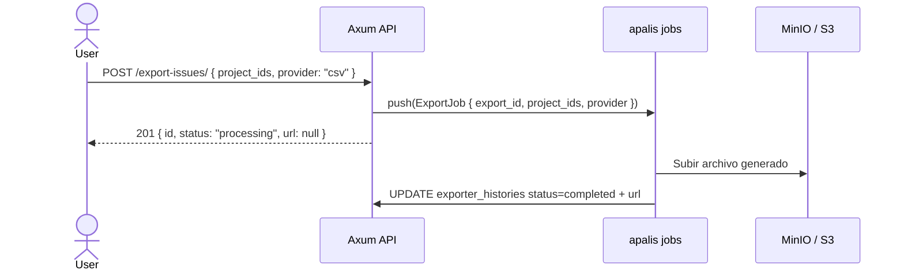

# Flujo de Workspace Settings

> [!NOTE] Panel de configuración del workspace
> Accesible desde `/{workspaceSlug}/settings/`.
> Control de acceso por rol en MobX store (frontend) + RBAC en Axum (backend).

---

## Índice de secciones

| #    | Sección                                                  | Ruta frontend                    | Roles con acceso  |
| ---- | -------------------------------------------------------- | -------------------------------- | ----------------- |
| WS-1 | [General](#ws-1--general)                                | `/{slug}/settings/`              | Admin, Member     |
| WS-2 | [Members](#ws-2--members)                                | `/{slug}/settings/members/`      | Admin, Member     |
| WS-3 | [Billing & Plans](#ws-3--billing--plans)                 | `/{slug}/settings/billing/`      | Admin (CE: vacío) |
| WS-4 | [Exports](#ws-4--exports)                                | `/{slug}/settings/exports/`      | Admin, Member     |
| WS-5 | [Integrations](#ws-5--integrations)                      | `/{slug}/settings/integrations/` | Admin             |
| WS-6 | [Webhooks](#ws-6--webhooks)                              | `/{slug}/settings/webhooks/`     | Admin             |
| WS-7 | [UI State](#ws-7--workspace-ui-state-endpoints-modernos) | -                                | Admin, Member     |
| WS-8 | [Aggregates](#ws-8--workspace-aggregates)                | -                                | Admin, Member     |

---

## Arquitectura de capas (frontend)

```typescript
// packages/constants/src/settings/workspace.ts
WORKSPACE_SETTINGS_ACCESS = {
  "/settings": [Admin, Member],
  "/settings/members": [Admin, Member],
  "/settings/billing": [Admin],
  "/settings/exports": [Admin, Member],
  "/settings/integrations": [Admin],
  "/settings/webhooks": [Admin],
};
```

El layout `WorkspaceSettingLayout` verifica el rol del usuario con MobX antes de renderizar la página. Si no tiene acceso → `<NotAuthorizedView />`.

---

## WS-1 — General

**Propósito:** Editar nombre, logo, descripción y slug. Eliminar workspace (solo admin).

**Endpoints:**

| Método   | URL                       | Guard                        |
| -------- | ------------------------- | ---------------------------- |
| `GET`    | `/api/workspaces/{slug}/` | `WorkspaceMemberGuard (≥5)`  |
| `PATCH`  | `/api/workspaces/{slug}/` | `WorkspaceMemberGuard (≥20)` |
| `DELETE` | `/api/workspaces/{slug}/` | `WorkspaceMemberGuard (≥20)` |

```rust
// src/routes/workspaces.rs
Router::new()
    .route("/api/workspaces/:slug",
           get(get_workspace).patch(update_workspace).delete(delete_workspace))
```

---

## WS-2 — Members

**Propósito:** Ver, invitar, cambiar rol y expulsar miembros.

**Endpoints:**

| Método  | URL                                    | Guard                        |
| ------- | -------------------------------------- | ---------------------------- |
| `GET`   | `/api/workspaces/{slug}/members/`      | `WorkspaceMemberGuard (≥5)`  |
| `GET`   | `/api/workspaces/{slug}/members/{pk}/` | `WorkspaceMemberGuard (≥5)`  |
| `PATCH` | `/api/workspaces/{slug}/members/{pk}/` | `WorkspaceMemberGuard (≥20)` |

> [!NOTE] INC-13 corregido
> GUEST (5) tiene permiso para listar miembros.
> | `DELETE` | `/api/workspaces/{slug}/members/{pk}/` | `WorkspaceMemberGuard (≥20)` |
> | `POST` | `/api/workspaces/{slug}/members/leave/` | `WorkspaceMemberGuard (≥5)` |
> | `GET` | `/api/workspaces/{slug}/invitations/` | `WorkspaceMemberGuard (≥20)` |
> | `POST` | `/api/workspaces/{slug}/invitations/` | `WorkspaceMemberGuard (≥20)` |
> | `DELETE` | `/api/workspaces/{slug}/invitations/{pk}/` | `WorkspaceMemberGuard (≥20)` |

**Roles:**

| Valor | Nombre        | Puede invitar | Puede cambiar roles | Puede expulsar |
| ----- | ------------- | :-----------: | :-----------------: | :------------: |
| 20    | Admin / Owner |      ✅       |         ✅          |       ✅       |
| 15    | Member        |      ❌       |         ❌          |       ❌       |
| 10    | Viewer        |      ❌       |         ❌          |       ❌       |
| 5     | Guest         |      ❌       |         ❌          |       ❌       |

> [!WARNING] No expulsar al único Owner
> El handler de DELETE debe verificar que el workspace tendrá al menos un Owner tras la operación. Si intenta expulsar al último → 400 Bad Request.

---

## WS-3 — Billing & Plans

**Estado en CE (self-hosted):** La página existe en el frontend pero el componente renderiza vacío. No hay endpoints de billing en la API de CE.

**Implementación Rust:** No requiere endpoints nuevos para CE.

---

## WS-4 — Exports

**Propósito:** Exportar datos (issues, cycles, modules) a CSV/JSON.

**Endpoints:**

| Método | URL                                     | Guard                       |
| ------ | --------------------------------------- | --------------------------- |
| `POST` | `/api/workspaces/{slug}/export-issues/` | `WorkspaceMemberGuard (≥5)` |

> [!WARNING] INC-01 corregido
> Django solo expone `POST /export-issues/` (`ExportIssuesEndpoint`). No hay `GET` para listar
> ni `DELETE` para cancelar — el status se devuelve en el response del POST.
> La URL `/exports/` era incorrecta.

**Flujo:**



**Job apalis (Fase 3):**

```rust
// src/jobs/export.rs
#[derive(Debug, Clone, Serialize, Deserialize)]
pub struct ExportJob {
    pub export_id:   Uuid,
    pub workspace_id: Uuid,
    pub project_ids: Vec<Uuid>,
    pub provider:    String,   // "csv" | "json"
    pub multiple:    bool,
}

pub async fn handle_export(
    job: ExportJob,
    ctx: Data<DatabaseConnection>,
) -> Result<(), apalis::prelude::Error> {
    // 1. Generar CSV/JSON en memoria
    // 2. Subir a S3/MinIO con aws-sdk-s3
    // 3. UPDATE exporter_histories SET status='completed', url='...'
    Ok(())
}
```

---

## WS-5 — Integrations

**Propósito:** Conectar con GitHub App, GitLab y Slack.

**Ruta frontend:** `/{workspaceSlug}/settings/integrations/`

**Documentación completa:** ver [[dominio-integraciones]]

**Resumen de endpoints:**

| Método   | URL                                                                  |
| -------- | -------------------------------------------------------------------- |
| `GET`    | `/api/integrations/`                                                 |
| `GET`    | `/api/workspaces/{slug}/workspace-integrations/`                     |
| `POST`   | `/api/workspaces/{slug}/workspace-integrations/{provider}/install/`  |
| `DELETE` | `/api/workspaces/{slug}/workspace-integrations/{provider}/provider/` |

**Flujo de la página (`/settings/integrations/`):**

```
WorkspaceIntegrationsPage (useSWR)
  ├─ GET /api/integrations/            → 3 providers disponibles (filas estáticas)
  ├─ GET /api/workspaces/{slug}/workspace-integrations/ → instaladas
  └─ <SingleIntegrationCard /> × 3
       ├─ isEnabled: instance config (IS_GITHUB_INTEGRATION_ENABLED etc.)
       ├─ isInstalled: workspace_integrations filtrado por provider
       ├─ Botón "Connect" → popup OAuth
       └─ Botón "Configure →" → /settings/integrations/{provider}/
```

---

## WS-6 — Webhooks

**Propósito:** Registrar URLs externas que reciben notificaciones de eventos.

**Endpoints:**

| Método   | URL                                                 | Guard                        |
| -------- | --------------------------------------------------- | ---------------------------- |
| `GET`    | `/api/workspaces/{slug}/webhooks/`                  | `WorkspaceMemberGuard (≥20)` |
| `POST`   | `/api/workspaces/{slug}/webhooks/`                  | `WorkspaceMemberGuard (≥20)` |
| `GET`    | `/api/workspaces/{slug}/webhooks/{pk}/`             | `WorkspaceMemberGuard (≥20)` |
| `PATCH`  | `/api/workspaces/{slug}/webhooks/{pk}/`             | `WorkspaceMemberGuard (≥20)` |
| `DELETE` | `/api/workspaces/{slug}/webhooks/{pk}/`             | `WorkspaceMemberGuard (≥20)` |
| `POST`   | `/api/workspaces/{slug}/webhooks/{pk}/regenerate/`  | `WorkspaceMemberGuard (≥20)` |
| `GET`    | `/api/workspaces/{slug}/webhook-logs/{webhook_id}/` | `WorkspaceMemberGuard (≥20)` |

**Eventos disponibles:** `issue`, `cycle`, `module`, `issue_comment`, `project`

**Job de despacho de webhook (Fase 3):**

> [!WARNING] Fix #20 — SSRF via `webhook.url` sin validación de dominio
> El URL del webhook puede apuntar a servicios internos (`http://169.254.169.254/`,
> `http://localhost/`, rangos RFC-1918, etc.). Se debe validar antes de enviar.
>
> Fix #21 — `reqwest::Client::new()` por request (ver también Fix #18)
> El cliente debe vivir en `AppState` y pasarse como `Data<reqwest::Client>`.

```rust
// src/jobs/webhooks.rs
use std::net::IpAddr;
use url::Url;

#[derive(Debug, Clone, Serialize, Deserialize)]
pub struct WebhookDeliveryJob {
    pub webhook_id:  Uuid,
    pub event_type:  String,
    pub payload:     serde_json::Value,
}

/// Rechaza URLs que apunten a redes privadas / loopback / link-local (SSRF).
/// Devuelve error si el URL es inválido o resuelve a una dirección no pública.
fn validate_webhook_url(raw: &str) -> Result<Url, anyhow::Error> {
    let url = Url::parse(raw)
        .map_err(|_| anyhow::anyhow!("invalid webhook URL"))?;

    // Solo HTTP/HTTPS permitidos
    if !matches!(url.scheme(), "http" | "https") {
        anyhow::bail!("webhook URL scheme must be http or https");
    }

    let host = url.host_str()
        .ok_or_else(|| anyhow::anyhow!("webhook URL has no host"))?;

    // Bloquear literales de IP privada / loopback
    if let Ok(ip) = host.parse::<IpAddr>() {
        if ip.is_loopback() || ip.is_unspecified() || is_private_ip(ip) {
            anyhow::bail!("webhook URL resolves to a private/reserved address");
        }
    }

    // Bloquear hostnames conocidos de metadata cloud y loopback por nombre
    let blocked_hosts = ["localhost", "metadata.google.internal"];
    if blocked_hosts.contains(&host) {
        anyhow::bail!("webhook URL host is blocked");
    }

    Ok(url)
}

fn is_private_ip(ip: IpAddr) -> bool {
    match ip {
        IpAddr::V4(v4) => {
            v4.is_private()        // 10.x, 172.16-31.x, 192.168.x
            || v4.is_link_local()  // 169.254.x.x (AWS metadata)
            || v4.is_broadcast()
            || v4.is_documentation()
        }
        IpAddr::V6(v6) => v6.is_loopback() || v6.is_unspecified(),
    }
}

/// `http_client` se inyecta desde AppState — se construye UNA VEZ en main.rs.
pub async fn handle_webhook_delivery(
    job: WebhookDeliveryJob,
    db:  Data<DatabaseConnection>,
    http_client: Data<reqwest::Client>,
) -> Result<(), apalis::prelude::Error> {
    let db = db.as_ref();
    let webhook = webhooks::Entity::find_by_id(job.webhook_id)
        .one(db).await?
        .ok_or_else(|| apalis::prelude::Error::Failed("not found".into()))?;

    if !webhook.is_active { return Ok(()); }

    // [Fix #20] Validar URL antes de hacer cualquier petición
    let validated_url = validate_webhook_url(&webhook.url).map_err(|e| {
        tracing::warn!(webhook_id = %job.webhook_id, error = %e, "blocked SSRF attempt");
        apalis::prelude::Error::Failed(e.to_string().into())
    })?;

    // Firmar con HMAC-SHA256
    let signature = compute_hmac_signature(&webhook.secret_key, &job.payload);

    // [Fix #21] Usar cliente compartido — sin new() por request
    let result = http_client
        .post(validated_url)
        .header("X-Plane-Delivery", uuid::Uuid::new_v4().to_string())
        .header("X-Plane-Event", &job.event_type)
        .header("X-Plane-Signature", &signature)
        .json(&job.payload)
        .timeout(std::time::Duration::from_secs(30))
        .send()
        .await;

    // Fallo silencioso pero registrado en webhook_logs
    if let Err(e) = result {
        tracing::warn!(webhook_id = %job.webhook_id, error = %e, "webhook delivery failed");
    }

    Ok(())
}
```

**Construcción del cliente en `main.rs` (una sola vez):**

```rust
// src/main.rs — al construir AppState
let http_client = reqwest::Client::builder()
    .timeout(std::time::Duration::from_secs(30))
    .build()
    .expect("failed to build HTTP client");
// Se pasa como Data<reqwest::Client> al worker de apalis
```

---

## Prioridad de implementación

```
Fase 2 (endpoints de alta frecuencia):
  ✅ WS-1 General     → GET/PATCH/DELETE /workspaces/{slug}/
  ✅ WS-2 Members     → CRUD completo de miembros e invitaciones
  [ ] WS-6 Webhooks   → CRUD + regenerate secret

Fase 3 (background jobs):
  [ ] WS-4 Exports    → ExportJob en apalis
  [ ] WS-6 Webhooks   → WebhookDeliveryJob en apalis

Fase 2 extendida:
  [ ] WS-5 Integrations → ver dominio-integraciones
```

---

## WS-7 — Workspace UI State (endpoints modernos)

> [!WARNING] INC-03 — Estos endpoints existían en Django pero no estaban documentados.

Endpoints del workspace para gestionar estado de UI del usuario (homescreen, stickies, visitas recientes):

| Método             | URL                                              | Vista Django                     |
| ------------------ | ------------------------------------------------ | -------------------------------- |
| `GET/POST`         | `/api/workspaces/{slug}/quick-links/`            | `QuickLinkViewSet`               |
| `GET/PATCH/DELETE` | `/api/workspaces/{slug}/quick-links/{pk}/`       | `QuickLinkViewSet`               |
| `GET`              | `/api/workspaces/{slug}/recent-visits/`          | `UserRecentVisitViewSet`         |
| `GET/PATCH`        | `/api/workspaces/{slug}/home-preferences/`       | `WorkspaceHomePreferenceViewSet` |
| `GET/PATCH`        | `/api/workspaces/{slug}/home-preferences/{key}/` | `WorkspaceHomePreferenceViewSet` |
| `GET/POST`         | `/api/workspaces/{slug}/stickies/`               | `WorkspaceStickyViewSet`         |
| `GET/PATCH/DELETE` | `/api/workspaces/{slug}/stickies/{pk}/`          | `WorkspaceStickyViewSet`         |
| `GET/PATCH`        | `/api/workspaces/{slug}/sidebar-preferences/`    | `WorkspaceUserPreferenceViewSet` |

**Workspace Favorites (INC-15):**

| Método             | URL                                                          | Vista Django                     |
| ------------------ | ------------------------------------------------------------ | -------------------------------- |
| `GET/POST`         | `/api/workspaces/{slug}/user-favorites/`                     | `WorkspaceFavoriteEndpoint`      |
| `GET/PATCH/DELETE` | `/api/workspaces/{slug}/user-favorites/{favorite_id}/`       | `WorkspaceFavoriteEndpoint`      |
| `GET`              | `/api/workspaces/{slug}/user-favorites/{favorite_id}/group/` | `WorkspaceFavoriteGroupEndpoint` |

---

## WS-8 — Workspace Aggregates

> [!WARNING] INC-17 — Endpoints de agregación cross-project.

| Método             | URL                                             | Vista Django                       | Descripción                      |
| ------------------ | ----------------------------------------------- | ---------------------------------- | -------------------------------- |
| `GET`              | `/api/workspaces/{slug}/labels/`                | `WorkspaceLabelsEndpoint`          | Todos los labels del workspace   |
| `GET`              | `/api/workspaces/{slug}/states/`                | `WorkspaceStatesEndpoint`          | Todos los estados del workspace  |
| `GET`              | `/api/workspaces/{slug}/estimates/`             | `WorkspaceEstimatesEndpoint`       | Todos los sistemas de estimación |
| `GET`              | `/api/workspaces/{slug}/modules/`               | `WorkspaceModulesEndpoint`         | Todos los módulos del workspace  |
| `GET`              | `/api/workspaces/{slug}/cycles/`                | `WorkspaceCyclesEndpoint`          | Todos los ciclos del workspace   |
| `GET/PATCH`        | `/api/workspaces/{slug}/user-properties/`       | `WorkspaceUserPropertiesEndpoint`  | Filtros globales del usuario     |
| `GET/POST`         | `/api/workspaces/{slug}/workspace-themes/`      | `WorkspaceThemeViewSet`            | Temas del workspace              |
| `GET/PATCH/DELETE` | `/api/workspaces/{slug}/workspace-themes/{pk}/` | `WorkspaceThemeViewSet`            | —                                |
| `GET`              | `/api/workspaces/{slug}/workspace-views/`       | `WorkspaceMemberUserViewsEndpoint` | Vistas guardadas del usuario     |
| `GET`              | `/api/workspaces/{slug}/workspace-members/me/`  | `WorkspaceMemberUserEndpoint`      | Info del miembro actual          |
| `GET`              | `/api/workspaces/{slug}/project-members/`       | `WorkspaceProjectMemberEndpoint`   | Roles en proyectos               |

---

## Entidades SeaORM relevantes

| Sección      | Entidad Rust                  | Notas                               |
| ------------ | ----------------------------- | ----------------------------------- |
| General      | `workspaces.rs`               | PATCH + soft delete                 |
| Members      | `workspace_members.rs`        | Filtrar `is_active=true`            |
| Members      | `workspace_member_invites.rs` | Status: pending/accepted            |
| Exports      | `exporter_histories.rs`       | status: processing/completed/failed |
| Integrations | `workspace_integrations.rs`   | Ver [[dominio-integraciones]]       |
| Integrations | `integrations.rs`             | 3 filas estáticas (seed)            |
| Webhooks     | `webhooks.rs`                 | secret_key para HMAC                |
| Webhooks     | `webhook_logs.rs`             | Historial de entregas               |

---

## 🔗 Navegar

← [[dominio-integraciones]] | [[MOC]] | → [[ref-diagramas-flujo]]

**Relacionado:** Integraciones detalle: [[dominio-integraciones]] | Diagrama secuencia: [[ref-diagramas-secuencia#5. Flujo Workspace Settings — cambio de rol de miembro]] | Jobs: [[impl-error-jobs-cron]]
