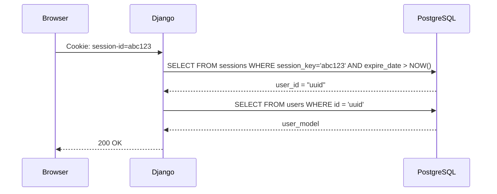

# Autenticación — Session Cookie y API Key

> [!INFO] Estado actual en Rust
> La capa base ya está implementada en código: `SessionUser`, `ApiKeyUser`, `AnyAuth`,
> `logout`, `RateLimitState`, `429 RateLimited` y headers `X-RateLimit-*` para requests
> con `X-Api-Key`. Lo pendiente son tests de integración y el uso en endpoints reales.

---

## Contexto — cómo autentifica Django hoy

| Mecanismo          | Módulo Django                          | Quién lo usa                         | Header / Cookie     |
| ------------------ | -------------------------------------- | ------------------------------------ | ------------------- |
| **Session cookie** | `plane/app/` + `plane/authentication/` | Frontend Next.js (web app)           | Cookie `session-id` |
| **API Key**        | `plane/api/`                           | Integraciones externas, CLI, scripts | Header `X-Api-Key`  |

La app web vive **100% en session cookies** — no usa JWT ni Bearer tokens.

---

## Dependencias a agregar

```toml
# apps/api_rust/Cargo.toml
axum-extra = { version = "0.10", features = ["cookie"] }
time = "0.3"   # requerido por Cookie::max_age
```

---

## Parte 1 — Session Cookie

### Cómo funciona en Django



**Puntos clave:**

- `session_key` es una cadena aleatoria de 128 chars — **no JWT, no encriptado**
- La tabla `sessions` tiene `user_id` como columna directa — Rust **no necesita decodificar `session_data`** (pickle Python)
- Dos cookies distintas según el path:
  - `session-id` → rutas normales (7 días TTL)
  - `admin-session-id` → rutas con `instances` en el path (1 hora TTL)

```rust
// src/auth/session.rs
use axum::{async_trait, extract::FromRequestParts, http::request::Parts};
use axum_extra::extract::CookieJar;
use axum::extract::FromRef;
use chrono::Utc;
use sea_orm::{ColumnTrait, EntityTrait, QueryFilter};
use crate::{AppState, entities::{sessions, users}, error::AppError};

pub const SESSION_COOKIE_NAME: &str       = "session-id";
pub const ADMIN_SESSION_COOKIE_NAME: &str = "admin-session-id";

#[derive(Debug, Clone, PartialEq)]
pub enum SessionKind {
    App,
    Admin,
}

impl SessionKind {
    pub fn from_path(path: &str) -> Self {
        if path.contains("instances") { Self::Admin } else { Self::App }
    }
    pub fn primary_cookie(&self) -> &'static str {
        match self { Self::App => SESSION_COOKIE_NAME, Self::Admin => ADMIN_SESSION_COOKIE_NAME }
    }
    pub fn fallback_cookie(&self) -> &'static str {
        match self { Self::App => ADMIN_SESSION_COOKIE_NAME, Self::Admin => SESSION_COOKIE_NAME }
    }
}

pub struct SessionUser(pub users::Model);

#[async_trait]
impl<S> FromRequestParts<S> for SessionUser
where
    S: Send + Sync,
    AppState: FromRef<S>,
{
    type Rejection = AppError;

    async fn from_request_parts(parts: &mut Parts, state: &S) -> Result<Self, AppError> {
        let app_state = AppState::from_ref(state);
        let jar  = CookieJar::from_headers(&parts.headers);
        let kind = SessionKind::from_path(parts.uri.path());

        let session_key = jar
            .get(kind.primary_cookie())
            .or_else(|| jar.get(kind.fallback_cookie()))
            .map(|c| c.value().to_string())
            .ok_or(AppError::Unauthorized)?;

        // Django genera session_key de 128 chars. Valores más largos son inválidos
        // y causarían una query DB innecesaria con input potencialmente enorme.
        if session_key.len() > 128 {
            return Err(AppError::Unauthorized);
        }

        let session = sessions::Entity::find_by_id(&session_key)
            .filter(sessions::Column::ExpireDate.gt(Utc::now()))
            .one(&app_state.db)
            .await
            .map_err(AppError::Database)?
            .ok_or(AppError::Unauthorized)?;

        let user_id: uuid::Uuid = session.user_id
            .ok_or(AppError::Unauthorized)?
            .parse()
            .map_err(|_| AppError::Unauthorized)?;

        let user = users::Entity::find_by_id(user_id)
            .one(&app_state.db)
            .await
            .map_err(AppError::Database)?
            .ok_or(AppError::Unauthorized)?;

        if !user.is_active { return Err(AppError::Unauthorized); }
        Ok(SessionUser(user))
    }
}
```

### Atributos de la cookie (réplica exacta de Django)

| Atributo Django                   | Valor                   | Rust (`Cookie::build`)                     |
| --------------------------------- | ----------------------- | ------------------------------------------ |
| `SESSION_COOKIE_HTTPONLY = True`  | No accesible desde JS   | `.http_only(true)`                         |
| `SESSION_COOKIE_SECURE`           | Solo HTTPS en prod      | `.secure(config.is_production)`            |
| `SESSION_COOKIE_SAMESITE`         | `"Lax"`                 | `.same_site(SameSite::Lax)`                |
| `SESSION_COOKIE_DOMAIN`           | `COOKIE_DOMAIN` env var | `.domain(config.cookie_domain.as_deref())` |
| `SESSION_COOKIE_AGE = 604800`     | 7 días                  | `.max_age(time::Duration::days(7))`        |
| `ADMIN_SESSION_COOKIE_AGE = 3600` | 1 hora                  | `.max_age(time::Duration::hours(1))`       |

### Diferencia crítica: `session_data` vs `user_id`

```sql
-- migration/src/migrations/m_create_sessions_table.sql
-- Tabla sessions en PostgreSQL
session_key  TEXT PRIMARY KEY   -- clave aleatoria 128 chars
session_data TEXT               -- base64(pickle(dict)) — SOLO lo lee Python
expire_date  TIMESTAMPTZ
user_id      VARCHAR(50)        -- ← Rust usa SOLO esta columna (indexada)
```

```rust
// src/auth/session.rs
// ✅ Correcto
let user_id_str = session.user_id.ok_or(AppError::Unauthorized)?;

// ❌ NUNCA intentar esto — pickle de Python no decodificable en Rust
// let data = base64::decode(&session.session_data)?;
```

### Logout

```rust
// src/auth/logout.rs
use axum::{extract::State, http::{StatusCode, Uri}};
use axum_extra::extract::{CookieJar, cookie::{Cookie, SameSite}};

pub async fn logout(
    State(state): State<AppState>,
    uri: Uri,
    jar: CookieJar,
    SessionUser(_user): SessionUser,
) -> Result<(CookieJar, StatusCode), AppError> {
    // ✅ Usar SessionKind::from_path para determinar qué cookie leer —
    // igual que lo hace el extractor SessionUser. Sin esto, un admin
    // en /instances/... buscaría "session-id" primero (equivocado).
    let kind = SessionKind::from_path(uri.path());

    // Borrar sesión de la DB — intentar cookie principal primero, luego fallback
    let session_key = jar
        .get(kind.primary_cookie())
        .or_else(|| jar.get(kind.fallback_cookie()))
        .map(|c| c.value().to_string());

    if let Some(key) = session_key {
        sessions::Entity::delete_by_id(&key)
            .exec(&state.db).await
            .map_err(AppError::Database)?;
    }

    // Expirar cookies (Max-Age=0 elimina la cookie en el browser)
    let expired = |name: &str| Cookie::build((name, ""))
        .max_age(time::Duration::ZERO)
        .http_only(true)
        .same_site(SameSite::Lax)
        .path("/")
        .build();

    let new_jar = jar
        .remove(expired(SESSION_COOKIE_NAME))
        .remove(expired(ADMIN_SESSION_COOKIE_NAME));

    Ok((new_jar, StatusCode::NO_CONTENT))
}
```

---

## Parte 2 — API Key (`X-Api-Key`)

```rust
// src/auth/api_key.rs
use axum::{async_trait, extract::FromRequestParts, http::request::Parts};
use axum::extract::FromRef;
use chrono::Utc;
use sea_orm::{ActiveModelTrait, ColumnTrait, EntityTrait, QueryFilter, Set};
use crate::{AppState, entities::{api_tokens, users}, error::AppError};

pub const API_KEY_HEADER:    &str = "x-api-key";
pub const RATE_LIMIT_HUMAN:  u32  = 60;    // requests/min
pub const RATE_LIMIT_SERVICE: u32 = 300;   // requests/min (is_service=true)

pub struct ApiKeyContext {
    pub user:  users::Model,
    pub token: api_tokens::Model,
}

pub struct ApiKeyUser(pub ApiKeyContext);

#[async_trait]
impl<S> FromRequestParts<S> for ApiKeyUser
where
    S: Send + Sync,
    AppState: FromRef<S>,
{
    type Rejection = AppError;

    async fn from_request_parts(parts: &mut Parts, state: &S) -> Result<Self, AppError> {
        let app_state = AppState::from_ref(state);
        let raw_key = parts.headers
            .get(API_KEY_HEADER)
            .and_then(|v| v.to_str().ok())
            .ok_or(AppError::Unauthorized)?;

        // Validación de longitud — evita queries DB con inputs gigantes
        if raw_key.len() > 128 {
            return Err(AppError::Unauthorized);
        }

        let now = Utc::now();

        let token = api_tokens::Entity::find()
            .filter(api_tokens::Column::Token.eq(raw_key))
            .filter(api_tokens::Column::IsActive.eq(true))
            .filter(api_tokens::Column::DeletedAt.is_null())
            .filter(
                sea_orm::Condition::any()
                    .add(api_tokens::Column::ExpiredAt.is_null())
                    .add(api_tokens::Column::ExpiredAt.gt(now)),
            )
            .one(&app_state.db)
            .await
            .map_err(AppError::Database)?
            .ok_or(AppError::Unauthorized)?;

        // ✅ Rate limit AQUÍ — tenemos token.is_service, aplicamos el límite correcto.
        // El middleware de rate limit genérico no tiene acceso al modelo del token
        // y siempre aplicaría RATE_LIMIT_HUMAN (bug silencioso para tokens de servicio).
        let limit = if token.is_service { RATE_LIMIT_SERVICE } else { RATE_LIMIT_HUMAN };
        apply_rate_limit(&app_state.rate_limit, raw_key, limit)?;

        // Actualizar last_used fire-and-forget — log errores en lugar de descartarlos
        {
            let mut active: api_tokens::ActiveModel = token.clone().into();
            active.last_used = Set(Some(now.into()));
            if let Err(e) = active.update(&app_state.db).await {
                tracing::warn!(error = %e, "Failed to update last_used for api token");
            }
        }

        let user = users::Entity::find_by_id(token.user_id)
            .one(&app_state.db)
            .await
            .map_err(AppError::Database)?
            .ok_or(AppError::Unauthorized)?;

        if !user.is_active { return Err(AppError::Unauthorized); }
        Ok(ApiKeyUser(ApiKeyContext { user, token }))
    }
}

/// Aplica el rate limit en memoria al bucket del token dado.
/// Retorna `Err(AppError::RateLimited)` si se superó el límite.
/// Separar la lógica facilita el test unitario sin levantar un servidor.
pub fn apply_rate_limit(
    state: &RateLimitState,
    raw_key: &str,
    limit: u32,
) -> Result<(), AppError> {
    use std::time::{SystemTime, UNIX_EPOCH};
    let window  = 60u64;
    let now     = SystemTime::now().duration_since(UNIX_EPOCH).unwrap_or_default().as_secs();
    let window_start = (now / window) * window;

    let bucket = bucket_key(raw_key);
    // ✅ std::sync::Mutex::lock() — correcto en contexto async cuando
    // la sección crítica no contiene .await (solo HashMap lookup + increment).
    // NUNCA usar tokio::sync::Mutex::blocking_lock() en async — bloquea el runtime.
    let mut buckets = state.buckets.lock().unwrap_or_else(|p| p.into_inner());
    let entry = buckets.entry(bucket).or_insert((0, window_start));
    if entry.1 < window_start { *entry = (0, window_start); }
    entry.0 += 1;
    if entry.0 > limit {
        Err(AppError::RateLimited)
    } else {
        Ok(())
    }
}
```

### Rate limit middleware

> [!IMPORTANT] Arquitectura actualizada
> El **enforcement** del rate limit (contar requests, retornar 429) ocurre dentro de `ApiKeyUser::from_request_parts` porque en ese punto el extractor ya tiene `token.is_service` — lo que permite elegir el límite correcto (`RATE_LIMIT_HUMAN=60` vs `RATE_LIMIT_SERVICE=300`).
>
> El middleware Tower de abajo es solo un **inyector de headers de respuesta** (`X-RateLimit-*`) y no toma decisiones de bloqueo.

```rust
// src/auth/rate_limit.rs
use axum::{body::Body, http::{Request, Response, StatusCode, HeaderValue}, middleware::Next};
use std::{collections::HashMap, sync::Arc};
// ✅ std::sync::Mutex — NO tokio::sync::Mutex — ver RateLimitState
use sha2::{Sha256, Digest};

/// Genera un bucket key opaco a partir del raw token.
/// ⚠️ NUNCA almacenar el raw token como key del HashMap:
///    cualquier memory dump / heap profiler expondría todas las claves activas.
pub fn bucket_key(raw_token: &str) -> String {
    let mut h = Sha256::new();
    h.update(raw_token.as_bytes());
    format!("{:x}", h.finalize())
}

#[derive(Default)]
pub struct RateLimitState {
    /// sha256(token) → (request_count, window_start_unix_secs)
    /// ✅ std::sync::Mutex (NO tokio::sync::Mutex) — la sección crítica es
    /// trivial (lookup + increment en HashMap) y no contiene ningún .await,
    /// por lo que bloquear el hilo del OS es correcto y eficiente.
    /// Usar tokio::sync::Mutex aquí y llamar .blocking_lock() en async
    /// bloquearía el thread del runtime Tokio — anti-patrón crítico.
    pub buckets: std::sync::Mutex<HashMap<String, (u32, u64)>>,
}

/// Middleware Tower — inyecta headers X-RateLimit-* en la respuesta.
/// No bloquea — el bloqueo ocurre en ApiKeyUser::from_request_parts.
pub async fn rate_limit_headers_middleware(
    req: Request<Body>,
    next: Next,
) -> Response<Body> {
    let window  = 60u64;
    let now     = chrono::Utc::now().timestamp() as u64;
    let reset_at = ((now / window) + 1) * window;

    let reset_hv = HeaderValue::from_str(&reset_at.to_string())
        .unwrap_or_else(|_| HeaderValue::from_static("0"));

    let mut resp = next.run(req).await;
    // Los headers de remaining los añade el extractor vía Extension si es necesario.
    resp.headers_mut().insert("X-RateLimit-Reset", reset_hv);
    resp
}
```

> [!NOTE] Migración a Redis en Fase 3
> El rate limit en memoria no es consistente entre múltiples instancias. Migrar a `fred` (Redis) en la Fase 3 para entornos con múltiples réplicas.

---

## Parte 3 — Extractor combinado `AnyAuth`

Para endpoints que aceptan tanto sesión como API Key:

```rust
// src/auth/any_auth.rs
pub struct AnyAuth(pub users::Model);

#[async_trait]
impl<S> FromRequestParts<S> for AnyAuth
where S: Send + Sync + AsRef<AppState>,
{
    type Rejection = AppError;

    async fn from_request_parts(parts: &mut Parts, state: &S) -> Result<Self, AppError> {
        // Intentar session cookie primero
        if let Ok(SessionUser(user)) = SessionUser::from_request_parts(parts, state).await {
            return Ok(AnyAuth(user));
        }
        // Fallback: API Key
        if let Ok(ApiKeyUser(ctx)) = ApiKeyUser::from_request_parts(parts, state).await {
            return Ok(AnyAuth(ctx.user));
        }
        Err(AppError::Unauthorized)
    }
}
```

---

## Tabla comparativa Django vs Rust

### Session Cookie

| Aspecto         | Django                              | Rust                                                           |
| --------------- | ----------------------------------- | -------------------------------------------------------------- |
| Leer cookie     | `request.COOKIES.get("session-id")` | `CookieJar::from_headers(&parts.headers)`                      |
| Buscar sesión   | `SessionStore(session_key)`         | `sessions::Entity::find_by_id(&key).filter(expire_date > now)` |
| Obtener user_id | `session["_auth_user_id"]`          | `session.user_id` (columna directa)                            |
| Logout — DB     | `logout(request)`                   | `sessions::Entity::delete_by_id(&key)`                         |
| Logout — cookie | `response.delete_cookie(...)`       | `Cookie::build(...).max_age(Duration::ZERO)`                   |

### API Key

| Aspecto           | Django                                          | Rust                                                               |
| ----------------- | ----------------------------------------------- | ------------------------------------------------------------------ |
| Leer header       | `request.headers.get("X-Api-Key")`              | `parts.headers.get("x-api-key")`                                   |
| Check expiración  | `expired_at__gt=now OR expired_at__isnull=True` | `Condition::any().add(ExpiredAt.is_null()).add(ExpiredAt.gt(now))` |
| Rate limit normal | 60/min (Redis cache)                            | `RATE_LIMIT_HUMAN = 60` (memoria → Redis Fase 3)                   |

---

## Plan de implementación

> Tracking completo en [[plan-fases#Fase 1 — Auth middleware]].

```
Fase 1:
  [x] src/auth/csrf.rs         — GET /auth/get-csrf-token/ + validación CSRF básica
  [x] src/auth/session.rs      — SessionUser extractor (Cookie)
  [x] src/auth/logout.rs       — handlers POST /auth/sign-out/ y /auth/spaces/sign-out/
  [x] src/auth/api_key.rs      — ApiKeyUser extractor (X-Api-Key)
  [x] src/auth/rate_limit.rs   — RateLimitState (std::sync::Mutex<HashMap>)
                                  bucket_key() + apply_rate_limit()
                                  middleware Tower para X-RateLimit-* headers
  [x] src/auth/any_auth.rs     — AnyAuth combinado (session OR api key)

Fase 3:
  [ ] src/auth/rate_limit.rs   — migrar RateLimitState a Redis (fred) para multi-réplica

Magic auth (implementado):
  [x] src/auth/magic_auth.rs   — POST /auth/magic-generate, /auth/magic-sign-in,
                                  /auth/magic-sign-up y variantes /spaces/

Forgot / reset password (implementado):
  [x] src/auth/forgot_reset_password.rs — POST /auth/forgot-password,
                                           POST /auth/reset-password/:uidb64/:token
                                           y variantes /spaces/
```

---

## Parte 5 — Magic Link Authentication

### Endpoints implementados

| Método | Path | Descripción |
|--------|------|-------------|
| POST | `/api/auth/magic-generate` | Genera y envía código a email (app) |
| POST | `/api/auth/magic-sign-in` | Valida código y crea sesión — usuario existente (app) |
| POST | `/api/auth/magic-sign-up` | Valida código y crea usuario + sesión — usuario nuevo (app) |
| POST | `/api/auth/spaces/magic-generate` | Igual, superficie space |
| POST | `/api/auth/spaces/magic-sign-in` | Igual, superficie space |
| POST | `/api/auth/spaces/magic-sign-up` | Igual, superficie space |

### Flujo — generate

```
POST /api/auth/magic-generate { "email": "user@example.com" }
 ├─ instancia configurada y ENABLE_MAGIC_LINK_LOGIN activo
 ├─ EMAIL_HOST configurado → SMTP_NOT_CONFIGURED si vacío
 ├─ Redis GET magic_<email>
 │   ├─ existe → incrementa current_attempt; si > 2 → EMAIL_CODE_ATTEMPT_EXHAUSTED_*
 │   └─ no existe → crea MagicCodeData { attempt: 0, token: 6-dígitos, email }
 ├─ Redis SET magic_<email> TTL=600s
 ├─ envía email SMTP (error → log, no falla la respuesta)
 └─ { "key": "magic_<email>" }
```

### Flujo — sign-in / sign-up

```
POST /api/auth/magic-sign-in { email, code, next_path }
 ├─ código / email presentes → error MAGIC_SIGN_IN_EMAIL_CODE_REQUIRED
 ├─ usuario debe existir (sign-in) / no existir (sign-up)
 ├─ Redis GET magic_<email>
 │   ├─ no existe → EXPIRED_MAGIC_CODE_SIGN_IN / _SIGN_UP
 │   └─ token != code → INVALID_MAGIC_CODE_SIGN_IN / _SIGN_UP
 ├─ Redis DEL magic_<email>   ← invalida inmediatamente tras uso
 ├─ sign-up → create_magic_user (is_password_autoset=true, is_email_verified=true)
 ├─ issue_session_cookie / replace_session_cookie
 └─ redirect app/space con next_path o default
```

### Redis schema

```
Clave:  magic_<email_normalizado>
TTL:    600 segundos
Valor:  JSON { "current_attempt": 0-3, "email": "...", "token": "NNNNNN" }
```

### Códigos de error

| Código | Constante | Situación |
|--------|-----------|-----------|
| 5016 | `MAGIC_LINK_LOGIN_DISABLED` | `ENABLE_MAGIC_LINK_LOGIN=0` |
| 5025 | `SMTP_NOT_CONFIGURED` | `EMAIL_HOST` vacío |
| 5055/5085 | `MAGIC_SIGN_UP/IN_EMAIL_CODE_REQUIRED` | Campos faltantes |
| 5090/5092 | `INVALID_MAGIC_CODE_SIGN_IN/UP` | Token incorrecto |
| 5095/5097 | `EXPIRED_MAGIC_CODE_SIGN_IN/UP` | TTL expirado en Redis |
| 5100 | `EMAIL_CODE_ATTEMPT_EXHAUSTED_SIGN_IN` | >2 intentos, usuario existe |
| 5102 | `EMAIL_CODE_ATTEMPT_EXHAUSTED_SIGN_UP` | >2 intentos, usuario nuevo |

### Dependencias Cargo.toml

```toml
fred = { version = "9", features = ["tokio-runtime"] }
lettre = { version = "0.11", features = ["tokio1-native-tls", "builder"] }
uuid = { version = "1", features = ["v4"] }
```

### `AppState` — campo Redis

```rust
pub struct AppState {
    pub db: sea_orm::DatabaseConnection,
    pub redis: fred::prelude::Pool,   // ← agregado en esta fase
    pub config: Arc<Config>,
    pub rate_limit: Arc<RateLimitState>,
}
```

Redis se inicializa en `main.rs` con `fred::Builder` y se conecta antes de servir tráfico.

---

## Parte 6 — Forgot / Reset Password

### Endpoints

| Método | Path | Descripción |
|--------|------|-------------|
| POST | `/api/auth/forgot-password` | Solicita reset — envía email (app) |
| POST | `/api/auth/reset-password/:uidb64/:token` | Aplica nueva contraseña (app) |
| POST | `/api/auth/spaces/forgot-password` | Igual, superficie space |
| POST | `/api/auth/spaces/reset-password/:uidb64/:token` | Igual, superficie space |

### Flujo — forgot-password

```
POST /api/auth/forgot-password { "email": "user@example.com" }
 ├─ instancia configurada
 ├─ EMAIL_HOST presente → SMTP_NOT_CONFIGURED (5025) si vacío
 ├─ email válido (lettre parser) → INVALID_EMAIL (5005) si mal
 ├─ usuario existe → USER_DOES_NOT_EXIST (5060) si no
 ├─ genera: uidb64 = base64url(user_id.to_string())
 │           token  = uuid_v4.simple() (32 hex chars)
 ├─ Redis SET pwreset_{uidb64} → { token, user_id, email } TTL=86400s
 ├─ envía email SMTP (error → log, no expuesto al cliente)
 └─ { "message": "Check your email to reset your password" }
```

### Flujo — reset-password

```
POST /api/auth/reset-password/:uidb64/:token  body: password=...
 ├─ decode uidb64 → UUID → INVALID_PASSWORD_TOKEN (5125) si falla
 ├─ Redis GET pwreset_{uidb64}
 │   ├─ no existe → EXPIRED_PASSWORD_TOKEN (5130)  [redirect]
 │   └─ token distinto (tiempo constante) → INVALID_PASSWORD_TOKEN (5125) [redirect]
 ├─ password presente y no vacío → INVALID_PASSWORD (5020)
 ├─ zxcvbn score ≥ 3 → PASSWORD_TOO_WEAK (5021)
 ├─ UPDATE users SET password=hash, is_password_autoset=false
 ├─ Redis DEL pwreset_{uidb64}   ← invalida token inmediatamente
 └─ redirect /sign-in/?success=true  (app) | space base (space)
```

### Diferencia clave vs Django

| | Django | Rust |
|---|---|---|
| Token | HMAC stateless (PasswordResetTokenGenerator) | UUID aleatorio en Redis |
| TTL | 3 días (PASSWORD_RESET_TIMEOUT) | 24 horas |
| Revocación | No — válido hasta que expira o cambia la contraseña | Sí — se elimina de Redis al usar |
| Timing attack | No protegido | `constant_time_eq` en validación |

### Redis schema

```
Clave:  pwreset_{uidb64}
TTL:    86 400 segundos (24 h)
Valor:  JSON { "token": "...", "user_id": "uuid", "email": "..." }
```

### Códigos de error (redirect params en reset, JSON en forgot)

| Código | Constante | Situación |
|--------|-----------|-----------|
| 5000 | `INSTANCE_NOT_CONFIGURED` | Instancia no inicializada |
| 5005 | `INVALID_EMAIL` | Email con formato inválido |
| 5025 | `SMTP_NOT_CONFIGURED` | `EMAIL_HOST` vacío |
| 5060 | `USER_DOES_NOT_EXIST` | Email no registrado |
| 5020 | `INVALID_PASSWORD` | Campo password vacío en reset |
| 5021 | `PASSWORD_TOO_WEAK` | zxcvbn score < 3 |
| 5125 | `INVALID_PASSWORD_TOKEN` | uidb64 inválido o token incorrecto |
| 5130 | `EXPIRED_PASSWORD_TOKEN` | TTL expirado en Redis |

## 🔗 Navegar

← [[impl-bootstrap]] | [[MOC]] | → [[impl-extractores-auth]]

**Relacionado:** Guards y RBAC: [[impl-extractores-auth]] | Riesgos: [[plan-riesgos]] | Estructura Django auth: [[ref-estructura-django]]

---

_`docs/api-rust/impl-autenticacion.md` · rama `feature/integrations-panel-fix-17593507967815292912`_
