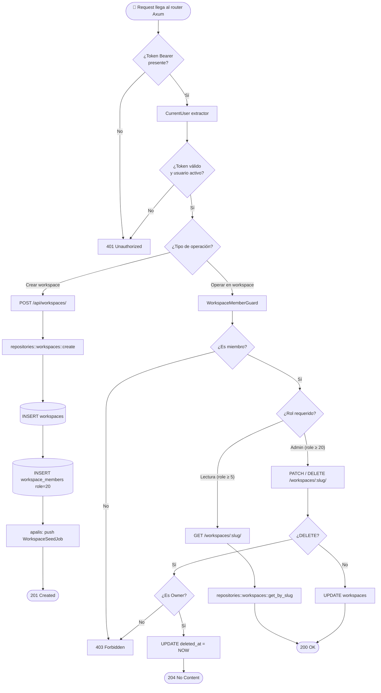
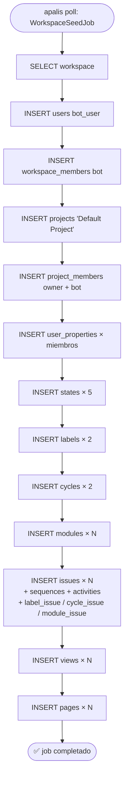
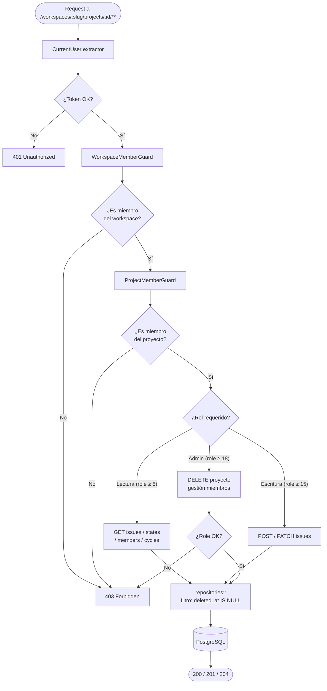
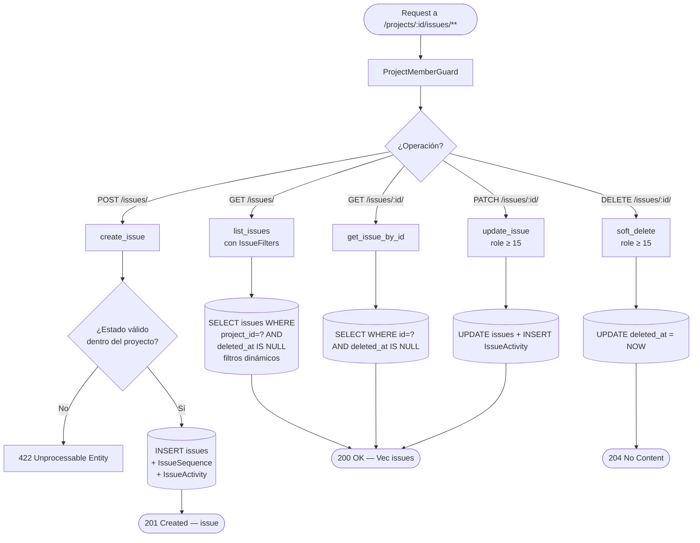
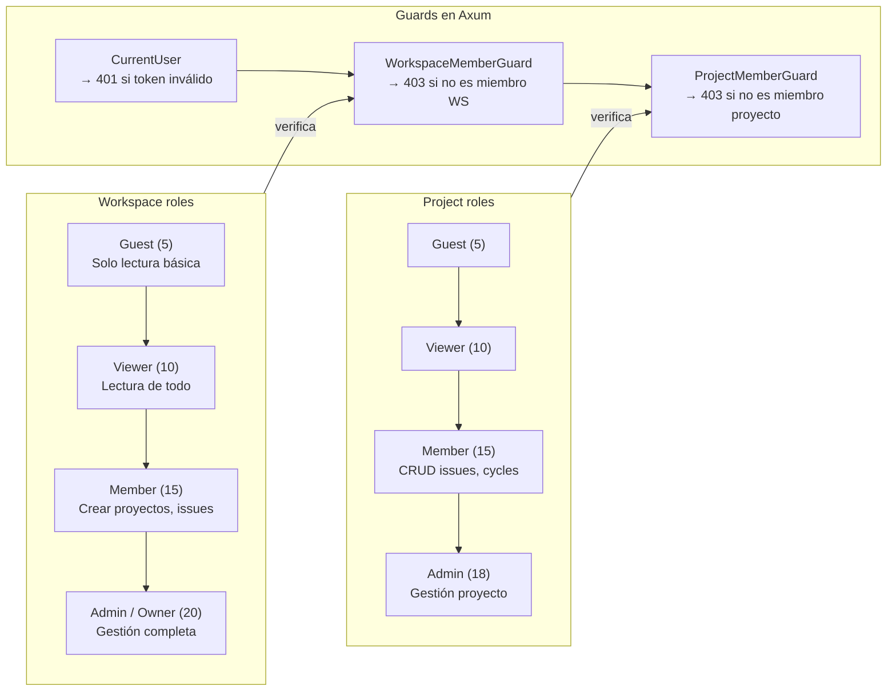
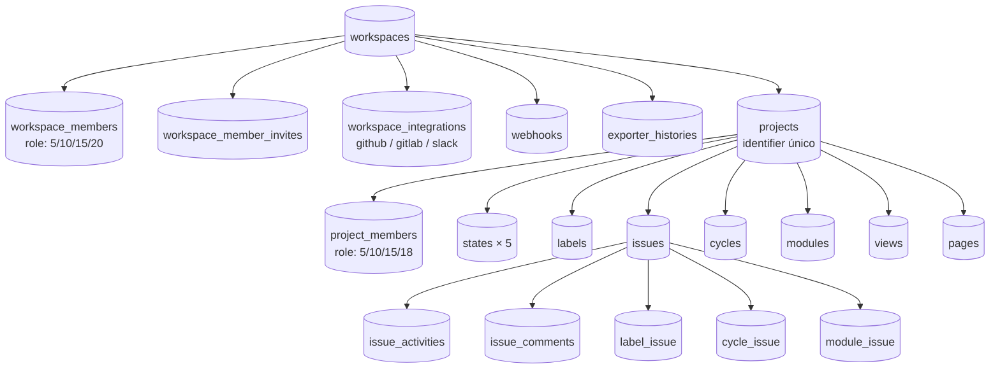
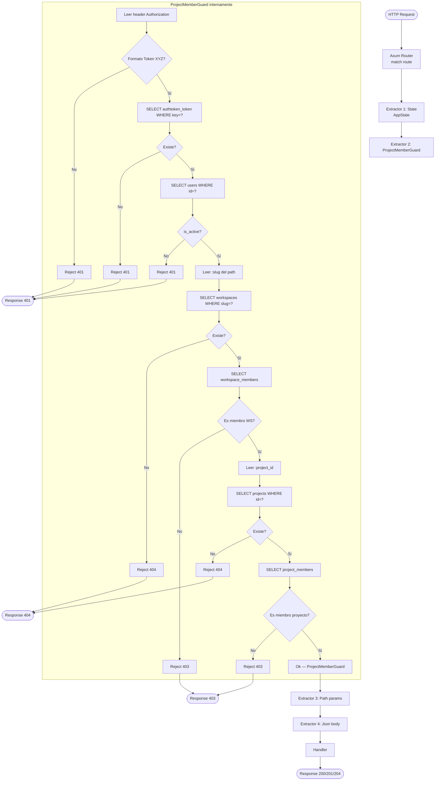

# Diagramas de flujo — Workspace y Projects

> Los flowcharts muestran el **árbol de decisiones** (if/else, guards).
> Para el orden temporal de los eventos, ver [[ref-diagramas-secuencia]].

---

## Workspace — flujo de creación y acceso

---

## Workspace Seed Worker — flujo interno

---

## Projects — guard chain y acceso

---

## Issues — CRUD completo

---

## Roles — jerarquía por entidad

---

## Relación entidades Workspace ↔ Projects

---

## Tabla de rutas por entidad

| Entidad        | Método           | Ruta                                              | Guard mínimo                            | Fase |
| -------------- | ---------------- | ------------------------------------------------- | --------------------------------------- | ---- |
| Workspaces     | GET              | `/api/workspaces/`                                | `CurrentUser`                           | 2    |
| Workspace      | POST             | `/api/workspaces/`                                | `CurrentUser`                           | 2    |
| Workspace      | GET/PATCH/DELETE | `/api/workspaces/:slug/`                          | `WorkspaceMemberGuard`                  | 2    |
| WS Members     | GET              | `/api/workspaces/:slug/members/`                  | `WorkspaceMemberGuard (≥15)`            | 2    |
| WS Members     | PATCH/DELETE     | `/api/workspaces/:slug/members/:pk/`              | `WorkspaceMemberGuard (≥20)`            | 2    |
| WS Invitations | GET/POST         | `/api/workspaces/:slug/invitations/`              | `WorkspaceMemberGuard (≥20)`            | 2    |
| WS Webhooks    | GET/POST         | `/api/workspaces/:slug/webhooks/`                 | `WorkspaceMemberGuard (≥20)`            | 2    |
| Projects       | GET              | `/api/workspaces/:slug/projects/`                 | `WorkspaceMemberGuard (≥5)`             | 2    |
| Project        | POST             | `/api/workspaces/:slug/projects/`                 | `WorkspaceMemberGuard (≥15)`            | 2    |
| Project        | GET/PATCH/DELETE | `/api/workspaces/:slug/projects/:id/`             | `ProjectMemberGuard (≥18 PATCH/DELETE)` | 2    |
| Issues         | GET/POST         | `/api/workspaces/:slug/projects/:id/issues/`      | `ProjectMemberGuard (≥5 GET, ≥15 POST)` | 2    |
| Issue          | GET/PATCH/DELETE | `/api/workspaces/:slug/projects/:id/issues/:iid/` | `ProjectMemberGuard (≥15 PATCH/DELETE)` | 2    |
| States         | GET              | `/api/workspaces/:slug/projects/:id/states/`      | `ProjectMemberGuard (≥5)`               | 2    |
| Members        | GET              | `/api/workspaces/:slug/projects/:id/members/`     | `ProjectMemberGuard (≥5)`               | 2    |
| Cycles         | GET/POST         | `/api/workspaces/:slug/projects/:id/cycles/`      | `ProjectMemberGuard (≥5 GET, ≥15 POST)` | 2    |
| Modules        | GET/POST         | `/api/workspaces/:slug/projects/:id/modules/`     | `ProjectMemberGuard (≥5 GET, ≥15 POST)` | 2    |
| Exports        | GET/POST         | `/api/workspaces/:slug/exports/`                  | `WorkspaceMemberGuard (≥5)`             | 3    |

---

## Extractor chain — `ProjectMemberGuard` internamente

Muestra las 5 queries secuenciales que dispara `ProjectMemberGuard` antes de que llegue al handler.

---

## 🔗 Navegar

← [[ref-diagramas-secuencia]] | [[MOC]]

**Relacionado:** Extractores: [[impl-extractores-auth]] | Workspace Settings: [[dominio-workspace-settings]] | Fases: [[plan-fases]]
