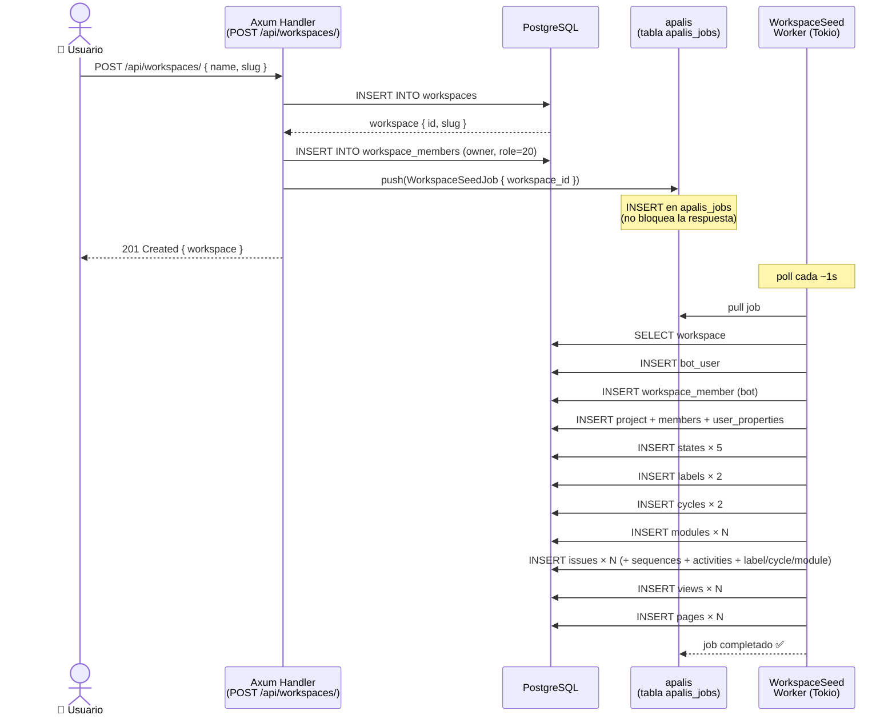
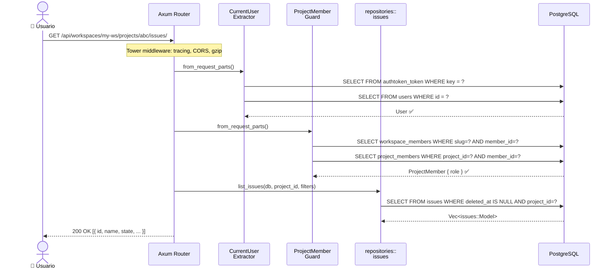
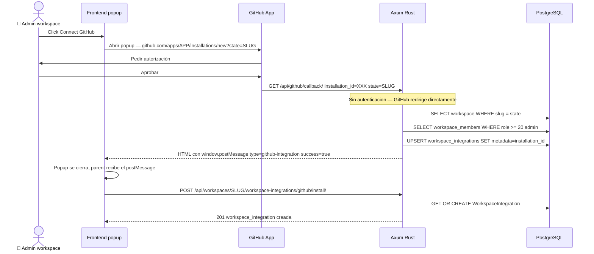
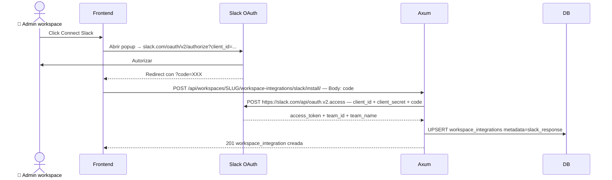
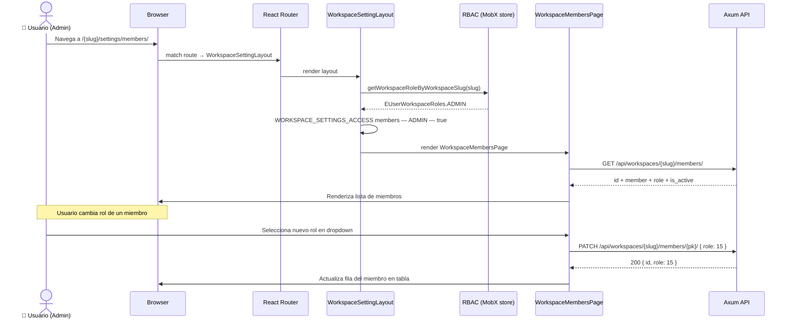
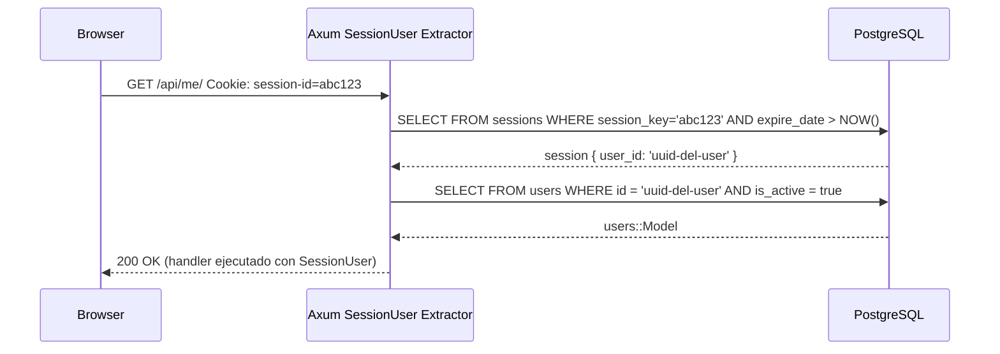

# Diagramas de secuencia

> Los diagramas de secuencia muestran el **orden temporal** de los eventos.
> Para el árbol de decisiones (if/else, guards), ver [[ref-diagramas-flujo]].

---

## 1. Creación de workspace + seed asíncrono

Ver detalles de implementación: [[dominio-workspace-seed]]

---

## 2. Flujo de request autenticado (issues)

Ver extractores: [[impl-extractores-auth]]

---

## 3. Flujo OAuth — GitHub App (instalación workspace)

Ver detalles: [[dominio-integraciones#Flujo OAuth — GitHub App el más complejo]]

---

## 4. Flujo OAuth — Slack

---

## 5. Flujo Workspace Settings — cambio de rol de miembro

Ver: [[dominio-workspace-settings]]

---

## 6. Session Cookie — flujo de autenticación

Ver: [[impl-autenticacion]]

---

## 🔗 Navegar

← [[MOC]] | → [[ref-diagramas-flujo]]

**Relacionado:** Workspace Seed: [[dominio-workspace-seed]] | Extractores: [[impl-extractores-auth]] | Integraciones: [[dominio-integraciones]]
