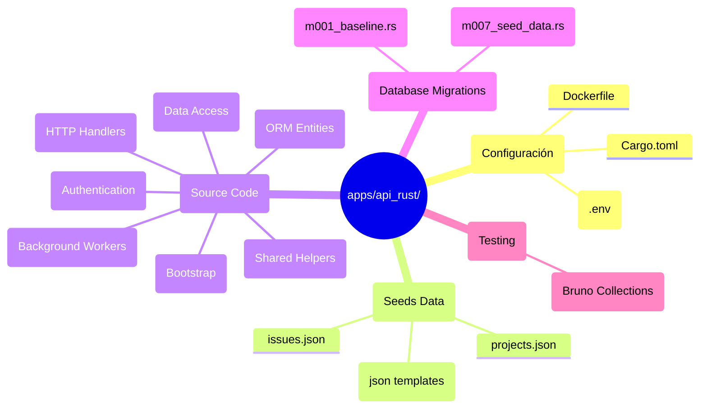

# Estructura completa de archivos — estado objetivo

---

## Reglas de la estructura

| Directorio          | Regla                                                                      |
| ------------------- | -------------------------------------------------------------------------- |
| `src/entities/`     | **NO editar a mano** — regenerar con `sea-orm-cli generate entity`         |
| `src/repositories/` | Un archivo por dominio; los handlers llaman aquí, no a SeaORM directamente |
| `src/routes/`       | Handlers puros — reciben AppState, llaman a repositories, retornan JSON    |
| `src/jobs/`         | Un archivo por job apalis; un archivo `scheduled.rs` para cron             |
| `src/auth/`         | Extractores, session, api_key — todo lo relacionado con autenticación      |
| `src/utils/`        | Helpers reutilizables — soft delete, GitHub App, OAuth popup               |
| `seeds/data/`       | Copiar desde `apps/api/plane/seeds/data/*.json` — no modificar             |
| `tests/bruno/`      | Colecciones versionadas en git — correr con `bruno run --env local`        |

---

## Correspondencia Django → Rust

| Directorio Django                            | Equivalente Rust                            |
| -------------------------------------------- | ------------------------------------------- |
| `plane/db/models/`                           | `src/entities/` (generado)                  |
| `plane/db/mixins.py` (SoftDelete)            | `src/utils/soft_delete.rs`                  |
| `plane/db/migrations/` (126 archivos)        | `migration/src/migrations/m001_baseline.rs` |
| `plane/bgtasks/` (36 tasks Celery)           | `src/jobs/` (apalis)                        |
| `plane/app/views/` (handlers DRF)            | `src/routes/`                               |
| `plane/app/permissions/`                     | `src/auth/permissions.rs` + extractors      |
| `plane/app/middleware/api_authentication.py` | `src/auth/extractors.rs` + `session.rs`     |
| `plane/settings/`                            | `src/config.rs`                             |
| `plane/utils/`                               | `src/utils/`                                |
| `plane/celery.py`                            | apalis en `src/jobs/mod.rs`                 |

Ver [[ref-estructura-django]] para el árbol completo de Django.

---

## 🔗 Navegar

← [[MOC]] | Estructura Django: [[ref-estructura-django]] | Bootstrap: [[impl-bootstrap]] | Testing: [[ref-testing]]
