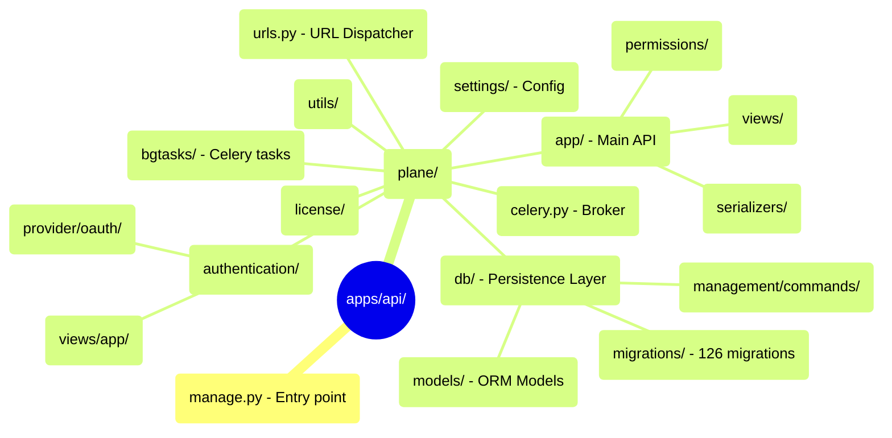

# Estructura de carpetas Django — `apps/api`

> [!INFO] Propósito
> Referencia completa del proyecto Django que se está migrando a Rust.
> El árbol refleja el estado actual de la rama `feature/integrations-panel-fix-17593507967815292912`.

---

## Árbol completo



---

## Módulos Django → equivalente Rust

| Módulo Django                                | Propósito                | Equivalente Rust                            | Estado         |
| -------------------------------------------- | ------------------------ | ------------------------------------------- | -------------- |
| `plane/db/models/`                           | ORM Models (33 archivos) | `src/entities/` (122 entidades)             | ✅ Baseline    |
| `plane/db/mixins.py`                         | SoftDelete, Timestamps   | `src/utils/soft_delete.rs`                  | ✅             |
| `plane/db/migrations/`                       | 126 migraciones          | `migration/src/migrations/m001_baseline.rs` | ✅             |
| `plane/bgtasks/`                             | 36 tareas Celery         | `src/jobs/` (apalis)                        | 🔄 Parcial     |
| `plane/bgtasks/workspace_seed_task.py`       | Seed workspace           | `src/jobs/workspace_seed/`                  | 📝 Diseñado    |
| `plane/bgtasks/github_sync_task.py`          | Sync GitHub              | `src/jobs/github_sync.rs`                   | 📝 Planificado |
| `plane/app/views/`                           | Handlers DRF             | `src/routes/`                               | 🔄 Fase 2      |
| `plane/app/permissions/`                     | Guards de acceso         | `src/auth/permissions.rs`                   | ✅ Base        |
| `plane/app/middleware/api_authentication.py` | Session + Token auth     | `src/auth/`                                 | 📝 Diseñado    |
| `plane/authentication/`                      | OAuth providers          | Pendiente Fase 3                            | 📝 No iniciado |
| `plane/settings/`                            | Config por entorno       | `src/config.rs` (dotenvy)                   | ✅             |
| `plane/celery.py`                            | Broker Celery            | apalis (PostgreSQL-backed)                  | ✅             |
| `plane/db/models/integration/`               | Modelos integración      | `migration/src/migrations/m001 (baseline)`  | ✅             |
| `plane/license/`                             | Gestión instancia        | Pendiente                                   | 📝 No iniciado |
| `plane/utils/github_app.py`                  | Cliente GitHub App       | `src/utils/github_app.rs`                   | 📝 Diseñado    |

---

## Background tasks Celery → apalis jobs

| Celery task               | Equivalente Rust     | Trigger               |
| ------------------------- | -------------------- | --------------------- |
| `workspace_seed_task`     | `WorkspaceSeedJob`   | Workspace creado      |
| `github_sync_task`        | `GithubSyncJob`      | Webhook GitHub / cron |
| `notification_task`       | `NotificationJob`    | Cola de eventos       |
| `email_notification_task` | `EmailJob`           | Cola de eventos       |
| `webhook_task`            | `WebhookDispatchJob` | Post-mutación         |
| `export_task`             | `ExportJob`          | Request usuario       |
| `cleanup_task`            | `CleanupCron`        | tokio-cron-scheduler  |
| `issue_automation_task`   | `AutomationCron`     | Cron diario           |
| `magic_link_code_task`    | —                    | Pendiente auth Rust   |

---

## Migraciones históricas más relevantes

| Migración Django                                 | Qué introduce                               |
| ------------------------------------------------ | ------------------------------------------- |
| `0001_initial`                                   | Schema base 2022                            |
| `0047_webhook_*`                                 | Webhooks y API tokens                       |
| `0085_intake_*`                                  | Módulo Intake                               |
| `0101_description_descriptionversion`            | Versiones de descripción                    |
| `0122_add_github_gitlab_integrations`            | Modelos integración GitHub/GitLab           |
| `0123_add_slack_integration`                     | Modelo Slack                                |
| `0124_githubprstatemapping_usergithubconnection` | PR mapping + user OAuth                     |
| `0126_gitlab_sync_models`                        | GitLab sync completo — **última migración** |

> Las últimas 5 son las que materializa la migración Rust `m001` (Baseline SQL).

---

## Comandos Django vs Rust equivalentes

```bash
# Django: aplicar migraciones
python manage.py migrate
# Rust equivalente:
cargo run -p migration -- up

# Django: seed de datos de instancia
python manage.py configure_instance
# Rust equivalente:
# Se dispara automáticamente vía WorkspaceSeedJob al crear workspace

# Django: esperar DB
python manage.py wait_for_db
# Rust equivalente:
# El binario intenta conectar con reintentos al arrancar
```

---

## 🔗 Navegar

← [[ref-estructura-archivos]] | [[MOC]]

**Relacionado:** ORM y migraciones: [[fundamentos-orm]] | Autenticación Django → Rust: [[impl-autenticacion]] | Plan de migración: [[plan-fases]]
