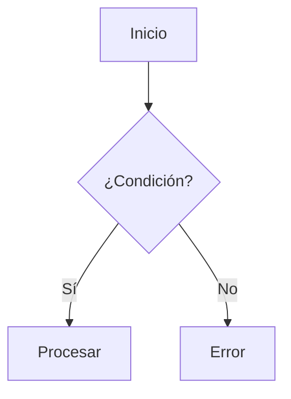

# 🎨 Guía de Estilo y Convenciones de Documentación

Esta guía define los estándares para toda la documentación en `docs/api-rust/`.

---

## 🏷️ Etiquetas (Tags)

Se debe usar un conjunto estricto de etiquetas para facilitar la indexación y búsqueda:

- `#plane`: General del proyecto.
- `#rust`: Relacionado con la implementación en Rust.
- `#api`: Definiciones de endpoints y contratos.
- `#dominio`: Lógica de negocio y entidades.
- `#infraestructura`: Base de datos, workers, proxies, etc.
- `#referencia`: Documentos de apoyo, diagramas y glosarios.
- `#fase-0` a `#fase-5`: Marcador de fase de migración.
- `#implementado`: Funcionalidad ya presente en el código.
- `#disenado`: Especificación técnica lista pero no programada.

---

## 📝 Frontmatter (YAML)

Cada archivo `.md` debe comenzar con un bloque YAML:

```yaml
---
titulo: Título Descriptivo
aliases:
  - alias-1
  - alias-2
tags:
  - plane
  - rust
  - tag-especifico
estado: activo | en-progreso | pendiente
---
```

---

## 📣 Callouts (Obsidian Style)

Usar callouts para resaltar información importante:

- `> [!SUMMARY]`: Resumen ejecutivo o "una frase".
- `> [!INFO]`: Información general o fuentes.
- `> [!NOTE]`: Notas importantes o aclaraciones.
- `> [!WARNING]`: Advertencias, riesgos o puntos críticos.
- `> [!ERROR]`: Errores identificados o bugs documentados.

---

## 📊 Diagramas (Mermaid)

**Prohibido el uso de ASCII-art o texto para diagramas.** Todo flujo, arquitectura, jerarquía o relación debe ser un bloque `mermaid`.

### Ejemplo de flujo:


---

## 🔗 Enlaces y Referencias

- Usar enlaces estilo Wiki: `[[Nombre de la Nota]]`.
- Mantener la sección `## 🔗 Navegar` al final de los archivos de dominio.

---

## 🛠️ Formato de Tablas

- Los encabezados de las tablas deben estar en negrita.
- Usar alineación consistente (`:---` para izquierda, `:---:` para centro).

---

## 🌐 Idioma

- Descripciones, advertencias y prosa en **Español**.
- Términos técnicos, nombres de variables, tablas y código en **Inglés** (conforme al código fuente).

---

_`docs/api-rust/ref-guia-estilo.md` · rama `feature/integrations-panel-fix-17593507967815292912`_
