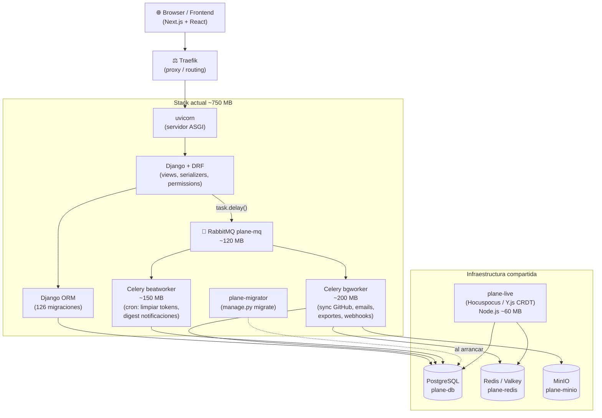
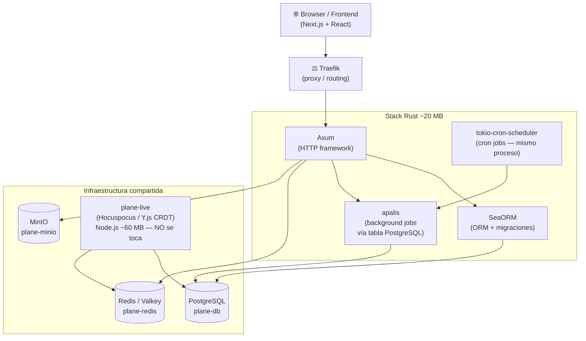
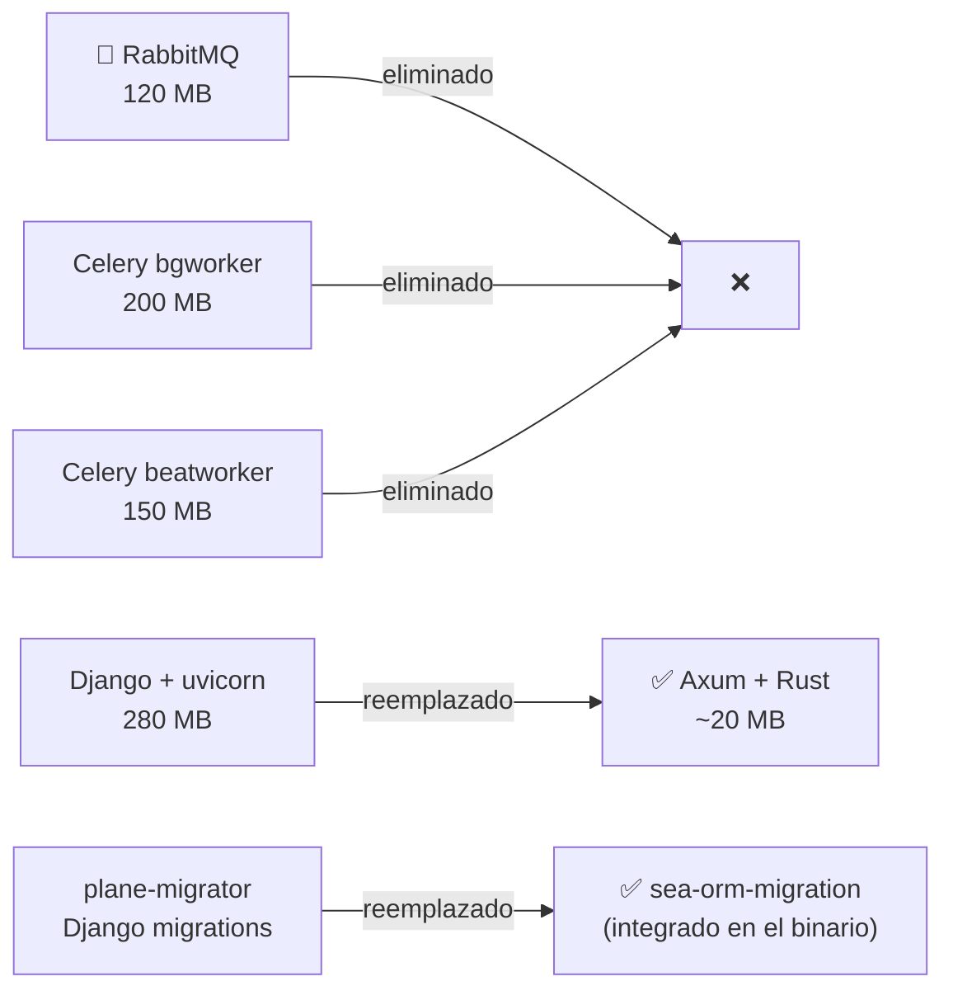

# Arquitectura actual vs futura

---

## Stack actual (Django + Celery + RabbitMQ) — ~750 MB



---

## Stack futuro (Rust — ~20 MB total)



---

## Lo que desaparece



### Tabla de impacto por contenedor

| Contenedor               | RAM         | Resultado     |
| ------------------------ | ----------- | ------------- |
| api (Django + uvicorn)   | ~280 MB     | → Rust ~20 MB |
| bgworker (Celery)        | ~200 MB     | → eliminado   |
| beatworker (Celery beat) | ~150 MB     | → eliminado   |
| plane-mq (RabbitMQ)      | ~120 MB     | → eliminado   |
| plane-migrator (Django)  | —           | → eliminado   |
| **Total**                | **~750 MB** | **~20 MB**    |

---

## Lo que se mantiene

| Servicio                        | Por qué                                        |
| ------------------------------- | ---------------------------------------------- |
| plane-live (Hocuspocus/Node.js) | Protocolo Y.js CRDT — no reemplazable          |
| plane-db (PostgreSQL)           | Misma DB, Rust toma ownership del schema       |
| plane-redis (Valkey)            | Sigue necesario para plane-live y caché        |
| plane-minio (MinIO)             | Sin cambio                                     |
| Proxy (Traefik)                 | El mismo, se agrega routing al contenedor Rust |

---

## Impacto en el frontend

> La migración a Rust **no reduce tiempos de carga percibidos** en el browser.
> El cuello de botella es el bundle JS de Next.js y la hydration de React — no la API.
>
> La ganancia es en el **servidor**: -730 MB RAM, mejor throughput bajo carga concurrente,
> y eliminación de 4 contenedores de infraestructura.

---

## Routing dual durante la migración (Fases 1–4)

Durante la migración, Django y Rust corren en paralelo. Traefik los distingue por prioridad:

```yaml
# Rust — alta prioridad, toma los endpoints ya migrados
- "traefik.http.routers.api-rust.rule=PathPrefix(`/api/`)"
- "traefik.http.routers.api-rust.priority=10"
# Django — baja prioridad, solo recibe lo que Rust no maneja aún
- "traefik.http.routers.api-django.rule=PathPrefix(`/api/`)"
- "traefik.http.routers.api-django.priority=5"
```

Esto permite mover endpoints uno a uno sin downtime. Ver [[plan-fases]] para la estrategia completa.

---

## 🔗 Navegar

← [[vision-stack]] | [[MOC]] | → [[plan-fases]] | Diagramas detallados: [[ref-diagramas-flujo]]

---

_`docs/api-rust/vision-arquitectura.md` · rama `feature/integrations-panel-fix-17593507967815292912`_
